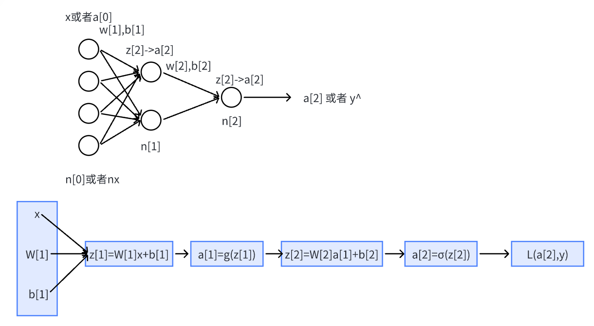

吴恩达Deep Learning 学习笔记

## 1、Logstic Regression(回归)

#### 1、理解w=w-α *df/dw 为什么是这样?

https://zhuanlan.zhihu.com/p/86147140

​	由于梯度方向（df/dx，df/dy，df/dw ...）是函数变化最快的方向（通过最大时夹角值得出）

[从为什么梯度方向是函数变化率最快方向详谈梯度下降](https://zhuanlan.zhihu.com/p/420701835)

​	所以每个变量分别取梯度里对应的变化量，整体就沿着下降速度最快的方向去了。

​	然后加上一个学习率来控制步长即可。

#### 2、完整形式

一些简单的推导（此时假设为单个样本）：

其中，X=（x(1),x(2)...) , X的每一列都是一个样本

编程Tips : 使用向量化替代for加快速度，利用广播（复制至同规模）

## 2、多种激活函数

**Sigmoid** : **常用作最后一层二分类的激活函数**，但其他地方不常用，存在梯度消失
$$
a=\sigma(z)=\frac{1}{1+e^{-z}}
$$

$$
导数=a'(z)=a(1-a)
$$

**tanh**:  总体上都优于sigmoid函数的激活函数，**几乎适合所有场合**，存在梯度消失
$$
a=tanh(z)=\frac{e^z-e^{-z}}{e^z+e^{-z}}
\\ 导数= a'(z)=1-(tanh(z))^2
$$
**Relu(Rectified Linear Unit) :** **最常用的默认函数**，解决梯度消失问题

​																𝑎 = 𝑚𝑎𝑥(0, 𝑧)

**Leaky Relu: **Relu的改进
$$
y = max(0, x) + leak*min(0,x) \\ leak是一个很小的常数
$$

## 3、梯度下降法

[有关向量，矩阵的求导 定义与推导](https://zhuanlan.zhihu.com/p/371234412?ivk_sa=1024320u)

其实，求导定义比较可以直观理解：即本来要一个一个求导，为了方便，合成一个整体进行求导，所以定义也就是一个一个的导数拼接而成即可。

#### 神经网络前向传递，反向传播 向量化 推导：

最基本的单元就是Loggistic Regression的单元  

##### 示意图：

（实际实现上一般仅最后一层使用sigmoid激活函数来作分类，其他层一般不用sigmoid函数，暂记作g(x))

##### 前向传递公式如上

##### 反向传播(BP)公式推导

###### 	一些符号:

$$
\begin{align*}
& \quad n^{[x]}表示第n层节点个数，输入层不算进层数里，此时一共是两层。\\
& \quad W^{[x]},b^{[x]}为线性组合的系数。\\
& \quad x表示一批次的样本,也就是n^{[0]}的个数。\\
& \quad 损失函数L这里使用二分类的损失函数=-[ylog \hat{y}+(1-y)log(1-\hat{y})]
\end{align*}
$$

###### 	规模说明：

$$
\begin{align*}
& \quad n^{[x]}表示第n层节点个数，输入层不算进层数里，此时一共是两层。\\
& \quad z^{[x]}，a^{[x]}为n^{[x]} \times 1大小的矩阵，\\
& \quad W^{[x]}看成是行向量的组合，例如
W^{[2]}为n^{[2]} \times n^{[1]}大小的矩阵，记作\\
&W^{[2]}=\left(\begin{matrix}
 W^{[2](1)}\\
 W^{[2](2)}\\
 W^{[2](3)}\\
 .. \\
 W^{[2](n^{[2]})}
\end{matrix}\right)
，其中W^{[2](i)}表示对于第二层第i个节点的W权重组合。
\end{align*}\\
$$

###### 	

###### 	推导：

**一些前置推导：**
$$
y=\frac{1}{1+e^{-x}},易证得y'(x)=y(1-y)
$$
**正式推导：**
$$
\begin{align*}
&\textbf{损失函数 J= 所有样本平均损失} = \frac{1}{m}\sum_{i=1}^m L(a^{[2](i)},y^{[i]})
=\frac{1}{m}\sum_{i=1}^m -(y^{(i)}log\hat{y}^{(i)}+(1-y^{(i)})log(1-\hat{y}^{(i)}))\\
&=\frac{1}{m}\sum_{i=1}^m -(y^{(i)}loga^{[2](i)}+(1-y^{(i)})log(1-a^{[2](i)}))\\
&=-\frac{1}{m}(yloga^{[2]}+(1-y)log(1-a^{[2]}))——向量化形式,\quad 大小: 1\times 1\\
\end{align*}
$$

**第二层：**
$$
\begin{align*}

\\ &对每个神经元求导，每个结果记录在对应列，列间无关系。\\
&\quad \frac{dJ}{da^{[2](i)}}=-\frac{1}{m}[\frac{y^{(i)}}{a^{[2](i)}}-\frac{1-y^{(i)}}{1-a^{[2](i)}}] \quad => \quad \frac{dJ}{da^{[2]}}=-\frac{1}{m}[\frac{y}{a^{[2]}}-\frac{(1-y)}{(1-a^{[2]})}]  ,\quad 大小: n^{[2]}\times 1
\\
\\&由于每个z^{[2](i)}是分别通过影响对应的a^{[2](i)}来影响J的，所以求导时可以分开求导，然后拼起来！

\\& \quad \frac{dJ}{dz^{[2](i)}}=\frac{dJ}{da^{[2](i)}}\frac{da^{[2](i)}}{dz^{[2](i)}}
=-\frac{1}{m}(\frac{y^{(i)}}{a^{[2](i)}}-\frac{1-y^{(i)}}{1-a^{[2](i)}})a^{[2](i)}(1-a^{[2](i)})
=\frac{1}{m}(a^{[2](i)}-y^{(i)}),
\\&=> \frac{dJ}{dz^{[2]}}=\frac{1}{m}(a^{[2]}-y),\quad 大小: n^{[2]}\times 1
\\

\end{align*}
$$

$$
\begin{align*}

\\& 由于每个W^{[2](i)}是通过影响对应的z^{[2](i)}来影响J的，所以求导时同样可以分离来求。
\\即
\\& \quad \frac{dJ}{dW^{[2](i)}}=\frac{dJ}{dz^{[2](i)}}\frac{dz^{[2](i)}}{dW^{[2](i)}}
\\
\\&同时，\left(\begin{matrix}
 W^{[2](1)}\\
 W^{[2](2)}\\
 ..\\
 W^{[2](i)}\\
 .. \\
\end{matrix}\right)
\left( a^{[1]}\right)=\left(\begin{matrix}
 z^{[2](1)}\\
 z^{[2](2)}\\
 ..\\
 z^{[2](i)}\\
 .. \\
\end{matrix}\right),其中a^{[1]}为该层针对任一节点统一的输入，即z^{[2](i)}=W^{[2](i)}a^{[1]}+b^{[2](i)},\\
&进一步展开，\\
&z^{[2](i)}=W^{[2](i)(1)}a^{[1](1)}+W^{[2](i)(2)}a^{[1](2)}+...,(由于是对W求导，所以这里就忽略b的项，不影响求导结果)\\
&所以，
\frac{dz^{[2](i)}}{dW^{[2](i)}}
=\left(\begin{matrix}
\frac{dz^{[2](i)}}{dW^{[2](i)(1)}} & .. & \frac{dz^{[2](i)}}{dW^{[2](i)(j)}}  & ..
\end{matrix}\right)
=\left(\begin{matrix}
 a^{[1](1)} &  a^{[1](2)} & ..  & a^{[1](j)} & ..\\
\end{matrix}\right)(由于W^{[2](i)}为1\times n^{[1]}大小，z^{[2](i)}为1\times 1,所以结果大小即为1\times n^{[1]}，即a^{[1](i)}的排列方式为横着排列的)\\
&={a^{[1]}}^T
\\& 所以，
\\
&\quad \frac{dJ}{dW^{[2](i)}}=\frac{dJ}{dz^{[2](i)}}\frac{dz^{[2](i)}}{dW^{[2](i)}}
=\frac{1}{m}(a^{[2]}-y){a^{[1]}}^T \quad => \quad \frac{dJ}{dW^{[2]}}=\frac{1}{m}(a^{[2]}-y){a^{[1]}}^T
=\frac{dJ}{dz^{[2]}} {a^{[1]}}^T,
\quad 大小: (n^{[2]}\times 1) , (1 \times n^{[1]})\\
\\

\end{align*}
$$

$$
\begin{align*}

\\& 由于b^{[2](i)}对J的影响是通过z^{[2](i)}产生的，所以求导时同样可以分离来求。
\\&由于z^{[2](i)}=W^{[2](i)(1)}a^{[1](1)}+W^{[2](i)(2)}a^{[1](2)}+...+b^{[2](i)},所以\frac{dz^{[2](i)}}{db^{[2](i)}}=1\\
&从而，\\
&\quad \frac{dJ}{db^{[2](i)}}=\frac{dJ}{dz^{[2](i)}}\frac{dz^{[2](i)}}{db^{[2](i)}}= \frac{dJ}{dz^{[2](i)}}
\quad => \quad \frac{dJ}{db^{[2]}}=\frac{dJ}{dz^{[2]}},
\quad 大小: n^{[2]}\times 1\\

\end{align*}
$$
​	

**第一层：**
$$
\begin{align*}

& 由于a^{[1]}对J的影响是通过各个z^{[2](i)}产生的，所以求导（变化率）时是累加效果。\\
&\quad \frac{dJ}{da^{[1]}}=\sum_i \frac{dJ}{dz^{[2](i)}} \frac{dz^{[2](i)}}{da^{[1]}},
\\
\\& 由于z^{[2](i)}=W^{[2](i)(1)}a^{[1](1)}+W^{[2](i)(2)}a^{[1](2)}+...+b^{[2](i)}=\sum_j W^{[2](i)(j)}a^{[1](j)}+b^{[2](i)},
\\& 所以\frac{dz^{[2](i)}}{da^{[1](j)}}=W^{[2](i)(j)}（标量对标量导）,得
\frac{dz^{[2](i)}}{da^{[1]}}=

\left(\begin{matrix}
 W^{[2](i)(1)}\\
 W^{[2](i)(2)}\\
 ..\\
\end{matrix}\right)={W^{[2](i)}}^T,即W的第i行按列来排，
\\&所以，
\\& \quad \frac{dz^{[2](i)}}{da^{[1]}}
=\left(\begin{matrix}
 W^{[2](1)(1)} & .. & W^{[2](i)(1)} & ..& W^{[2](..)(1)}\\
 .. & .. & .. & ..  & ..\\
 .. & .. & .. & ..  & ..\\
\end{matrix}\right)
={W^{[2]}}^T
\\&从而，
\\& \quad \frac{dJ}{da^{[1]}}=\sum_i \frac{dJ}{dz^{[2](i)}} \frac{dz^{[2](i)}}{da^{[1]}}
=\frac{1}{m} \sum_i (a^{[2](i)}-y^{(i)})\left(\begin{matrix}
 W^{[2](i)(1)}\\
 W^{[2](i)(2)}\\
 ..\\
\end{matrix}\right),
形式类似于
\end{align*}
$$

****

$$
\begin{align*}
&所以，\\
&\quad \frac{dJ}{da^{[1]}}=\frac{1}{m} {W^{[2]}}^T (a^{[2]}-y)
={W^{[2]}}^T \frac{dJ}{dz^{[2]}},

\quad 大小: (n^{[1]}\times n^{[2]}) , (n^{[2]} \times 1)\\
\end{align*}
$$

$$
\begin{align*}
&由于a^{[1]}=g(z^{[1]}),对应元素分别使用g函数\\
&所以，\frac{da^{[1](i)}}{dz^{[1](i)}}=g^{[1]'}(z^{[1](i)}) \quad => 
\quad \frac{da^{[1]}}{dz^{[1]}}=g^{[1]'}(z^{[1]}) （对应位置的导数）\\
& => 
\frac{dJ}{dz^{[1]}} = \frac{dJ}{da^{[1]}} * g^{[1]'}(z^{[1]}) （对应位置数乘）
={W^{[2]}}^T \frac{dJ}{dz^{[2]}} * g^{[1]'}(z^{[1]}) ，

\quad 大小: n^{[1]} \times 1\\
\end{align*}
$$

$$
\begin{align*}
& \quad \frac{dJ}{dW^{[1]}} = \frac{dJ}{dz^{[1]}}  \frac{dz^{[1]}}{dW^{[1]}}\\
& 类比可得，\frac{dz^{[1]}}{dW^{[1]}}={a^{[0]}}^T=x^T,所以\\
&\quad \frac{dJ}{dW^{[1]}} = \frac{dJ}{dz^{[1]}} x^T\\
&同理，类比\frac{dz^{[2]}}{db^{[2]}}计算过程，可得\\
& \quad \frac{dJ}{db^{[1]}}=\frac{dJ}{dz^{[1]}}
\end{align*}
$$

##### **公式整理：**

###### 正向传递：

$$
z^{[i]}=W^{[i]}a^{[i-1]}+b^{[i]}\\
a^{[i]}=g^{[i]}(a^{[i]})
$$

###### 反向传播：

$$
\frac{dJ}{dz^{[i]}} = \frac{dJ}{da^{[i]}} * g^{[i]'}(a^{[i]})\\
\frac{dJ}{dW^{[i]}} = \frac{dJ}{dz^{[i]}} {a^{[i-1]}}^T\\
\frac{dJ}{db^{[i]}}= \frac{dJ}{dz^{[i]}}\\
\frac{dJ}{da^{[i-1]}}= {W^{[i]}}^T \frac{dJ}{dz^{[i]}}
$$

#### 随机初始化：
