吴恩达Deep Learning 学习笔记


[TOC]


# 第一门课 神经网络和深度学习(Neural Networks and Deep Learning)


## 1、Logstic Regression(回归)

#### 1、理解w=w-α *df/dw 为什么是这样?

https://zhuanlan.zhihu.com/p/86147140

​	由于梯度方向（df/dx，df/dy，df/dw ...）是函数变化最快的方向（通过最大时夹角值得出）

[从为什么梯度方向是函数变化率最快方向详谈梯度下降](https://zhuanlan.zhihu.com/p/420701835)

​	所以每个变量分别取梯度里对应的变化量，整体就沿着下降速度最快的方向去了。

​	然后加上一个学习率来控制步长即可。

#### 2、完整形式

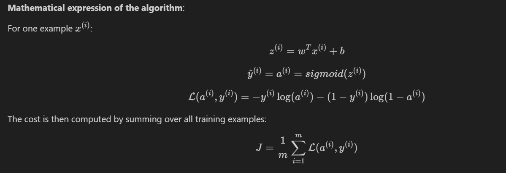


一些简单的推导（此时假设为单个样本）：

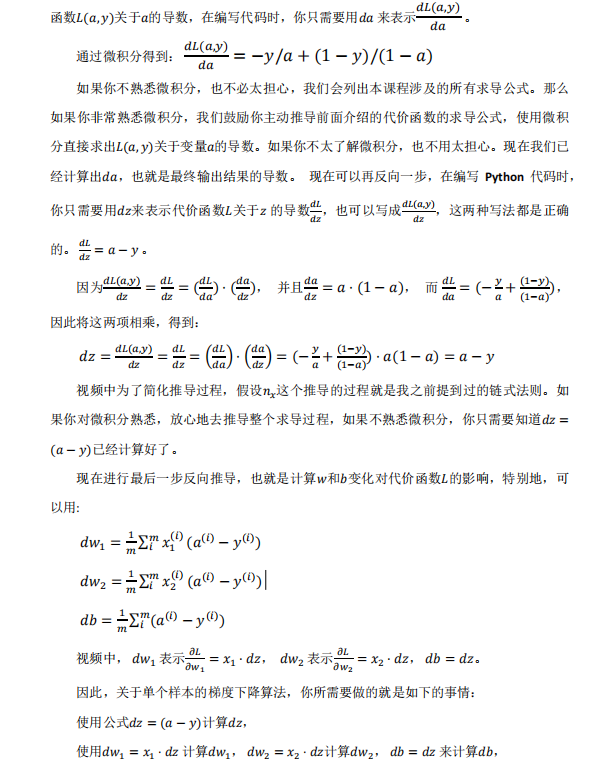

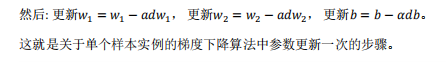


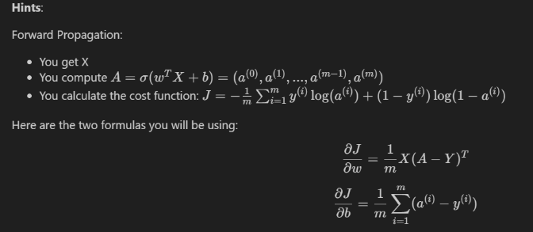

其中，X=（x(1),x(2)...) , X的每一列都是一个样本

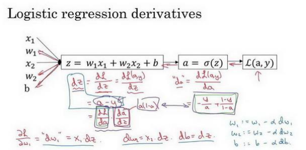


编程Tips : 使用向量化替代for加快速度，利用广播（复制至同规模）


## 2、多种激活函数

**Sigmoid** : **常用作最后一层二分类的激活函数**，但其他地方不常用，存在梯度消失
$$
a=\sigma(z)=\frac{1}{1+e^{-z}}
$$

$$
导数=a'(z)=a(1-a)
$$

**tanh**:  总体上都优于sigmoid函数的激活函数，**几乎适合所有场合**，存在梯度消失
$$
a=tanh(z)=\frac{e^z-e^{-z}}{e^z+e^{-z}}
\\ 导数= a'(z)=1-(tanh(z))^2
$$
**Relu(Rectified Linear Unit) :** **最常用的默认函数**，解决梯度消失问题

​																𝑎 = 𝑚𝑎𝑥(0, 𝑧)

**Leaky Relu: **Relu的改进
$$
y = max(0, x) + leak*min(0,x) \\ leak是一个很小的常数
$$
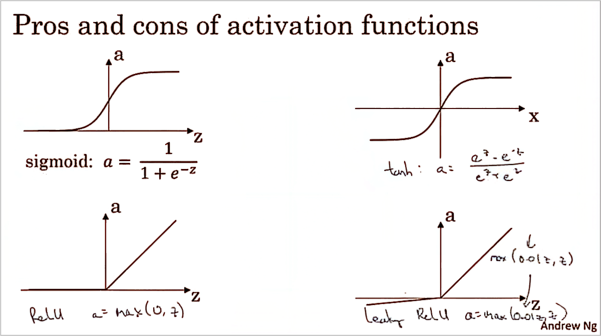


## 3、梯度下降法

[有关向量，矩阵的求导 定义与推导](https://zhuanlan.zhihu.com/p/371234412?ivk_sa=1024320u)

其实，求导定义比较可以直观理解：即本来要一个一个求导，为了方便，合成一个整体进行求导，所以定义也就是一个一个的导数拼接而成即可。


#### 神经网络前向传递，反向传播 向量化 推导：

最基本的单元就是Loggistic Regression的单元  

##### 示意图：

（实际实现上一般仅最后一层使用sigmoid激活函数来作分类，其他层一般不用sigmoid函数，暂记作g(x))

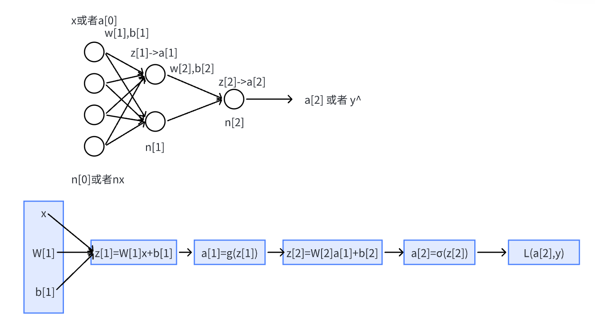

##### 前向传递公式如上

注意图中的每一个节点实际上是m个节点(当考虑向量化处理的时候，即每个样本经过的网络是一样的)

##### 反向传播(BP)公式推导

###### 	一些符号:

$$
\begin{align*}
& \quad n^{[x]}表示第n层节点个数，输入层不算进层数里，此时一共是两层。\\
& \quad W^{[x]},b^{[x]}为\textbf{线性组合的系数，维度不受到样本数的影响}。\\
& \quad x表示一批次的样本,也就是n^{[0]}的个数。\\
& \quad 损失函数L这里使用二分类的损失函数=-[ylog \hat{y}+(1-y)log(1-\hat{y})]
\end{align*}
$$


###### 	规模说明：

$$
\begin{align*}
& \quad n^{[x]}表示第n层节点个数，输入层不算进层数里，此时一共是两层。\\
& \quad z^{[x]}，a^{[x]}为n^{[x]} \times m大小的矩阵(m为样本个数,即对于每一个样本，都有n^{[x]} \times 1的结果)，输入X为n^{[0]} \times m,其中n^{[0]}为输入特征的维度，\\
& Y为n_y \times m,其中n_y为输出特征的维度（若为二分类，则只需输出是/否，维度为1）\\
& \quad W^{[x]}看成是行向量的组合，例如
W^{[2]}为n^{[2]} \times n^{[1]}大小的矩阵，记作\\
&W^{[2]}=\left(\begin{matrix}
 W^{[2](1)}\\
 W^{[2](2)}\\
 W^{[2](3)}\\
 .. \\
 W^{[2](n^{[2]})}
\end{matrix}\right)
，其中W^{[2](i)}表示对于第二层第i个节点的W权重组合。
\end{align*}\\
$$


###### 	推导：

**多样本还不知道该怎么表示求导等运算，只能等后续数学更好的时候补上了!!!**

而且推出1/m的位置跟课程里给的也不大一样，也不知道谁对了，希望是我对！


**一些前置推导/知识：**
$$
y=\frac{1}{1+e^{-x}},易证得y'(x)=y(1-y)\\
一个数对向量求导=该数对向量各分量求导后拼接
$$
**正式推导：**
$$
\begin{align*}
&\textbf{损失函数 J= 所有样本平均损失} = \frac{1}{m}\sum_{i=1}^m L(a^{[2](i)},y^{[i]})
=\frac{1}{m}\sum_{i=1}^m -(y^{(i)}log\hat{y}^{(i)}+(1-y^{(i)})log(1-\hat{y}^{(i)}))\\
&其中i表示第i个样本，y^{(i)}与\hat{y}^{(i)}表示对于第i个样本的实际二分类与输出二分类结果。\\
&=\frac{1}{m}\sum_{i=1}^m -(y^{(i)}loga^{[2](i)}+(1-y^{(i)})log(1-a^{[2](i)}))\\
&=-\frac{1}{m}(yloga^{[2]}+(1-y)log(1-a^{[2]}))——向量化形式,\quad 大小: 1\times 1\\
\end{align*}
$$

**第二层：**
$$
\begin{align*}

\\ &\textbf{单个样本:}对每个神经元求导，每个结果记录在对应行，行间无关系。\\
&\quad \frac{dJ}{da^{[2](i)}}=-\frac{1}{m}[\frac{y^{(i)}}{a^{[2](i)}}-\frac{1-y^{(i)}}{1-a^{[2](i)}}] \quad => \quad \frac{dJ}{da^{[2]}}=-\frac{1}{m}[\frac{y}{a^{[2]}}-\frac{(1-y)}{(1-a^{[2]})}]  ,\quad 大小: n^{[2]}\times 1\\
& \textbf{多个样本:}由于不同样本间不会互相影响，各自算各自的，所以直接堆叠即可，由于y为n^{[2]}\times m，所以最终维度为n^{[2]}\times m\\
\\
\\&由于每个z^{[2](i)}是分别通过影响对应的a^{[2](i)}来影响J的，所以求导时可以分开求导，然后拼起来！

\\& \quad \frac{dJ}{dz^{[2](i)}}=\frac{dJ}{da^{[2](i)}}\frac{da^{[2](i)}}{dz^{[2](i)}}
=-\frac{1}{m}(\frac{y^{(i)}}{a^{[2](i)}}-\frac{1-y^{(i)}}{1-a^{[2](i)}})a^{[2](i)}(1-a^{[2](i)})
=\frac{1}{m}(a^{[2](i)}-y^{(i)}),
\\&=> \frac{dJ}{dz^{[2]}}=\frac{1}{m}(a^{[2]}-y),\quad 大小: n^{[2]}\times 1
\\& => 对于多个样本时:a^{[2]}与y的维度都乘以m,但整个计算过程不变，也是堆叠，大小: n^{[2]}\times m
\\

\end{align*}
$$

$$
\begin{align*}

\\& 由于每个W^{[2](i)}是通过影响对应的z^{[2](i)}来影响J的，所以求导时同样可以分离来求。
\\即
\\& \quad \frac{dJ}{dW^{[2](i)}}=\frac{dJ}{dz^{[2](i)}}\frac{dz^{[2](i)}}{dW^{[2](i)}}
\\
\\&同时，\left(\begin{matrix}
 W^{[2](1)}\\
 W^{[2](2)}\\
 ..\\
 W^{[2](i)}\\
 .. \\
\end{matrix}\right)
\left( a^{[1]}\right)=\left(\begin{matrix}
 z^{[2](1)}\\
 z^{[2](2)}\\
 ..\\
 z^{[2](i)}\\
 .. \\
\end{matrix}\right),其中a^{[1]}为该层针对任一节点统一的输入，即z^{[2](i)}=W^{[2](i)}a^{[1]}+b^{[2](i)},\\
&进一步展开，\\
&z^{[2](i)}=W^{[2](i)(1)}a^{[1](1)}+W^{[2](i)(2)}a^{[1](2)}+...,(由于是对W求导，所以这里就忽略b的项，不影响求导结果)\\
&所以，
\frac{dz^{[2](i)}}{dW^{[2](i)}}
=\left(\begin{matrix}
\frac{dz^{[2](i)}}{dW^{[2](i)(1)}} & .. & \frac{dz^{[2](i)}}{dW^{[2](i)(j)}}  & ..
\end{matrix}\right)
=\left(\begin{matrix}
 a^{[1](1)} &  a^{[1](2)} & ..  & a^{[1](j)} & ..\\
\end{matrix}\right)(由于W^{[2](i)}为1\times n^{[1]}大小，z^{[2](i)}为1\times 1,所以结果大小即为1\times n^{[1]}，即a^{[1](i)}的排列方式为横着排列的)\\
&={a^{[1]}}^T
\\& 所以，
\\
&\quad \frac{dJ}{dW^{[2](i)}}=\frac{dJ}{dz^{[2](i)}}\frac{dz^{[2](i)}}{dW^{[2](i)}}
=\frac{1}{m}(a^{[2]}-y){a^{[1]}}^T \quad => \quad \frac{dJ}{dW^{[2]}}=\frac{1}{m}(a^{[2]}-y){a^{[1]}}^T
=\frac{dJ}{dz^{[2]}} {a^{[1]}}^T,
\quad 大小: (n^{[2]}\times 1) , (1 \times n^{[1]})\\
\\ &多样本时: 大小: (n^{[2]}\times m) , (m \times n^{[1]})\\
\\

\end{align*}
$$

$$
\begin{align*}

\\& J受每个z^{[2](i)}影响(该层多个节点),而每个z^{[2](i)}分别收到b^{[2](i)}影响，即b^{[2](i)}会影响到各个z^{[2](i)}进而影响J,所以是累加b^{[2](i)}对每个z^{[2](i)}到J的影响。
\\& 所以,\frac{dJ}{db^{[2](i)}}=\sum_j\frac{dJ}{dz^{[2](j)}}\frac{dz^{[2](j)}}{db^{[2](i)}}=\frac{dJ}{dz^{[2](i)}}(由于z^{[2](i)}=W^{[2](i)(1)}a^{[1](1)}+W^{[2](i)(2)}a^{[1](2)}+...+b^{[2](i)},所以\frac{dz^{[2](i)}}{db^{[2](i)}}=1)
\\& \quad 所以,\frac{dJ}{db^{[2]}}=\frac{dJ}{dz^{[2]}},
\quad 大小: n^{[2]}\times 1\\
&\quad 多样本时，dz^{[2]}的维度乘以m，但b的维度保持不变，所以需要对样本加权来降低维度=\frac{1}{m}np.sum(dz^{[2]},axis=1,keepdims=True)

\end{align*}
$$
​	

**第一层：**
$$
\begin{align*}

& 由于a^{[1]}对J的影响是通过各个z^{[2](i)}产生的，所以求导（变化率）时是累加效果。\\
&\quad \frac{dJ}{da^{[1]}}=\sum_i \frac{dJ}{dz^{[2](i)}} \frac{dz^{[2](i)}}{da^{[1]}},
\\
\\& 由于z^{[2](i)}=W^{[2](i)(1)}a^{[1](1)}+W^{[2](i)(2)}a^{[1](2)}+...+b^{[2](i)}=\sum_j W^{[2](i)(j)}a^{[1](j)}+b^{[2](i)},
\\& 所以\frac{dz^{[2](i)}}{da^{[1](j)}}=W^{[2](i)(j)}（标量对标量导）,得
\frac{dz^{[2](i)}}{da^{[1]}}=

\left(\begin{matrix}
 W^{[2](i)(1)}\\
 W^{[2](i)(2)}\\
 ..\\
\end{matrix}\right)={W^{[2](i)}}^T,即W的第i行按列来排，
\\&所以，
\\& \quad \frac{dz^{[2](i)}}{da^{[1]}}
=\left(\begin{matrix}
 W^{[2](1)(1)} & .. & W^{[2](i)(1)} & ..& W^{[2](..)(1)}\\
 .. & .. & .. & ..  & ..\\
 .. & .. & .. & ..  & ..\\
\end{matrix}\right)
={W^{[2]}}^T
\\&从而，
\\& \quad \frac{dJ}{da^{[1]}}=\sum_i \frac{dJ}{dz^{[2](i)}} \frac{dz^{[2](i)}}{da^{[1]}}
=\frac{1}{m} \sum_i (a^{[2](i)}-y^{(i)})\left(\begin{matrix}
 W^{[2](i)(1)}\\
 W^{[2](i)(2)}\\
 ..\\
\end{matrix}\right),
形式类似于
\end{align*}
$$

****


$$
\begin{align*}
&所以，\\
&\quad \frac{dJ}{da^{[1]}}=\frac{1}{m} {W^{[2]}}^T (a^{[2]}-y)
={W^{[2]}}^T \frac{dJ}{dz^{[2]}},

\quad 大小: (n^{[1]}\times n^{[2]}) , (n^{[2]} \times 1)\\
\end{align*}
$$

$$
\begin{align*}
&由于a^{[1]}=g(z^{[1]}),对应元素分别使用g函数\\
&所以，\frac{da^{[1](i)}}{dz^{[1](i)}}=g^{[1]'}(z^{[1](i)}) \quad => 
\quad \frac{da^{[1]}}{dz^{[1]}}=g^{[1]'}(z^{[1]}) （对应位置的导数）\\
& => 
\frac{dJ}{dz^{[1]}} = \frac{dJ}{da^{[1]}} * g^{[1]'}(z^{[1]}) （对应位置数乘）
={W^{[2]}}^T \frac{dJ}{dz^{[2]}} * g^{[1]'}(z^{[1]}) ，


\quad 大小: n^{[1]} \times 1\\
\end{align*}
$$


$$
\begin{align*}
& \quad \frac{dJ}{dW^{[1]}} = \frac{dJ}{dz^{[1]}}  \frac{dz^{[1]}}{dW^{[1]}}\\
& 类比可得，\frac{dz^{[1]}}{dW^{[1]}}={a^{[0]}}^T=x^T,所以\\
&\quad \frac{dJ}{dW^{[1]}} = \frac{dJ}{dz^{[1]}} x^T\\
&同理，类比\frac{dz^{[2]}}{db^{[2]}}计算过程，可得\\
& \quad \frac{dJ}{db^{[1]}}=\frac{dJ}{dz^{[1]}},(多样本时有\frac{dJ}{db^{[1]}}=\frac{1}{m}np.sum(dz^{[1]},axis=1,keepdims=True))
\end{align*}
$$


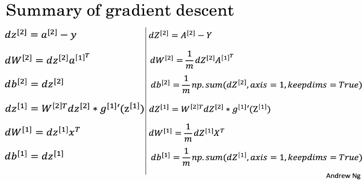


##### 公式整理：

###### 正向传递：

$$
z^{[i]}=W^{[i]}a^{[i-1]}+b^{[i]}\\
a^{[i]}=g^{[i]}(a^{[i]})
$$

###### 反向传播：

$$
\frac{dJ}{dz^{[i]}} = \frac{dJ}{da^{[i]}} * g^{[i]'}(a^{[i]})\\
\frac{dJ}{dW^{[i]}} = \frac{dJ}{dz^{[i]}} {a^{[i-1]}}^T\\
\frac{dJ}{db^{[i]}}= \frac{dJ}{dz^{[i]}}\\
\frac{dJ}{da^{[i-1]}}= {W^{[i]}}^T \frac{dJ}{dz^{[i]}}
$$

结果图:

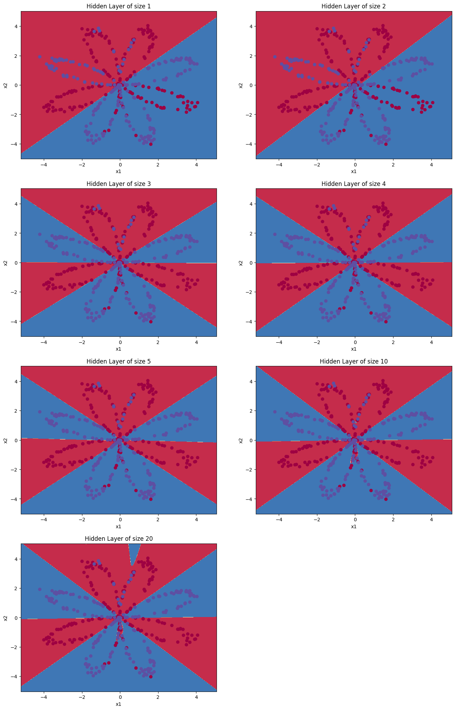


#### 随机初始化：

W需要随机初始化，不能初始化为0，否则所有节点都是对称的，参数完全相同，反向影响也相同。

b可以全初始化为0。


## 4、深层神经网络

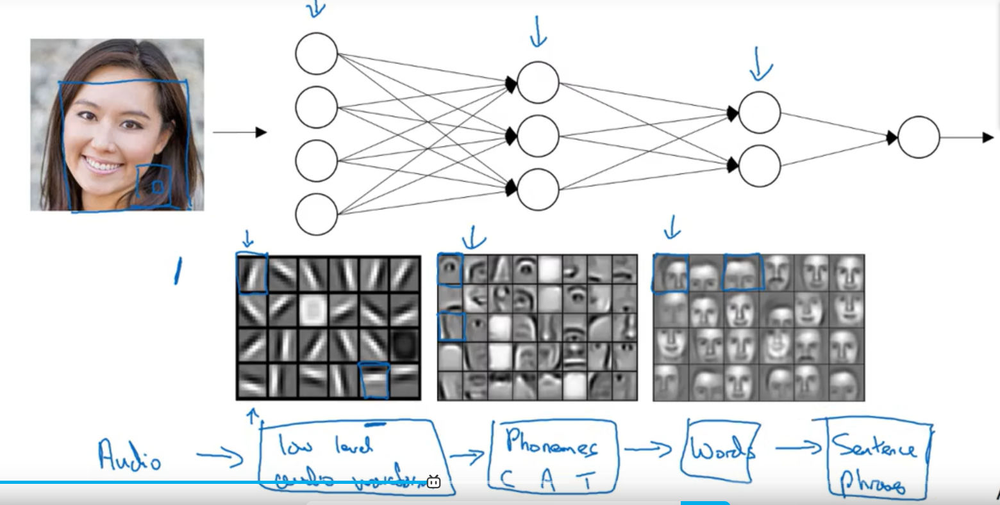

```
  "举个例子，这个小方块（第一行第一列）就是一个隐藏单元，它会去找这张照片里“|”
边缘的方向。那么这个隐藏单元（第四行第四列），可能是在找（“—”）水平向的边缘在哪
里。之后的课程里，我们会讲专门做这种识别的卷积神经网络，到时候会细讲，为什么小
单元是这么表示的。你可以先把神经网络的第一层当作看图，然后去找这张照片的各个边
缘。我们可以把照片里组成边缘的像素们放在一起看，然后它可以把被探测到的边缘组合
成面部的不同部分（第二张大图）。比如说，可能有一个神经元会去找眼睛的部分，另外还
有别的在找鼻子的部分，然后把这许多的边缘结合在一起，就可以开始检测人脸的不同部
分。最后再把这些部分放在一起，比如鼻子眼睛下巴，就可以识别或是探测不同的人脸
（第三张大图）。"
```


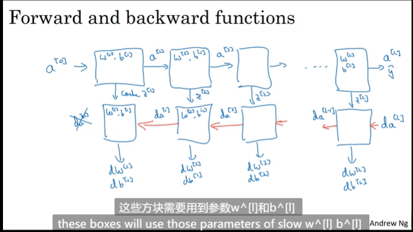

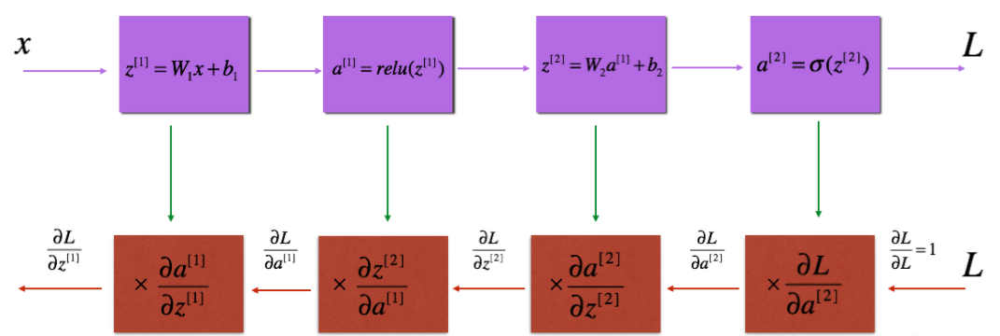

作业效果：


# 第二门课 改善深层神经网络：超参数调试、正则化以及优化(Improving Deep Neural  Networks:Hyperparameter tuning, Regularization and Optimization)


## 一、深度学习的实践层面


### 1、训练，验证，测试集（Train / Dev / Test sets）

在机器学习中，我们通常将样本分成训练集，验证集和测试集三部分，

**Dev目的：找出多个分类器中最优的一个**

**Test目的：正确评估分类器的性能**

数据集规模相对较小，适用传统的划分比例（7：2：1/7：3）

当前第一个趋势：数据集规模较大的，验证集和测试集要小于数据总量的 20%或 10%，具体地

```
比如我们有 100 万条数据，那么取 1 万条数据便足以进行评估，找出其中表现最好的
1-2 种算法。同样地，根据最终选择的分类器，测试集的主要目的是正确评估分类器的性
能，所以，如果拥有百万数据，我们只需要 1000 条数据，便足以评估单个分类器，并且准
确评估该分类器的性能。
```

当前第二个趋势：越来越多的人在训练和测试集分布不匹配的情况下进行训练

```
假设你要构建一个用户可以上传大量图片的应用程序，目的是找出并呈现所有猫咪
图片，可能你的用户都是爱猫人士，训练集可能是从网上下载的猫咪图片，而验证集和测
试集是用户在这个应用上上传的猫的图片，就是说，训练集可能是从网络上抓下来的图片。
而验证集和测试集是用户上传的图片。结果许多网页上的猫咪图片分辨率很高，很专业，
后期制作精良，而用户上传的照片可能是用手机随意拍摄的，像素低，比较模糊，这两类
数据有所不同，针对这种情况，根据经验，我建议大家要确保验证集和测试集的数据来自
同一分布
```


### 2、偏差，方差（Bias /Variance）

#### 偏差与方差的直观概念：

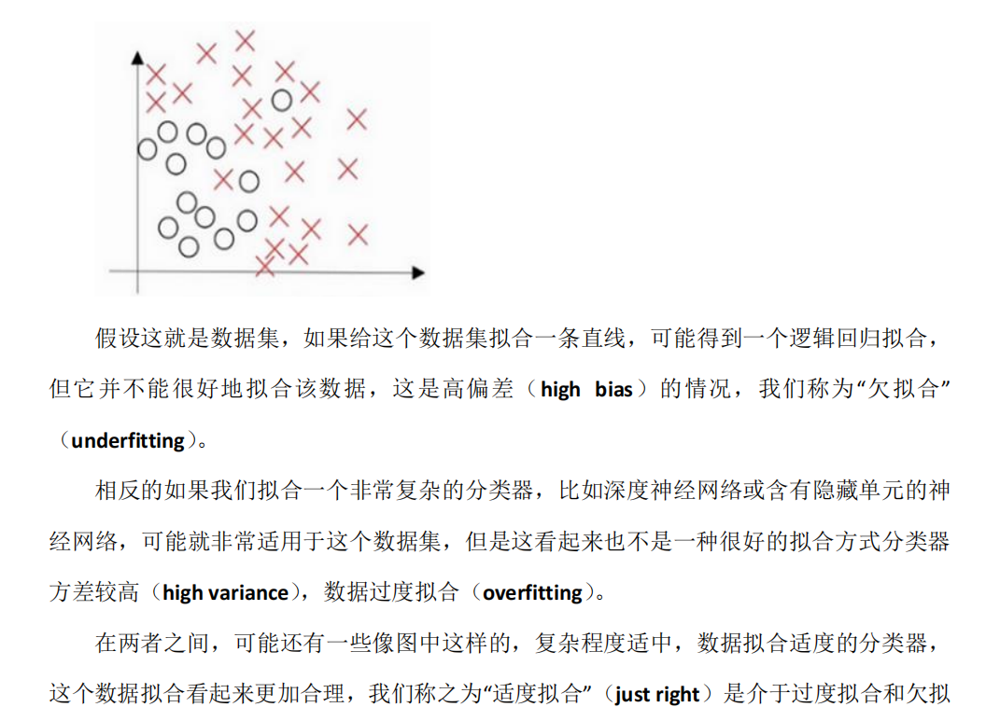

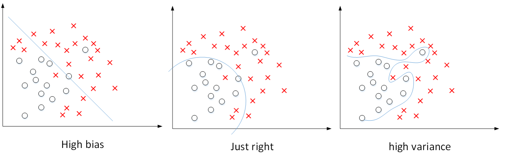


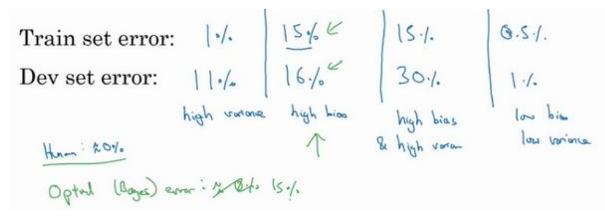


#### 高偏差&高方差的直观例子：

近线性=>高偏差，错误的地方过拟合=>高方差

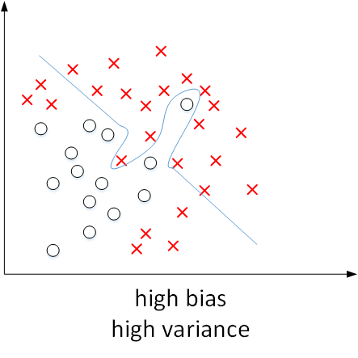


### 3、针对偏差和方差的调整

偏差大：采用规模更大的网络（因为原来网络太简单，学不到关键特征）

方差大：最好的解决办法就是采用更多数据；也可以尝试通过正则化来减少过拟合（主要为了解决过拟合问题/拟合了错误特征）


### 4、正则化（Regularization）


#### 防止过拟合的一类：L1，L2 regularization

**L1正则项**：将**权重参数的绝对值之和**加入到损失函数中，即加入$\frac{\lambda}{m} \sum_{j=1}^{n_x}|w_j|$ (一个系数 * 参数𝑤向量的𝐿1范数)

**L2正则项**:   将**权重参数的平方之和**加入到损失函数中,即加入$\frac{\lambda}{2m} \sum_{j=1}^{n_x} w_j^2$  ( 一个系数 * 参数𝑤向量的𝐿2范数)   (更常用)

```
补充说明:
为什么只对w进行正则化而不对b进行正则化呢？
	其实也可以对b进行正则化。但是一般w的维度很大，而b只是一个常数。相比较来说，参数很大程度上由w决定，改变b值对整体模型影响较小。所以，一般为了简便，就忽略对b的正则化了。
```

以L2正则化为例，

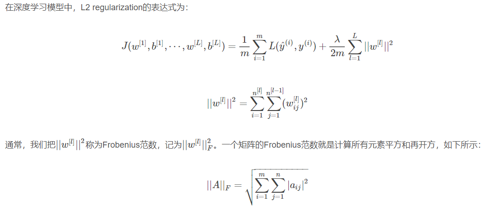

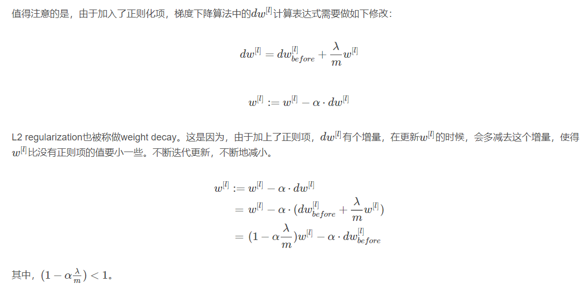


补充计算：$\sum_{l=1}^L||w^{[l]}||^2$对向量$w^{[l]}$求导（常数对向量求导=分别求导组合得到向量），

​	其中由于仅第l项求导后仍剩下，又因为为分别求导，即$w^{{[l](1)}^2}+w^{{[l](2)}^2}+...$分别对$w^{[l](1)},w^{[l](2)}...$求导，即可得到$2w^{[l]}$


### 5、为什么 正则化 有利于 预防 过拟合？

**以L2正则化为例：**

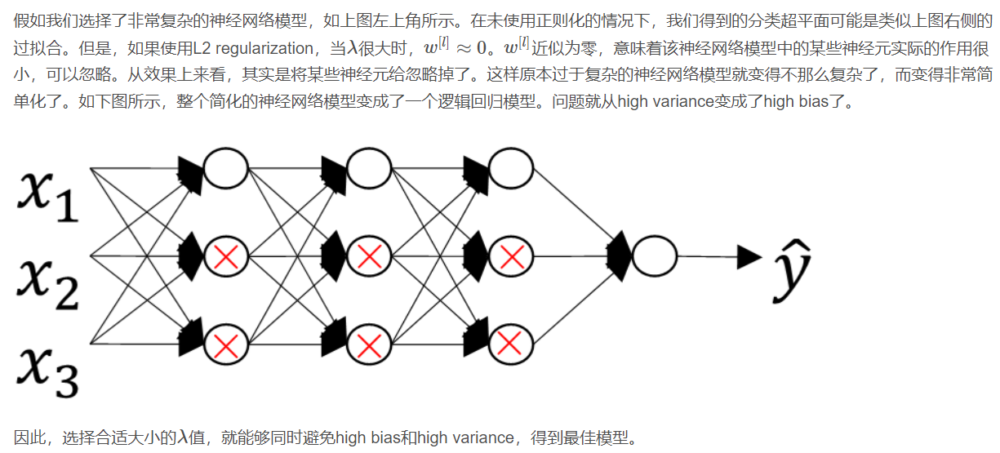


### 6&7、Dropout Regularization

#### 另一种防止过拟合方法：随机失活（Dropout）

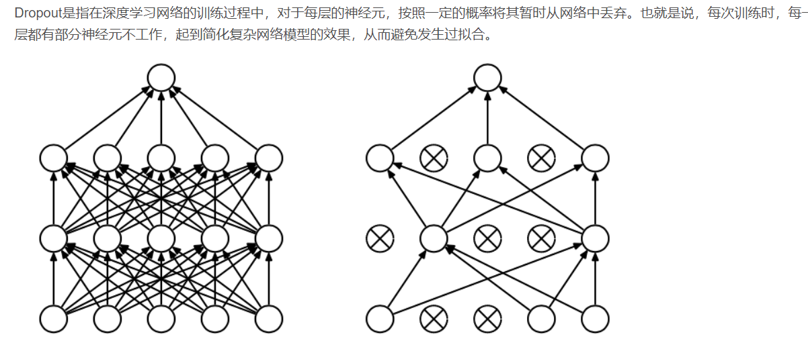

**Dropout的一种：Inverted Dropout**

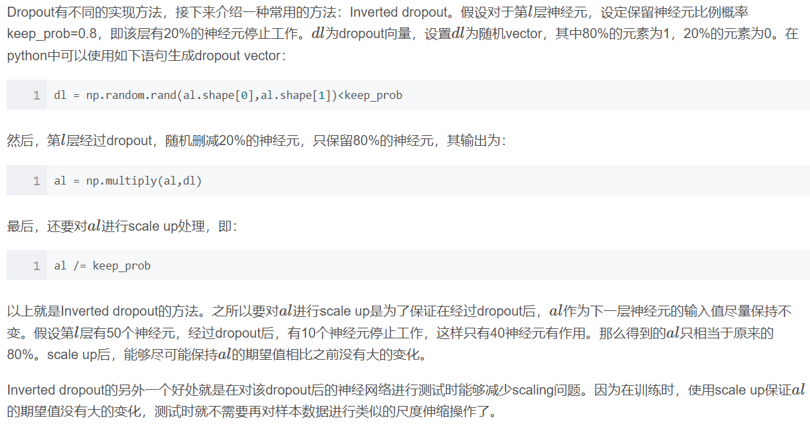


#### Dropout有效的原因：

每次丢掉一定数量的隐藏层神经元，相当于在不同的神经网络上进行训练，这样就**减少了神经元之间的依赖性，即每个神经元不能依赖于某几个其他的神经元**（指层与层之间相连接的神经元），使神经网络更加能学习到与其他神经元之间的更加健壮robust的特征。


#### Dropout使用注意：

1、不同隐藏层的dropout系数keep_prob可以不同。一般来说，**神经元越多的隐藏层，keep_out可以设置得小一些**，例如0.5；神经元越少的隐藏层，keep_out可以设置的大一些，例如0.8，1。

2、**不建议对输入层进行dropout**，如果输入层维度很大，例如图片，那么可以设置dropout，但keep_out应设置的大一些，例如0.8，0.9。总体来说，就是**越容易出现overfitting的隐藏层，其keep_prob就设置的相对小一些**。

3、（Debug建议）使用dropout的时候，可以通过绘制cost function来进行debug，看看dropout是否正确执行。**一般做法是，将所有层的keep_prob全设置为1，再绘制cost function**，即涵盖所有神经元，**看J是否单调下降**。下一次迭代训练时，再将keep_prob设置为其它值。


### 8、防止过拟合方法

- 正则化
- Dropout 

- 增加训练样本数量/数据增强制造更多样本

- early stopping


### 9、归一化输入 Normalize input

- **How:**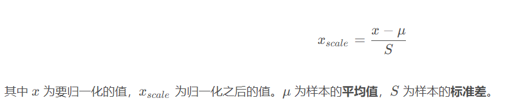

- **Why :** 在训练神经网络时，标准化输入可以**提高训练的速度**。标准化输入就是对训练数据集进行归一化的操作，即将原始数据减去其均值μ后，再除以其方差$σ^2$


- **Notes:** 值得注意的是，由于训练集进行了标准化处理，那么对于**测试集或在实际应用**时，应该使用同样的μ和$σ^2$对其进行标准化处理。这样保证了训练集合测试集的**标准化操作一致**。


### 10&11、梯度消失与梯度爆炸 Vanishing and Exploding gradients

**梯度消失与梯度爆炸描述：**

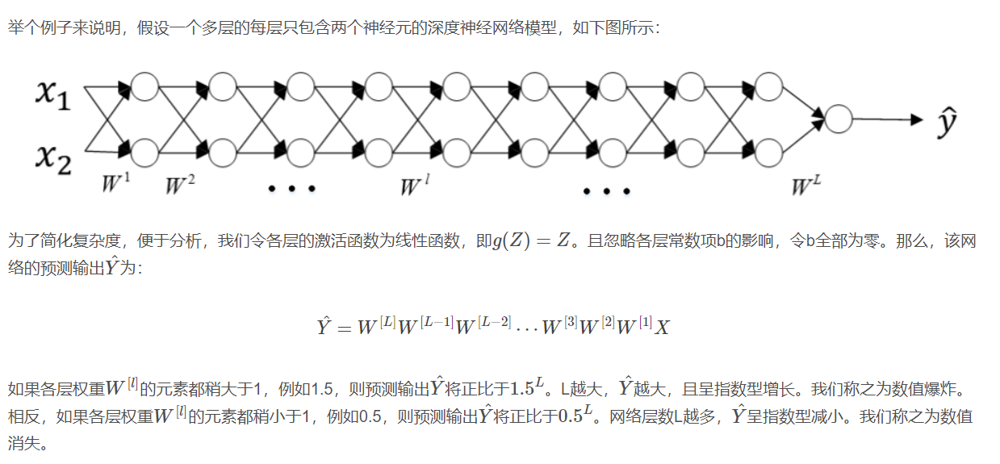

 即，L非常大时，例如L=150，则**梯度会非常大或非常小（因为前面参数非常大/小，所以梯度/变化率要非常小/大，才能使得y^有一定变化），这样就引起每次更新的步进长度过大或者过小**，这让训练过程十分困难。


**解决方法：**让W与n相关，互相限制，防止W构成的参数的累积效果太大/太小，即

- 如果激活函数是tanh， w[l] = np.random.randn(n[l],n[l-1])*np.sqrt(1/n[l-1]) （即缩放$\sqrt{\frac{1}{n^{[l-1]}}}$)
- 如果激活函数是ReLU,  w[l] = np.random.randn(n[l],n[l-1])*np.sqrt(2/n[l-1]) （即缩放$\sqrt{\frac{2}{n^{[l-1]}}}$)
- Yoshua Bengio提出了另外一种初始化w的方法,  w[l] = np.random.randn(n[l],n[l-1]) * np.sqrt(2/n[l-1]*n[l]) （即缩放$\sqrt{\frac{2}{n^{[l-1]}\times n^{[l]}}}$)


### 12&13&14、梯度检验

**Back Propagation神经网络**有一项重要的测试是**梯度检查（gradient checking）**。

- **目的：检查验证反向传播过程中梯度下降算法是否正确**。

- **方法：**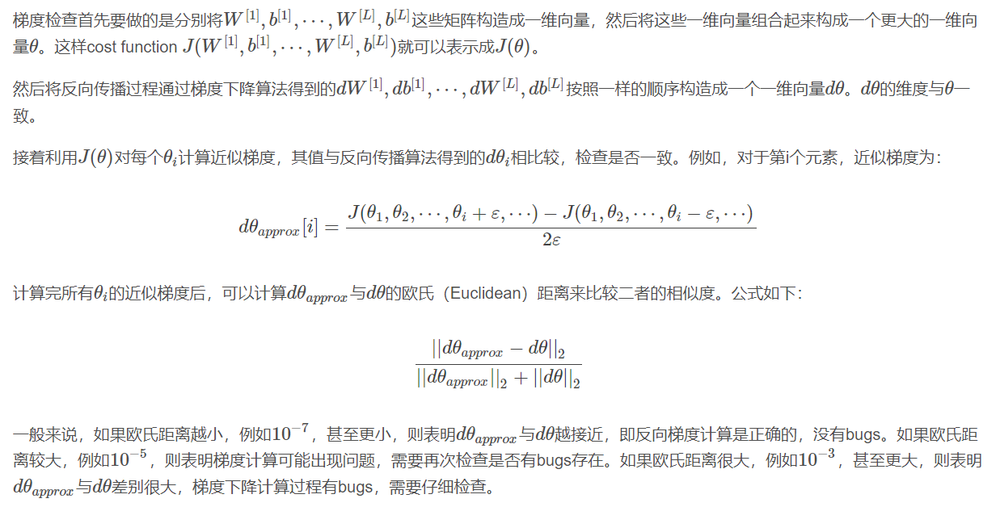

- **技巧与注意：**
  - 不要在整个训练过程中都进行梯度检查，仅仅作为debug使用。（因为梯度检查速度很慢）
  - 如果梯度检查出现错误，找到对应出错的梯度，检查其推导是否出现错误。
  - 注意不要忽略正则化项，计算近似梯度的时候要包括进去。
  - 梯度检查时关闭dropout，检查完毕后再打开dropout。（否则无法知道损失函数的真正计算公式进而无法反向传播求导检查）。
  - 具体可以参见作业的梯度检验部分代码。


## 二、优化算法

### 1、Mini-batch 梯度下降法

**Batch Gradient Descent**：神经网络训练过程是对**所有m个样本，称为batch**，通过**向量化**计算方式，同时进行的。如果m很大，例如达到百万数量级，训练速度往往会很慢，因为每次迭代都要对所有样本进行进行求和运算和矩阵运算。我们将这种梯度下降算法称为**Batch Gradient Descent**。

**Mini-batch Gradient Descent：**可以把**m个训练样本分成若干个子集，称为mini-batches**，这样每个子集包含的数据量就小了，例如只有1000，然后每次在单一子集上进行神经网络训练，速度就会大大提高。这种梯度下降算法叫做**Mini-batch Gradient Descent**。

**Epoch**：经过T次循环之后，**所有m个训练样本都进行了梯度下降计算**。这个过程，我们称之为**经历了一个epoch**。对于Batch Gradient Descent而言，一个epoch只进行一次梯度下降算法；而Mini-Batches Gradient Descent，一个epoch会进行T次梯度下降算法。

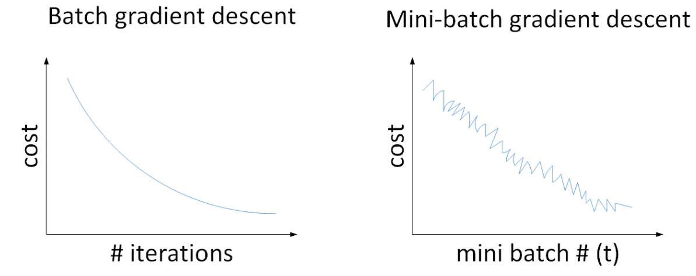


### 2、指数加权平均

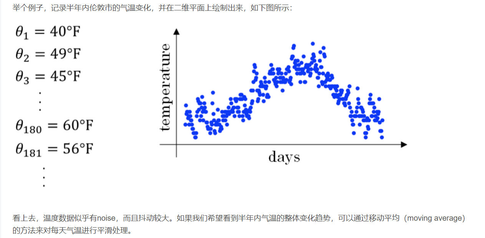

**目的**：希望看到**长时间内某个变量的整体变化趋势**

**公式**：$V_t=βV_{t−1}+(1−β)θ_t$，其中以气温为例，$V_t$表示第t天模型预估的气温，$\theta_t$表示第t天的实际气温，该公式即考虑之前模型的输出与当前的实际节点情况作一个平均。

举个例子，假设$\beta$=0.9,可以看到下面实际上就是**对每个过往时间实际气温作了一个指数的加权处理**

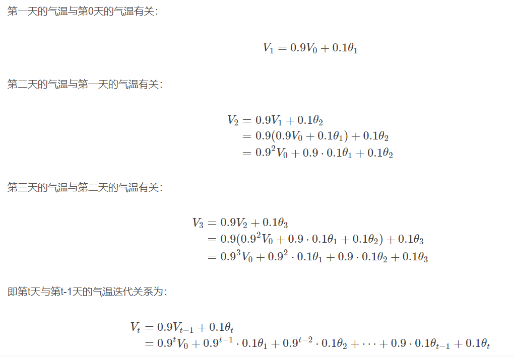

**物理含义：**准确来说，指数加权平均算法跟之前所有天的数值都有关系，根据之前的推导公式就能看出。但是指数是衰减的，一般认为衰减到$\frac{1}{e}$就可以忽略不计了。

因为$(1-\frac1N)^N=\frac1e$当N趋于无穷，所以$\beta^{\frac{1}{1-\beta}}=\frac1e$当$\beta$趋近与1,

而由上述$V_t$的公式可知，考虑最近的第x天实际值的系数为$\beta^{x}\times(1-\beta)$,所以当x=$\frac{1}{1-\beta}$时，近似系数为$\frac{1}{e}$,

即可以认为**指数加权平均的天数为$\frac{1}{1-\beta}$**。


**一些修正：**

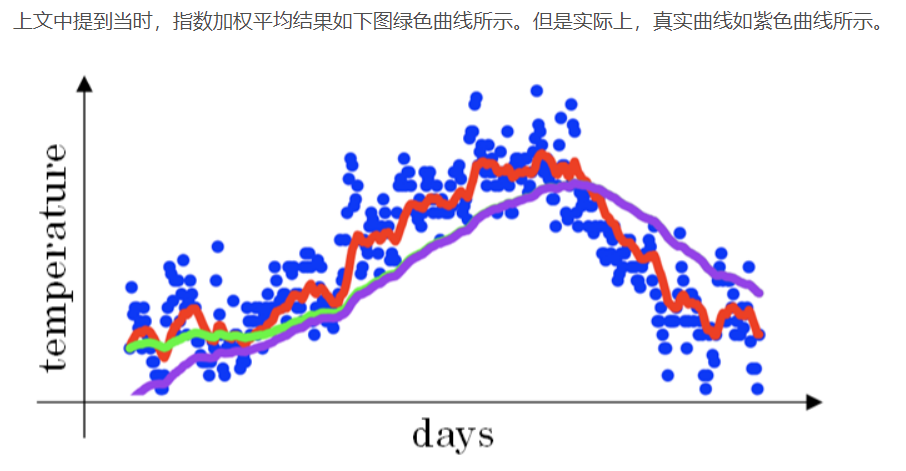

紫色曲线与绿色曲线的区别是，**紫色曲线开始的时候相对较低一些**。这是因为开始时我们设置，所以**初始值会相对小一些**，直到后面受前面的影响渐渐变小，趋于正常。

修正这种问题的方法是进行**偏移校正（bias correction）**，即在每次计算完后，对进行下式处理：$\frac{V_t}{1-\beta^t}$

在刚开始的时候，t比较小，这样就将$V_t$修正得更大一些，效果是把紫色曲线开始部分向上提升一些，与绿色曲线接近重合。随着t增大，修正近似不变，紫色曲线与绿色曲线近似重合。


### 3、动量梯度下降算法（Gradient descent with momentum）

其速度要比传统的梯度下降算法快很多。做法是在每次训练时，**对梯度进行指数加权平均处理**，然后**用得到的梯度值更新权重W和常数项b**。


**目的：** 原始的梯度下降算法如上图蓝色折线所示。在梯度下降过程中，梯度下降的振荡较大，尤其对于W、b之间数值范围差别较大的情况。此时每一点处的梯度只与当前方向有关，产生类似折线的效果，前进缓慢。而如果**对梯度进行指数加权平均**，这样使当前梯度不仅与当前方向有关，还与之前的方向有关，这样处理**让梯度前进方向更加平滑(之前的振荡相互抵消)，减少振荡，能够更快地到达最小值处。**

**公式：**
$$
V_{dW}=\beta\cdot V_{dW}+(1-\beta)\cdot dW  \\
V_{db}=\beta\cdot V_{db}+(1-\beta)\cdot db  \\
W=W-\alpha V_{dW} \\
b=b-\alpha V_{db} \\
$$


### 4、RMSprop(Root Mean Square Prop,均方根传播)

**公式：**
$$
S_{dW}=\beta S_{dW}+(1-\beta)dW^2\\
S_{db}=\beta S_{db}+(1-\beta)db^2\\
W:=W-\alpha \frac{dW}{\sqrt{S_{dW}}},\ b:=b-\alpha \frac{db}{\sqrt{S_{db}}}\\
$$
以下图为例，为了便于分析，假设**水平方向为W的方向，垂直方向为b的方向**。

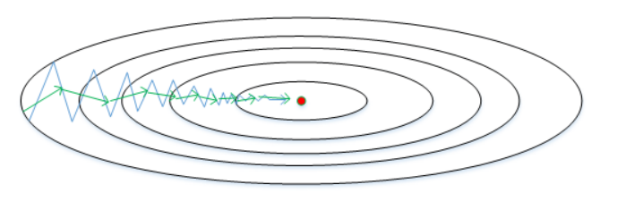

从图中可以看出，梯度下降（蓝色折线）在垂直方向（b）上振荡较大，在水平方向（W）上振荡较小，表示在b方向上梯度较大，即db较大，而在W方向上梯度较小，即dW较小。因此，上述表达式中Sdb较大，而SdW较小。在更新W和b的表达式中，变化值$\frac{d_W}{S_dW}$较大，而$\frac{d_b}{S_db}$较小。也就使得W变化得多一些，b变化得少一些。即加快了W方向的速度，减小了b方向的速度，减小振荡，实现快速梯度下降算法，其梯度下降过程如绿色折线所示。总得来说，就是如果**哪个方向振荡大，就减小该方向的更新速度，从而减小振荡**。


### 5、Adam 优化算法

结合了动量梯度下降算法和RMSprop算法。


**Adam算法超参数**

Adam算法包含以下超参数:

1. Learning rate, \( $\alpha$ \)
2. Momentum term, \( $\beta_1$ \)
3. RMSprop term, \( $\beta_2 $\)
4. Smoothing term, \( $\epsilon$ \)

常用的默认值如下:

- \( $\beta_1$ \): 通常设置为 0.9
- \( $\beta_2$ \): 通常设置为 0.999
- \( $\epsilon$ \): 通常设置为 \( 10^{-8} \)

在实际应用中，大多数情况下只需要对 \( $\beta_1$ \) 和 \( $\beta_2$ \) 进行调试。


### 6、学习率衰减 Learning Rate Decay

常用学习率公式：
$$
\begin{align*}
&\alpha=\frac{1}{1+decay\_rate*epoch}\alpha_0\\
\\
&\alpha=0.95^{epoch}\cdot \alpha_0\\
\\
&\alpha=\frac{k}{\sqrt{epoch}}\cdot \alpha_0\ \ \ \ or\ \ \ \ \frac{k}{\sqrt{t}}\cdot \alpha_0(其中，k为可调参数，t为mini-bach number)\\

\end{align*}
$$


### 7、局部最优问题

- 只要选择合理的强大的神经网络，一般不太可能陷入local optima
- Plateaus可能会使梯度下降变慢，降低学习速度


## 三、超参数调试、Batch正则化和编程框架


### 1、调试处理Tuning Process

#### 神经网络超参数

- 学习因子 (α)：学习率（最重要）
- 动量梯度下降因子 (β)：动量（重要性仅次于α）
- Adam算法参数 (β₁, β₂, ε) （常用默认的）
- 神经网络层数 (#layers)  (再次)
- 各隐藏层神经元个数 (#hidden units)（重要性仅次于α）
- 学习因子下降参数 (learning rate decay) (再次)
- 批量训练样本包含的样本个数 (mini-batch size)（重要性仅次于α）

#### 常用方法

- 随机采样

  - 尺度均匀采样

  - 尺度非均匀采样

    - 对于某些超参数，可能需要非均匀随机采样（即非均匀刻度尺）。例如超参数α，待调范围是[0.0001, 1]。如果使用均匀随机采样，那么有90%的采样点分布在[0.1, 1]之间，只有10%分布在[0.0001, 0.1]之间。这在实际应用中是不太好的，因为最佳的α值可能主要分布在[0.0001, 0.1]之间，而[0.1, 1]范围内α值效果并不好。因此我们更关注的是区间[0.0001, 0.1]，应该在这个区间内**细分更多刻度**。

    - 通常的做法是将**linear scale转换为log scale**，**将均匀尺度转化为非均匀尺度**，然后再在log scale下进行均匀采样。这样，[0.0001, 0.001]，[0.001, 0.01]，[0.01, 0.1]，[0.1, 1]各个区间内随机采样的超参数个数基本一致，也就扩大了之前[0.0001, 0.1]区间内采样值个数。

    - 在超参数调优中，与学习率（α）一样，**动量梯度因子（β）也需要进行非均匀采样**。通常，β的取值范围在**[0.9, 0.999]之间，因此1−β的取值范围在[0.001, 0.1]之间。为了采样1−β在这区间内，可以进行对数变换**。

      为什么需要对β进行非均匀采样呢？假设β从0.9000变化到0.9005，那么**1−β基本没有变化。但如果β从0.9990变化到0.9995，那么1−β前后的差别就是1000。当β接近1时，指数加权平均的项数越多，变化也越大。**因此，对于接近1的β值，应该更密集地采样。

      以上内容解释了为什么需要对β进行非均匀采样以及如何进行1−β的区间内的log变换。


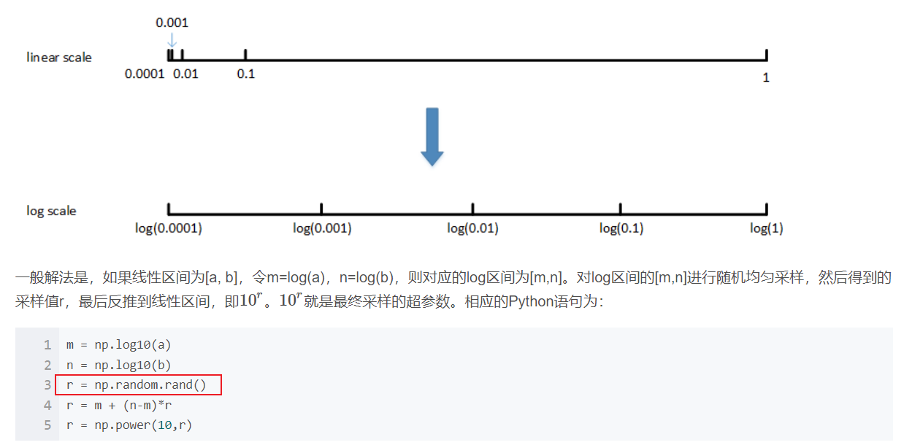


### 2、超参数训练的两种方式（Pandas vs Caviar）

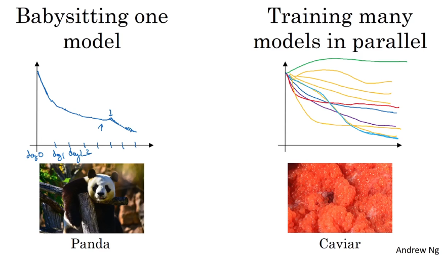

一种情况是受计算能力所限，我们只能对一个模型进行训练，调试不同的超参数，使得这个模型有最佳的表现。我们称之为Babysitting one model(Pandas)。

另外一种情况是可以对多个模型同时进行训练，每个模型上调试不同的超参数，根据表现情况，选择最佳的模型。我们称之为Training many models in parallel(Caviar)。


### 3、Batch Normalization（批量标准化）

#### 单层具体做法：

在神经网络中，第l层隐藏层的输入是第l−1层隐藏层的输出A[l−1]. 对A[l−1]进行标准化处理可以**提高W[l]和b[l]的训练速度和准确度**。这标准化处理就是**Batch Normalization**。在实际应用中，**通常对Z[l−1]进行标准化处理而不是A[l−1]，尽管差别不是很大**。

Batch Normalization**对第l层隐藏层的输入$Z^{[l−1]}$进行如下标准化处理**，忽略上标[l−1]：
$$
\mu=\frac1m\sum_iz^{(i)}:均值\\
\sigma^2=\frac1m\sum_i(z_i-\mu)^2:方差\\
z^{(i)}_{norm}=\frac{z^{(i)}-\mu}{\sqrt{\sigma^2+\varepsilon}}:标准化\\
$$
其中，m是单个mini-batch包含的样本个数，ε是为了防止分母为零，可取值$10^{-8}$。这样，使得该隐藏层的所有输入$z^{(i)}$均值为0，方差为1。

**然而，通常并不希望所有的z(i)均值都为0和方差都为1，因此需要进一步处理：**
$$
\tilde z^{(i)}=\gamma\cdot z^{(i)}_{norm}+\beta
$$
其中，γ和β是可学习参数，类似于W和b，可以通过梯度下降等算法求得。γ和β的作用是让$\tilde z^{(i)}$的均值和方差为任意值，只需调整其值即可。例如，令：

$\gamma=\sqrt{\sigma^2+\varepsilon},\ \ \beta=u$

可以得到的$\tilde z^{(i)}$，**通过设置不同的γ和β值，可以获得任意均值和方差。**

这样，通过Batch Normalization，对隐藏层的各个$z^{[l] (i)}$进行标准化处理，得到$\tilde z^{[l](i)}$，替代$z^{[l] (i)}$。

值得注意的是，输入的标准化处理Normalizing inputs和隐藏层的标准化处理Batch Normalization是有区别的。

- Normalizing inputs使所有**输入的均值为0，方差为1**。

- 而Batch Normalization可使各**隐藏层输入的均值和方差为任意值**。实际上，**从激活函数的角度(例如Sigmoid激活函数)来说，如果各隐藏层的输入均值在靠近0的区域即处于激活函数的线性区域，这样不利于训练好的非线性神经网络，得到的模型效果也不会太好。**这也解释了为什么需要用γ和β来对$z^{[l] (i)}$作进一步处理。


#### 多层具体做法：

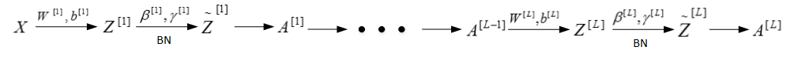

由于Batch Normalization对各隐藏层$Z^{[l]}$的输入进行**去均值操作**，**常数项$b^{[l]}$的影响可以被消除**，其数值效果完全可以由$\tilde z^{[l]}$中的β来实现。 在神经网络中，常数项$b^{[l]}$的值通常会对隐藏层的输出产生影响，但在**应用Batch Normalization后**，这种影响可以通过$\tilde z^{[l]}$中的可学习参数β来实现，而**常数项b[l]的具体值在这一过程中可以被忽略**。


#### 效果

- 收敛速率增加
- 模型更稳定（对各隐藏层输出$Z^{[l]}$进行均值和方差的归一化处理，$W^{[l]}$
  和$B^{[l]}$更加稳定


#### 测试时如何使用？

训练过程中，Batch Norm是对单个mini-batch进行操作的

而测试时由于是一个一个样本进行的，所以不可能对整体计算$\mu$和$\sigma^2$,所以采用训练集的参数，利用移动平均来得到需要的$\mu$和$\sigma^2$,即
$$
new\_average=β×old\_average+(1−β)×current\_value
$$


### 4、Softmax回归

多分类问题——Logistics分类的更一般形式

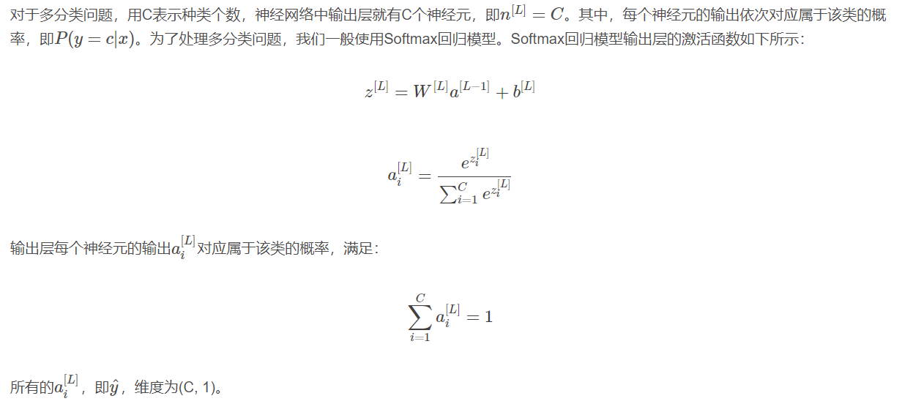

使用的损失函数
$$
L(\hat y,y)=-\sum_{j=1}^Cy_j\cdot log\ \hat y_j
$$

### 5、TensorFlow 框架

简单示例代码

```python
import numpy as np
import tensorflow as tf

cofficients = np.array([[1.],[-10.],[25.]])

w = tf.Variable(0,dtype=tf.float32)
x = tf.placeholder(tf.float32,[3,1]) #placeholder——可以后续赋值的
#cost = tf.add(tf.add(w**2,tf.multiply(-10,w)),25)
#cost = w**2 - 10*w +25
cost = x[0][0]*w**2 + x[1][0]*w + x[2][0]
train = tf.train.GradientDescentOptimizer(0.01).minimize(cost)

#全局变量等
init = tf.global_variables_initializer()
session = tf.Session()
session.run(init)
print(session.run(w))

#运行1次
session.run(train, feed_dict=(x:coefficients))
print(session.run(w))

#运行1000次
for i in range(1000):
    session.run(train, feed_dict=(x:coefficients))
print(session.run(w))
```


# 第三门课 结 构 化 机 器 学 习 项 目（Structuring Machine Learning Projects）


## 一、机器学习策略(上)

### 1、Why ML Strategy

目的：使用快速、有效的策略来优化机器学习模型

### 2、Strategy 1：正交化

Orthogonalization的核心在于**每次调试一个参数只会影响模型的某一个性能**。例如老式电视机旋钮，每个旋钮就对应一个功能，调整旋钮会调整对应的功能，而不会影响其它功能。也就是说**彼此旋钮之间是互不影响的，是正交的**


对应到机器学习监督式学习模型中，可以大致分成四个独立的“功能”，每个“功能”对应一些可调节的唯一的旋钮。四个“功能”如下：

- **Fit training set well on cost function**
- **Fit dev set well on cost function**
- **Fit test set well on cost function**
- **Performs well in real world**

| 旋钮                      | 解决方法                                           | 考虑解决的问题                                               |
| ------------------------- | -------------------------------------------------- | ------------------------------------------------------------ |
| Training Set   对应“旋钮” | Larger Network ; Different Optimization(like Adam) | 解决模型过于简单问题/Human-level与Traning error差距过大，超过Dev error与Training error的差距 |
| Dev Set  对应“旋钮”       | more training samples ; Regularization（正则化）   | 解决过拟合问题                                               |
| Test Set  对应“旋钮”      | more dev set samples                               | 解决dev set测得可能不够充分问题                              |
| Real Work     对应“旋钮”  | change test set ; use new cost function            | 解决cost可能跟实际不符问题/test set分布跟实际不符            |


### 3、Strategy 2：单值评价指标

将多指标的评价**整合成一个指标**，用以迅速评价哪个模型更好

- 1个作为优化指标（e.g Optimize accuracy），其他作为满足指标（e.g. $time \leq 100ms$）
- 各指标加权作为最终指标
- ...


### 4、Strategy 3：设立Train,Dev,Test Set

- Dev与Test Set的数据分布要近似一致（随机分配到两边）


## 二、机器学习策略(下)

### 1、错误分析（error analysis）

人工**从错误样本中进行统计**，判断其是受到了什么的影响，列一个表，从中找到主要影响因素并进行优化。

```
	我们可以从分类错误的样本中统计出狗类的样本数量。根据狗类样本所占的比重，判断这一问题的重要性。假如狗类样本所占比重仅为5%，即时我们花费几个月的时间扩大狗类样本，提升模型对其识别率，改进后的模型错误率最多只会降低到9.5%。相比之前的10%，并没有显著改善。我们把这种性能限制称为ceiling on performance。相反，假如错误样本中狗类所占比重为50%，那么改进后的模型错误率有望降低到5%，性能改善很大。因此，值得去花费更多的时间扩大狗类样本。
```

作出统计表，如下：

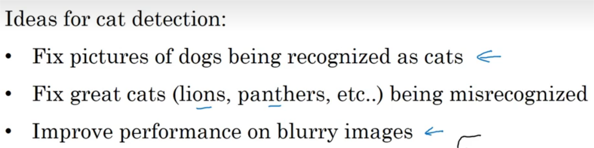

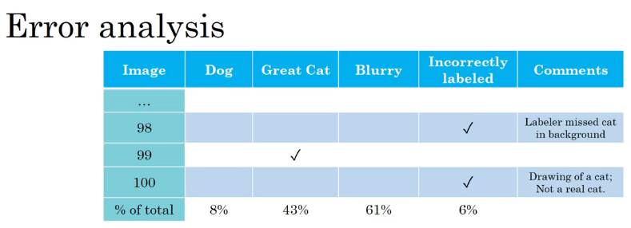

### 2、清除错误标记的数据

统计**dev sets中所有分类错误的样本**中**incorrectly labeled data所占的比例**，看其占error rate的占比来决定是否特地处理错误标记数据

注意，系统性标记错误是需要处理的，e.g 白色的狗都标记成猫


### 3、Training and testing on different distribution

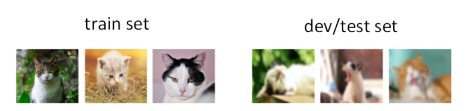

以猫类识别为例，train set来自于网络下载（webpages），图片比较清晰；dev/test set来自用户手机拍摄（mobile app），图片比较模糊。假如train set的大小为200000，而dev/test set的大小为10000，显然train set要远远大于dev/test set。

此时的**推荐做法**为：**train为网络下载(+手机拍摄）,dev/test全为手机拍摄（确保目标的数据分布与实际相同）**


### 4、 Bias and Variance with mismatched data distributions

当train set与dev/test set的数据分布不匹配时，如何分析Bias（human level & train error）和Variance(train error& dev error)并进行调整

例如某个模型

| Error Type        | Error Rate |
| ----------------- | ---------- |
| human-level error | 0%         |
| training error    | 1%         |
| dev error         | 10%        |

根据我们之前的理解，若数据分布一致，显然该模型出现了variance。

但是由于train与dev分布不同，所以此时的9%有两种可能：

- **由于train没有见过dev的数据而导致的error**
- **单纯由于数据分布不同而导致的error**

所以，引入 **train-dev set**（从train中shuffle中一部分数据，不进行训练，用于测试），用于检测是不是第一种可能。

举例说明，

| Exp1               |                                                            |      | Exp2               |                                                              |
| ------------------ | ---------------------------------------------------------- | ---- | ------------------ | ------------------------------------------------------------ |
| training error     | 1%                                                         |      | training error     | 1%                                                           |
| training-dev error | 9%                                                         |      | training-dev error | 1.5%                                                         |
| dev error          | 10%                                                        |      | dev error          | 10%                                                          |
| 结论               | （8%说明没讲过数据对结果影响较大）**variance问题比较突出** |      | 结论               | （8.5差距说明是因为数据分布不一致导致的问题）**data mismatch problem比较突出** |

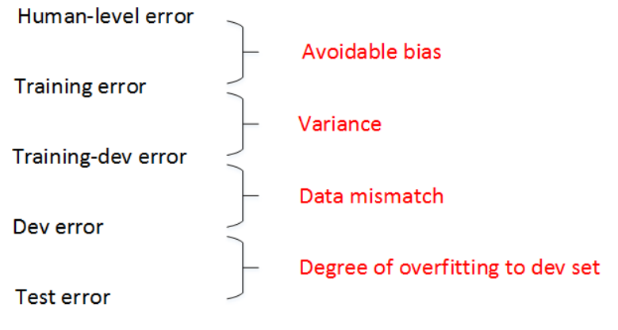


### 5、解决数据分布不匹配问题

方法：采用 **error analysis** 去分析出主要影响因素，比如train set与dev set的区别在哪里，更具体地，

- **Make training data more similar**
  - **人工数据合成**的方法（artificial data synthesis）。例如说话人识别问题，实际应用场合（dev/test set）是包含背景噪声的，而训练样本train set很可能没有背景噪声。为了让train set与dev/test set分布一致，我们可以在train set上人工添加背景噪声，合成类似实际场景的声音。
  - 不能给每段语音都增加同一段背景噪声，这样会出现对背景噪音的**过拟合**，效果不佳。这就是人工数据合成需要注意的地方。
- **collect more data similar to dev/test sets**


### 6、迁移学习 Transfer Learning

将已经训练好的模型的一部分知识（网络结构）直接应用到另一个类似模型中去。

如果我们已经有一个训练好的神经网络，用来做图像识别。现在，我们想要构建另外一个通过X光片进行诊断的模型。迁移学习的做法是**无需重新构建新的模型**，而是利用之前的神经网络模型，**只改变样本输入、输出以及输出层的权重系数W[L], b[L]**。也就是说**对新的样本(X,Y)，重新训练**输出层权重系数W[L], b[L]，而**其它层所有的权重系数W[l], b[l]保持不变**。
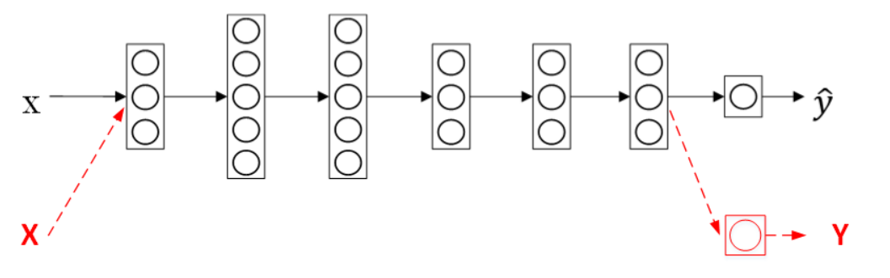

**适用场景：**

- Task A and B have the **same input x.**


- You have a lot **more data for Task A** than Task B.


- **Low level features from A could be helpful for learning B.**
  - 例如，神经网络浅层部分能够**检测出许多图片固有特征**，e.g. 图像边缘、曲线等。而使用之前训练好的神经网络部分（原有训练图像识别）结果有助于我们更快更准确地提取X光片特征。


### 7、多任务学习（multi-task learning）

构建神经网络同时执行多个任务。这跟二元分类或者多元分类都不同，多任务学习类似将多个神经网络融合在一起，用一个网络模型来实现多种分类效果。如果有C个，那么输出y的维度是(C,1)。例如汽车自动驾驶中，需要实现的多任务为行人、车辆、交通标志和信号灯。如果检测出汽车和交通标志，则y为：
$$
y=
\left[
 \begin{matrix}
   0\\
   1\\
   1\\
   0
  \end{matrix}
  \right]
$$
**适用场景：**

- Training on a set of tasks that could benefit from having **shared lower-level features**.
- Usually: **Amount of data** you have for each task is **quite similar**.
- Can train a **big enough neural network to do well on all the tasks**.


### 8、端到端深度学习 End-to-End

将所有不同阶段的数据处理系统或学习系统模块组合在一起，用一个单一的神经网络模型来实现所有的功能。它将所有模块混合在一起，**只关心输入和输出**。

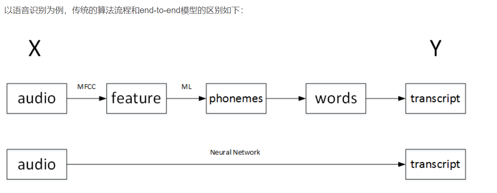

**优点：**

- **Let the data speak**
- **Less hand-designing of components needed**

**缺点：**

- **May need large amount of data**
- **Excludes potentially useful hand-designed**


# 第四门课 卷积神经网络（Convolutional Neural Networks）

## 一、卷积神经网络基础

### 1、边缘检测&卷积

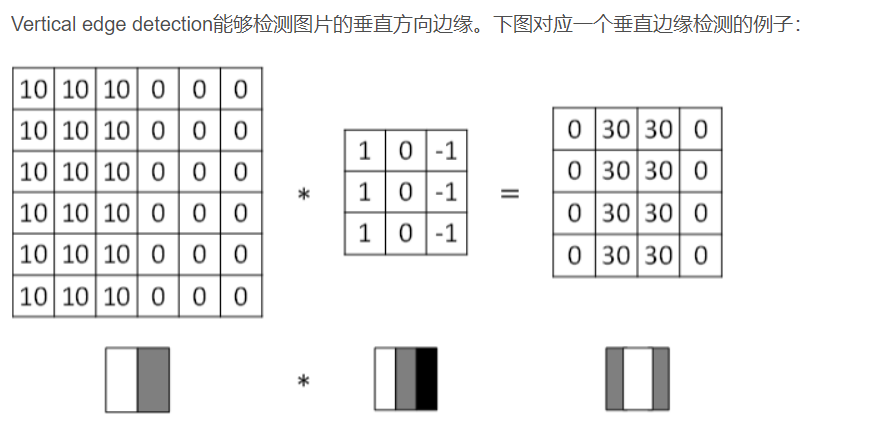

#### 边缘检测器设计的原因：

其实目的就是要找出变化/突变的边，可以近似转换成两侧的差值->即两侧的值同样权值进行对减，

又因为是减法，所以就把一侧的权重换成相反数，然后统一成加法即可。

即上面见到的
$$
\left(\begin{matrix}
1 & 0 & -1\\
1 & 0 & -1\\
1 & 0 & -1\\
\end{matrix}\right)
$$


#### 其他常见边缘检测器：

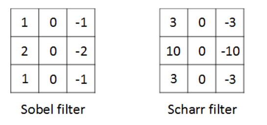


#### 相关系数（cross-correlations）与卷积（convolutions）的区别：

- 真正的**卷积**运算会先将**filter绕其中心旋转180度**，**然后再将旋转后的filter在原始图片上进行滑动计算**。filter旋转如下所示：

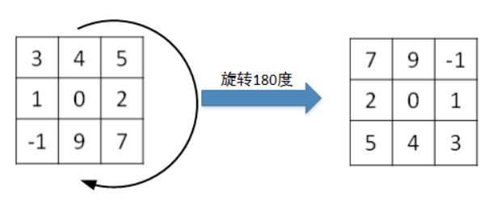

- **相关系数的计算过程则不会对filter进行旋转**，而是**直接在原始图片上进行滑动计算**。

但是，为了简化计算，我们一般把CNN中的这种“相关系数”就称作卷积运算。之所以可以这么等效，是因为滤波器算子一般是水平或垂直对称的，180度旋转影响不大；而且最终滤波器算子需要通过CNN网络梯度下降算法计算得到，旋转部分可以看作是包含在CNN模型算法中。总的来说，忽略旋转运算可以大大提高CNN网络运算速度，而且不影响模型性能。


### 2、三维卷积

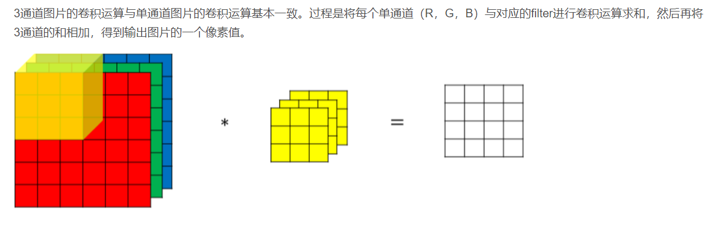


### 3、卷积神经网络

#### 卷积层 Convolution

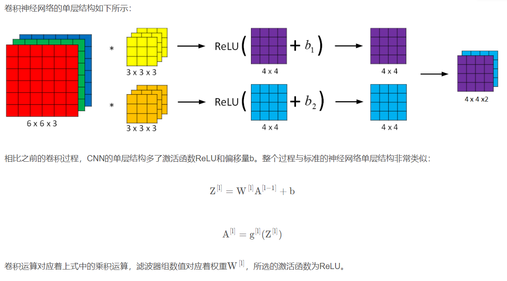

##### 一些符号设定

设层数为 $l$ ,
$$
\begin{align}
& f^{[l]} = \text{filter size} \\
& p^{[l]} = \text{padding} \\
& s^{[l]} = \text{stride} \\
& n_c^{[l]} = \text{number of filters}
\end{align}
$$

**输入维度**为：\( $n_H^{[l-1]} \times n_W^{[l-1]} \times n_c^{[l-1]}$ \)

每个**滤波器组维度**为：\( $f^{[l]} \times f^{[l]} \times n_c^{[l-1]}$ \)

**权重维度**为：\( $f^{[l]} \times f^{[l]} \times n_c^{[l-1]} \times n_c^{[l]}$ \)

**偏置维度**为：\( $1 \times 1 \times 1 \times n_c^{[l]}$ \)

**输出维度**为：\( $n_H^{[l]} \times n_W^{[l]} \times n_c^{[l]} $\)

其中，

$$
\begin{align}
& n_H^{[l]} = \left\lfloor \frac{n_H^{[l-1]} + 2p^{[l]} - f^{[l]}}{s^{[l]}} + 1 \right\rfloor \\
& n_W^{[l]} = \left\lfloor \frac{n_W^{[l-1]} + 2p^{[l]} - f^{[l]}}{s^{[l]}} + 1 \right\rfloor
\end{align}
$$

如果有 m 个样本，进行向量化运算，相应的输出维度为：\( $m \times n_H^{[l]} \times n_W^{[l]} \times n_c^{[l]}$ \)


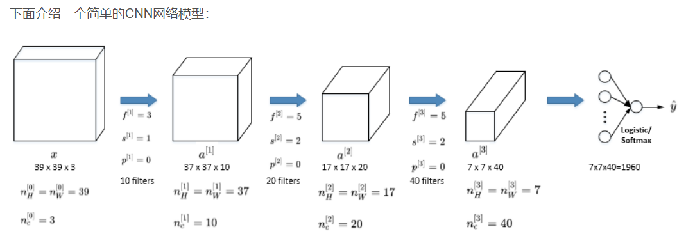

- 一般而言，随着CNN层数增加，$n_H^{[l]} 和n_W^{[l]} 一般逐渐减小，而n_c^{[l]} 一般逐渐增大$

- **每个filter对应提取的一种特征**，且最后一个维度与上一层的channel维度值一样(确保一个filter纵向层仅一层)

  

#### 池化层 Pooling

就两个参数，**filter_size，stride_size**并且是不需要进行学习的超参数，**一般不使用padding**(即p=0)

**但本质上与Conv一样，也是两个内容作运算，只是做的运算不同**

- Max Pooling

  - Pooling layers的做法比convolution layers简单许多，没有卷积运算，仅仅是在滤波器算子滑动区域内取最大值，即**max pooling，这是最常用的做法**。

    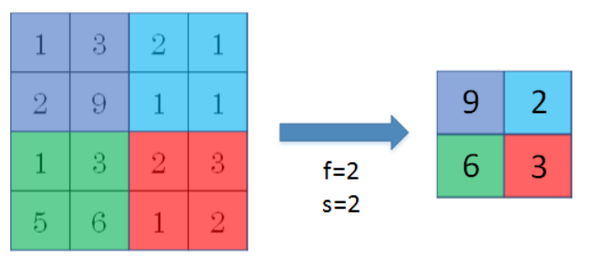

- Average Pooling

  - 滑动区域里取平均值

  

#### 全连接层 FC

变成一列


#### 一个具体完整卷积神经网络的例子（数字识别）

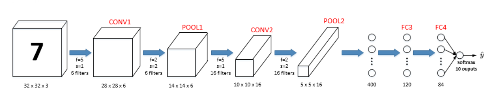
