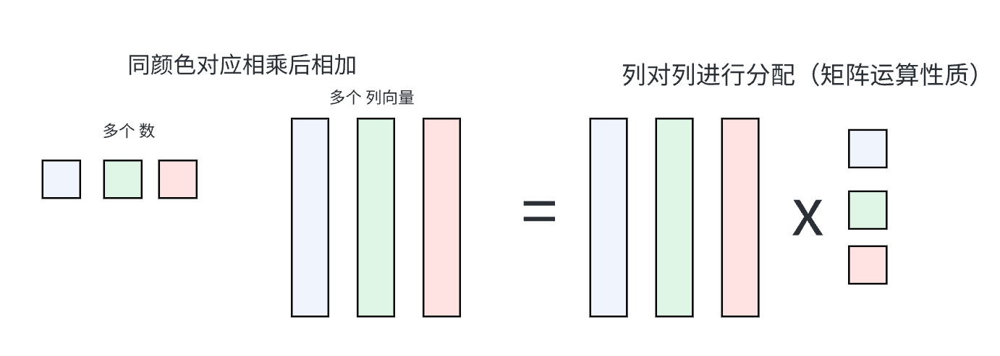

吴恩达Deep Learning 学习笔记


[TOC]


# 第一门课 神经网络和深度学习(Neural Networks and Deep Learning)


## 1、Logstic Regression(回归)

#### 1、理解w=w-α *df/dw 为什么是这样?

https://zhuanlan.zhihu.com/p/86147140

​	由于梯度方向（df/dx，df/dy，df/dw ...）是函数变化最快的方向（通过最大时夹角值得出）

[从为什么梯度方向是函数变化率最快方向详谈梯度下降](https://zhuanlan.zhihu.com/p/420701835)

​	所以每个变量分别取梯度里对应的变化量，整体就沿着下降速度最快的方向去了。

​	然后加上一个学习率来控制步长即可。

#### 2、完整形式


一些简单的推导（此时假设为单个样本）：


其中，X=（x(1),x(2)...) , X的每一列都是一个样本


编程Tips : 使用向量化替代for加快速度，利用广播（复制至同规模）


## 2、多种激活函数

**Sigmoid** : **常用作最后一层二分类的激活函数**，但其他地方不常用，存在梯度消失
$$
a=\sigma(z)=\frac{1}{1+e^{-z}}
$$

$$
导数=a'(z)=a(1-a)
$$

**tanh**:  总体上都优于sigmoid函数的激活函数，**几乎适合所有场合**，存在梯度消失
$$
a=tanh(z)=\frac{e^z-e^{-z}}{e^z+e^{-z}}
\\ 导数= a'(z)=1-(tanh(z))^2
$$
**Relu(Rectified Linear Unit) :** **最常用的默认函数**，解决梯度消失问题

​																𝑎 = 𝑚𝑎𝑥(0, 𝑧)

**Leaky Relu: **Relu的改进
$$
y = max(0, x) + leak*min(0,x) \\ leak是一个很小的常数
$$


## 3、梯度下降法

[有关向量，矩阵的求导 定义与推导](https://zhuanlan.zhihu.com/p/371234412?ivk_sa=1024320u)

其实，求导定义比较可以直观理解：即本来要一个一个求导，为了方便，合成一个整体进行求导，所以定义也就是一个一个的导数拼接而成即可。


#### 神经网络前向传递，反向传播 向量化 推导：

最基本的单元就是Loggistic Regression的单元  

##### 示意图：

（实际实现上一般仅最后一层使用sigmoid激活函数来作分类，其他层一般不用sigmoid函数，暂记作g(x))


##### 前向传递公式如上

注意图中的每一个节点实际上是m个节点(当考虑向量化处理的时候，即每个样本经过的网络是一样的)

##### 反向传播(BP)公式推导

###### 	一些符号:

$$
\begin{align*}
& \quad n^{[x]}表示第n层节点个数，输入层不算进层数里，此时一共是两层。\\
& \quad W^{[x]},b^{[x]}为\textbf{线性组合的系数，维度不受到样本数的影响}。\\
& \quad x表示一批次的样本,也就是n^{[0]}的个数。\\
& \quad 损失函数L这里使用二分类的损失函数=-[ylog \hat{y}+(1-y)log(1-\hat{y})]
\end{align*}
$$


###### 	规模说明：

$$
\begin{align*}
& \quad n^{[x]}表示第n层节点个数，输入层不算进层数里，此时一共是两层。\\
& \quad z^{[x]}，a^{[x]}为n^{[x]} \times m大小的矩阵(m为样本个数,即对于每一个样本，都有n^{[x]} \times 1的结果)，输入X为n^{[0]} \times m,其中n^{[0]}为输入特征的维度，\\
& Y为n_y \times m,其中n_y为输出特征的维度（若为二分类，则只需输出是/否，维度为1）\\
& \quad W^{[x]}看成是行向量的组合，例如
W^{[2]}为n^{[2]} \times n^{[1]}大小的矩阵，记作\\
&W^{[2]}=\left(\begin{matrix}
 W^{[2](1)}\\
 W^{[2](2)}\\
 W^{[2](3)}\\
 .. \\
 W^{[2](n^{[2]})}
\end{matrix}\right)
，其中W^{[2](i)}表示对于第二层第i个节点的W权重组合。
\end{align*}\\
$$


###### 	推导：

**多样本还不知道该怎么表示求导等运算，只能等后续数学更好的时候补上了!!!**

而且推出1/m的位置跟课程里给的也不大一样，也不知道谁对了，希望是我对！


**一些前置推导/知识：**
$$
y=\frac{1}{1+e^{-x}},易证得y'(x)=y(1-y)\\
一个数对向量求导=该数对向量各分量求导后拼接
$$
**正式推导：**
$$
\begin{align*}
&\textbf{损失函数 J= 所有样本平均损失} = \frac{1}{m}\sum_{i=1}^m L(a^{[2](i)},y^{[i]})
=\frac{1}{m}\sum_{i=1}^m -(y^{(i)}log\hat{y}^{(i)}+(1-y^{(i)})log(1-\hat{y}^{(i)}))\\
&其中i表示第i个样本，y^{(i)}与\hat{y}^{(i)}表示对于第i个样本的实际二分类与输出二分类结果。\\
&=\frac{1}{m}\sum_{i=1}^m -(y^{(i)}loga^{[2](i)}+(1-y^{(i)})log(1-a^{[2](i)}))\\
&=-\frac{1}{m}(yloga^{[2]}+(1-y)log(1-a^{[2]}))——向量化形式,\quad 大小: 1\times 1\\
\end{align*}
$$

**第二层：**
$$
\begin{align*}

\\ &\textbf{单个样本:}对每个神经元求导，每个结果记录在对应行，行间无关系。\\
&\quad \frac{dJ}{da^{[2](i)}}=-\frac{1}{m}[\frac{y^{(i)}}{a^{[2](i)}}-\frac{1-y^{(i)}}{1-a^{[2](i)}}] \quad => \quad \frac{dJ}{da^{[2]}}=-\frac{1}{m}[\frac{y}{a^{[2]}}-\frac{(1-y)}{(1-a^{[2]})}]  ,\quad 大小: n^{[2]}\times 1\\
& \textbf{多个样本:}由于不同样本间不会互相影响，各自算各自的，所以直接堆叠即可，由于y为n^{[2]}\times m，所以最终维度为n^{[2]}\times m\\
\\
\\&由于每个z^{[2](i)}是分别通过影响对应的a^{[2](i)}来影响J的，所以求导时可以分开求导，然后拼起来！

\\& \quad \frac{dJ}{dz^{[2](i)}}=\frac{dJ}{da^{[2](i)}}\frac{da^{[2](i)}}{dz^{[2](i)}}
=-\frac{1}{m}(\frac{y^{(i)}}{a^{[2](i)}}-\frac{1-y^{(i)}}{1-a^{[2](i)}})a^{[2](i)}(1-a^{[2](i)})
=\frac{1}{m}(a^{[2](i)}-y^{(i)}),
\\&=> \frac{dJ}{dz^{[2]}}=\frac{1}{m}(a^{[2]}-y),\quad 大小: n^{[2]}\times 1
\\& => 对于多个样本时:a^{[2]}与y的维度都乘以m,但整个计算过程不变，也是堆叠，大小: n^{[2]}\times m
\\

\end{align*}
$$

$$
\begin{align*}

\\& 由于每个W^{[2](i)}是通过影响对应的z^{[2](i)}来影响J的，所以求导时同样可以分离来求。
\\即
\\& \quad \frac{dJ}{dW^{[2](i)}}=\frac{dJ}{dz^{[2](i)}}\frac{dz^{[2](i)}}{dW^{[2](i)}}
\\
\\&同时，\left(\begin{matrix}
 W^{[2](1)}\\
 W^{[2](2)}\\
 ..\\
 W^{[2](i)}\\
 .. \\
\end{matrix}\right)
\left( a^{[1]}\right)=\left(\begin{matrix}
 z^{[2](1)}\\
 z^{[2](2)}\\
 ..\\
 z^{[2](i)}\\
 .. \\
\end{matrix}\right),其中a^{[1]}为该层针对任一节点统一的输入，即z^{[2](i)}=W^{[2](i)}a^{[1]}+b^{[2](i)},\\
&进一步展开，\\
&z^{[2](i)}=W^{[2](i)(1)}a^{[1](1)}+W^{[2](i)(2)}a^{[1](2)}+...,(由于是对W求导，所以这里就忽略b的项，不影响求导结果)\\
&所以，
\frac{dz^{[2](i)}}{dW^{[2](i)}}
=\left(\begin{matrix}
\frac{dz^{[2](i)}}{dW^{[2](i)(1)}} & .. & \frac{dz^{[2](i)}}{dW^{[2](i)(j)}}  & ..
\end{matrix}\right)
=\left(\begin{matrix}
 a^{[1](1)} &  a^{[1](2)} & ..  & a^{[1](j)} & ..\\
\end{matrix}\right)(由于W^{[2](i)}为1\times n^{[1]}大小，z^{[2](i)}为1\times 1,所以结果大小即为1\times n^{[1]}，即a^{[1](i)}的排列方式为横着排列的)\\
&={a^{[1]}}^T
\\& 所以，
\\
&\quad \frac{dJ}{dW^{[2](i)}}=\frac{dJ}{dz^{[2](i)}}\frac{dz^{[2](i)}}{dW^{[2](i)}}
=\frac{1}{m}(a^{[2]}-y){a^{[1]}}^T \quad => \quad \frac{dJ}{dW^{[2]}}=\frac{1}{m}(a^{[2]}-y){a^{[1]}}^T
=\frac{dJ}{dz^{[2]}} {a^{[1]}}^T,
\quad 大小: (n^{[2]}\times 1) , (1 \times n^{[1]})\\
\\ &多样本时: 大小: (n^{[2]}\times m) , (m \times n^{[1]})\\
\\

\end{align*}
$$

$$
\begin{align*}

\\& J受每个z^{[2](i)}影响(该层多个节点),而每个z^{[2](i)}分别收到b^{[2](i)}影响，即b^{[2](i)}会影响到各个z^{[2](i)}进而影响J,所以是累加b^{[2](i)}对每个z^{[2](i)}到J的影响。
\\& 所以,\frac{dJ}{db^{[2](i)}}=\sum_j\frac{dJ}{dz^{[2](j)}}\frac{dz^{[2](j)}}{db^{[2](i)}}=\frac{dJ}{dz^{[2](i)}}(由于z^{[2](i)}=W^{[2](i)(1)}a^{[1](1)}+W^{[2](i)(2)}a^{[1](2)}+...+b^{[2](i)},所以\frac{dz^{[2](i)}}{db^{[2](i)}}=1)
\\& \quad 所以,\frac{dJ}{db^{[2]}}=\frac{dJ}{dz^{[2]}},
\quad 大小: n^{[2]}\times 1\\
&\quad 多样本时，dz^{[2]}的维度乘以m，但b的维度保持不变，所以需要对样本加权来降低维度=\frac{1}{m}np.sum(dz^{[2]},axis=1,keepdims=True)

\end{align*}
$$
​	

**第一层：**
$$
\begin{align*}

& 由于a^{[1]}对J的影响是通过各个z^{[2](i)}产生的，所以求导（变化率）时是累加效果。\\
&\quad \frac{dJ}{da^{[1]}}=\sum_i \frac{dJ}{dz^{[2](i)}} \frac{dz^{[2](i)}}{da^{[1]}},
\\
\\& 由于z^{[2](i)}=W^{[2](i)(1)}a^{[1](1)}+W^{[2](i)(2)}a^{[1](2)}+...+b^{[2](i)}=\sum_j W^{[2](i)(j)}a^{[1](j)}+b^{[2](i)},
\\& 所以\frac{dz^{[2](i)}}{da^{[1](j)}}=W^{[2](i)(j)}（标量对标量导）,得
\frac{dz^{[2](i)}}{da^{[1]}}=

\left(\begin{matrix}
 W^{[2](i)(1)}\\
 W^{[2](i)(2)}\\
 ..\\
\end{matrix}\right)={W^{[2](i)}}^T,即W的第i行按列来排，
\\&所以，
\\& \quad \frac{dz^{[2](i)}}{da^{[1]}}
=\left(\begin{matrix}
 W^{[2](1)(1)} & .. & W^{[2](i)(1)} & ..& W^{[2](..)(1)}\\
 .. & .. & .. & ..  & ..\\
 .. & .. & .. & ..  & ..\\
\end{matrix}\right)
={W^{[2]}}^T
\\&从而，
\\& \quad \frac{dJ}{da^{[1]}}=\sum_i \frac{dJ}{dz^{[2](i)}} \frac{dz^{[2](i)}}{da^{[1]}}
=\frac{1}{m} \sum_i (a^{[2](i)}-y^{(i)})\left(\begin{matrix}
 W^{[2](i)(1)}\\
 W^{[2](i)(2)}\\
 ..\\
\end{matrix}\right),
形式类似于
\end{align*}
$$

****


$$
\begin{align*}
&所以，\\
&\quad \frac{dJ}{da^{[1]}}=\frac{1}{m} {W^{[2]}}^T (a^{[2]}-y)
={W^{[2]}}^T \frac{dJ}{dz^{[2]}},

\quad 大小: (n^{[1]}\times n^{[2]}) , (n^{[2]} \times 1)\\
\end{align*}
$$

$$
\begin{align*}
&由于a^{[1]}=g(z^{[1]}),对应元素分别使用g函数\\
&所以，\frac{da^{[1](i)}}{dz^{[1](i)}}=g^{[1]'}(z^{[1](i)}) \quad => 
\quad \frac{da^{[1]}}{dz^{[1]}}=g^{[1]'}(z^{[1]}) （对应位置的导数）\\
& => 
\frac{dJ}{dz^{[1]}} = \frac{dJ}{da^{[1]}} * g^{[1]'}(z^{[1]}) （对应位置数乘）
={W^{[2]}}^T \frac{dJ}{dz^{[2]}} * g^{[1]'}(z^{[1]}) ，


\quad 大小: n^{[1]} \times 1\\
\end{align*}
$$


$$
\begin{align*}
& \quad \frac{dJ}{dW^{[1]}} = \frac{dJ}{dz^{[1]}}  \frac{dz^{[1]}}{dW^{[1]}}\\
& 类比可得，\frac{dz^{[1]}}{dW^{[1]}}={a^{[0]}}^T=x^T,所以\\
&\quad \frac{dJ}{dW^{[1]}} = \frac{dJ}{dz^{[1]}} x^T\\
&同理，类比\frac{dz^{[2]}}{db^{[2]}}计算过程，可得\\
& \quad \frac{dJ}{db^{[1]}}=\frac{dJ}{dz^{[1]}},(多样本时有\frac{dJ}{db^{[1]}}=\frac{1}{m}np.sum(dz^{[1]},axis=1,keepdims=True))
\end{align*}
$$


##### 公式整理：

###### 正向传递：

$$
z^{[i]}=W^{[i]}a^{[i-1]}+b^{[i]}\\
a^{[i]}=g^{[i]}(a^{[i]})
$$

###### 反向传播：

$$
\frac{dJ}{dz^{[i]}} = \frac{dJ}{da^{[i]}} * g^{[i]'}(a^{[i]})\\
\frac{dJ}{dW^{[i]}} = \frac{dJ}{dz^{[i]}} {a^{[i-1]}}^T\\
\frac{dJ}{db^{[i]}}= \frac{dJ}{dz^{[i]}}\\
\frac{dJ}{da^{[i-1]}}= {W^{[i]}}^T \frac{dJ}{dz^{[i]}}
$$

结果图:


#### 随机初始化：

W需要随机初始化，不能初始化为0，否则所有节点都是对称的，参数完全相同，反向影响也相同。

b可以全初始化为0。


## 4、深层神经网络


```
  "举个例子，这个小方块（第一行第一列）就是一个隐藏单元，它会去找这张照片里“|”
边缘的方向。那么这个隐藏单元（第四行第四列），可能是在找（“—”）水平向的边缘在哪
里。之后的课程里，我们会讲专门做这种识别的卷积神经网络，到时候会细讲，为什么小
单元是这么表示的。你可以先把神经网络的第一层当作看图，然后去找这张照片的各个边
缘。我们可以把照片里组成边缘的像素们放在一起看，然后它可以把被探测到的边缘组合
成面部的不同部分（第二张大图）。比如说，可能有一个神经元会去找眼睛的部分，另外还
有别的在找鼻子的部分，然后把这许多的边缘结合在一起，就可以开始检测人脸的不同部
分。最后再把这些部分放在一起，比如鼻子眼睛下巴，就可以识别或是探测不同的人脸
（第三张大图）。"
```


作业效果：


# 第二门课 改善深层神经网络：超参数调试、正则化以及优化(Improving Deep Neural  Networks:Hyperparameter tuning, Regularization and Optimization)


## 一、深度学习的实践层面


### 1、训练，验证，测试集（Train / Dev / Test sets）

在机器学习中，我们通常将样本分成训练集，验证集和测试集三部分，

**Dev目的：找出多个分类器中最优的一个**

**Test目的：正确评估分类器的性能**

数据集规模相对较小，适用传统的划分比例（7：2：1/7：3）

当前第一个趋势：数据集规模较大的，验证集和测试集要小于数据总量的 20%或 10%，具体地

```
比如我们有 100 万条数据，那么取 1 万条数据便足以进行评估，找出其中表现最好的
1-2 种算法。同样地，根据最终选择的分类器，测试集的主要目的是正确评估分类器的性
能，所以，如果拥有百万数据，我们只需要 1000 条数据，便足以评估单个分类器，并且准
确评估该分类器的性能。
```

当前第二个趋势：越来越多的人在训练和测试集分布不匹配的情况下进行训练

```
假设你要构建一个用户可以上传大量图片的应用程序，目的是找出并呈现所有猫咪
图片，可能你的用户都是爱猫人士，训练集可能是从网上下载的猫咪图片，而验证集和测
试集是用户在这个应用上上传的猫的图片，就是说，训练集可能是从网络上抓下来的图片。
而验证集和测试集是用户上传的图片。结果许多网页上的猫咪图片分辨率很高，很专业，
后期制作精良，而用户上传的照片可能是用手机随意拍摄的，像素低，比较模糊，这两类
数据有所不同，针对这种情况，根据经验，我建议大家要确保验证集和测试集的数据来自
同一分布
```


### 2、偏差，方差（Bias /Variance）

#### 偏差与方差的直观概念：


#### 高偏差&高方差的直观例子：

近线性=>高偏差，错误的地方过拟合=>高方差


### 3、针对偏差和方差的调整

偏差大：采用规模更大的网络（因为原来网络太简单，学不到关键特征）

方差大：最好的解决办法就是采用更多数据；也可以尝试通过正则化来减少过拟合（主要为了解决过拟合问题/拟合了错误特征）


### 4、正则化（Regularization）


#### 防止过拟合的一类：L1，L2 regularization

**L1正则项**：将**权重参数的绝对值之和**加入到损失函数中，即加入$\frac{\lambda}{m} \sum_{j=1}^{n_x}|w_j|$ (一个系数 * 参数𝑤向量的𝐿1范数)

**L2正则项**:   将**权重参数的平方之和**加入到损失函数中,即加入$\frac{\lambda}{2m} \sum_{j=1}^{n_x} w_j^2$  ( 一个系数 * 参数𝑤向量的𝐿2范数)   (更常用)

```
补充说明:
为什么只对w进行正则化而不对b进行正则化呢？
	其实也可以对b进行正则化。但是一般w的维度很大，而b只是一个常数。相比较来说，参数很大程度上由w决定，改变b值对整体模型影响较小。所以，一般为了简便，就忽略对b的正则化了。
```

以L2正则化为例，


补充计算：$\sum_{l=1}^L||w^{[l]}||^2$对向量$w^{[l]}$求导（常数对向量求导=分别求导组合得到向量），

​	其中由于仅第l项求导后仍剩下，又因为为分别求导，即$w^{{[l](1)}^2}+w^{{[l](2)}^2}+...$分别对$w^{[l](1)},w^{[l](2)}...$求导，即可得到$2w^{[l]}$


### 5、为什么 正则化 有利于 预防 过拟合？

**以L2正则化为例：**


### 6&7、Dropout Regularization

#### 另一种防止过拟合方法：随机失活（Dropout）


**Dropout的一种：Inverted Dropout**


#### Dropout有效的原因：

每次丢掉一定数量的隐藏层神经元，相当于在不同的神经网络上进行训练，这样就**减少了神经元之间的依赖性，即每个神经元不能依赖于某几个其他的神经元**（指层与层之间相连接的神经元），使神经网络更加能学习到与其他神经元之间的更加健壮robust的特征。


#### Dropout使用注意：

1、不同隐藏层的dropout系数keep_prob可以不同。一般来说，**神经元越多的隐藏层，keep_out可以设置得小一些**，例如0.5；神经元越少的隐藏层，keep_out可以设置的大一些，例如0.8，1。

2、**不建议对输入层进行dropout**，如果输入层维度很大，例如图片，那么可以设置dropout，但keep_out应设置的大一些，例如0.8，0.9。总体来说，就是**越容易出现overfitting的隐藏层，其keep_prob就设置的相对小一些**。

3、（Debug建议）使用dropout的时候，可以通过绘制cost function来进行debug，看看dropout是否正确执行。**一般做法是，将所有层的keep_prob全设置为1，再绘制cost function**，即涵盖所有神经元，**看J是否单调下降**。下一次迭代训练时，再将keep_prob设置为其它值。


### 8、防止过拟合方法

- 正则化
- Dropout 

- 增加训练样本数量/数据增强制造更多样本

- early stopping


### 9、归一化输入 Normalize input

- **How:**

- **Why :** 在训练神经网络时，标准化输入可以**提高训练的速度**。标准化输入就是对训练数据集进行归一化的操作，即将原始数据减去其均值μ后，再除以其方差$σ^2$


- **Notes:** 值得注意的是，由于训练集进行了标准化处理，那么对于**测试集或在实际应用**时，应该使用同样的μ和$σ^2$对其进行标准化处理。这样保证了训练集合测试集的**标准化操作一致**。


### 10&11、梯度消失与梯度爆炸 Vanishing and Exploding gradients

**梯度消失与梯度爆炸描述：**


 即，L非常大时，例如L=150，则**梯度会非常大或非常小（因为前面参数非常大/小，所以梯度/变化率要非常小/大，才能使得y^有一定变化），这样就引起每次更新的步进长度过大或者过小**，这让训练过程十分困难。


**解决方法：**让W与n相关，互相限制，防止W构成的参数的累积效果太大/太小，即

- 如果激活函数是tanh， w[l] = np.random.randn(n[l],n[l-1])*np.sqrt(1/n[l-1]) （即缩放$\sqrt{\frac{1}{n^{[l-1]}}}$)
- 如果激活函数是ReLU,  w[l] = np.random.randn(n[l],n[l-1])*np.sqrt(2/n[l-1]) （即缩放$\sqrt{\frac{2}{n^{[l-1]}}}$)
- Yoshua Bengio提出了另外一种初始化w的方法,  w[l] = np.random.randn(n[l],n[l-1]) * np.sqrt(2/n[l-1]*n[l]) （即缩放$\sqrt{\frac{2}{n^{[l-1]}\times n^{[l]}}}$)


### 12&13&14、梯度检验

**Back Propagation神经网络**有一项重要的测试是**梯度检查（gradient checking）**。

- **目的：检查验证反向传播过程中梯度下降算法是否正确**。

- **方法：**

- **技巧与注意：**
  - 不要在整个训练过程中都进行梯度检查，仅仅作为debug使用。（因为梯度检查速度很慢）
  - 如果梯度检查出现错误，找到对应出错的梯度，检查其推导是否出现错误。
  - 注意不要忽略正则化项，计算近似梯度的时候要包括进去。
  - 梯度检查时关闭dropout，检查完毕后再打开dropout。（否则无法知道损失函数的真正计算公式进而无法反向传播求导检查）。
  - 具体可以参见作业的梯度检验部分代码。


## 二、优化算法

### 1、Mini-batch 梯度下降法

**Batch Gradient Descent**：神经网络训练过程是对**所有m个样本，称为batch**，通过**向量化**计算方式，同时进行的。如果m很大，例如达到百万数量级，训练速度往往会很慢，因为每次迭代都要对所有样本进行进行求和运算和矩阵运算。我们将这种梯度下降算法称为**Batch Gradient Descent**。

**Mini-batch Gradient Descent：**可以把**m个训练样本分成若干个子集，称为mini-batches**，这样每个子集包含的数据量就小了，例如只有1000，然后每次在单一子集上进行神经网络训练，速度就会大大提高。这种梯度下降算法叫做**Mini-batch Gradient Descent**。

**Epoch**：经过T次循环之后，**所有m个训练样本都进行了梯度下降计算**。这个过程，我们称之为**经历了一个epoch**。对于Batch Gradient Descent而言，一个epoch只进行一次梯度下降算法；而Mini-Batches Gradient Descent，一个epoch会进行T次梯度下降算法。


### 2、指数加权平均


**目的**：希望看到**长时间内某个变量的整体变化趋势**

**公式**：$V_t=βV_{t−1}+(1−β)θ_t$，其中以气温为例，$V_t$表示第t天模型预估的气温，$\theta_t$表示第t天的实际气温，该公式即考虑之前模型的输出与当前的实际节点情况作一个平均。

举个例子，假设$\beta$=0.9,可以看到下面实际上就是**对每个过往时间实际气温作了一个指数的加权处理**


**物理含义：**准确来说，指数加权平均算法跟之前所有天的数值都有关系，根据之前的推导公式就能看出。但是指数是衰减的，一般认为衰减到$\frac{1}{e}$就可以忽略不计了。

因为$(1-\frac1N)^N=\frac1e$当N趋于无穷，所以$\beta^{\frac{1}{1-\beta}}=\frac1e$当$\beta$趋近与1,

而由上述$V_t$的公式可知，考虑最近的第x天实际值的系数为$\beta^{x}\times(1-\beta)$,所以当x=$\frac{1}{1-\beta}$时，近似系数为$\frac{1}{e}$,

即可以认为**指数加权平均的天数为$\frac{1}{1-\beta}$**。


**一些修正：**


紫色曲线与绿色曲线的区别是，**紫色曲线开始的时候相对较低一些**。这是因为开始时我们设置，所以**初始值会相对小一些**，直到后面受前面的影响渐渐变小，趋于正常。

修正这种问题的方法是进行**偏移校正（bias correction）**，即在每次计算完后，对进行下式处理：$\frac{V_t}{1-\beta^t}$

在刚开始的时候，t比较小，这样就将$V_t$修正得更大一些，效果是把紫色曲线开始部分向上提升一些，与绿色曲线接近重合。随着t增大，修正近似不变，紫色曲线与绿色曲线近似重合。


### 3、动量梯度下降算法（Gradient descent with momentum）

其速度要比传统的梯度下降算法快很多。做法是在每次训练时，**对梯度进行指数加权平均处理**，然后**用得到的梯度值更新权重W和常数项b**。


**目的：** 原始的梯度下降算法如上图蓝色折线所示。在梯度下降过程中，梯度下降的振荡较大，尤其对于W、b之间数值范围差别较大的情况。此时每一点处的梯度只与当前方向有关，产生类似折线的效果，前进缓慢。而如果**对梯度进行指数加权平均**，这样使当前梯度不仅与当前方向有关，还与之前的方向有关，这样处理**让梯度前进方向更加平滑(之前的振荡相互抵消)，减少振荡，能够更快地到达最小值处。**

**公式：**
$$
V_{dW}=\beta\cdot V_{dW}+(1-\beta)\cdot dW  \\
V_{db}=\beta\cdot V_{db}+(1-\beta)\cdot db  \\
W=W-\alpha V_{dW} \\
b=b-\alpha V_{db} \\
$$


### 4、RMSprop(Root Mean Square Prop,均方根传播)

**公式：**
$$
S_{dW}=\beta S_{dW}+(1-\beta)dW^2\\
S_{db}=\beta S_{db}+(1-\beta)db^2\\
W:=W-\alpha \frac{dW}{\sqrt{S_{dW}}},\ b:=b-\alpha \frac{db}{\sqrt{S_{db}}}\\
$$
以下图为例，为了便于分析，假设**水平方向为W的方向，垂直方向为b的方向**。


从图中可以看出，梯度下降（蓝色折线）在垂直方向（b）上振荡较大，在水平方向（W）上振荡较小，表示在b方向上梯度较大，即db较大，而在W方向上梯度较小，即dW较小。因此，上述表达式中Sdb较大，而SdW较小。在更新W和b的表达式中，变化值$\frac{d_W}{S_dW}$较大，而$\frac{d_b}{S_db}$较小。也就使得W变化得多一些，b变化得少一些。即加快了W方向的速度，减小了b方向的速度，减小振荡，实现快速梯度下降算法，其梯度下降过程如绿色折线所示。总得来说，就是如果**哪个方向振荡大，就减小该方向的更新速度，从而减小振荡**。


### 5、Adam 优化算法

结合了动量梯度下降算法和RMSprop算法。


**Adam算法超参数**

Adam算法包含以下超参数:

1. Learning rate, \( $\alpha$ \)
2. Momentum term, \( $\beta_1$ \)
3. RMSprop term, \( $\beta_2 $\)
4. Smoothing term, \( $\epsilon$ \)

常用的默认值如下:

- \( $\beta_1$ \): 通常设置为 0.9
- \( $\beta_2$ \): 通常设置为 0.999
- \( $\epsilon$ \): 通常设置为 \( 10^{-8} \)

在实际应用中，大多数情况下只需要对 \( $\beta_1$ \) 和 \( $\beta_2$ \) 进行调试。


### 6、学习率衰减 Learning Rate Decay

常用学习率公式：
$$
\begin{align*}
&\alpha=\frac{1}{1+decay\_rate*epoch}\alpha_0\\
\\
&\alpha=0.95^{epoch}\cdot \alpha_0\\
\\
&\alpha=\frac{k}{\sqrt{epoch}}\cdot \alpha_0\ \ \ \ or\ \ \ \ \frac{k}{\sqrt{t}}\cdot \alpha_0(其中，k为可调参数，t为mini-bach number)\\

\end{align*}
$$


### 7、局部最优问题

- 只要选择合理的强大的神经网络，一般不太可能陷入local optima
- Plateaus可能会使梯度下降变慢，降低学习速度


## 三、超参数调试、Batch正则化和编程框架
