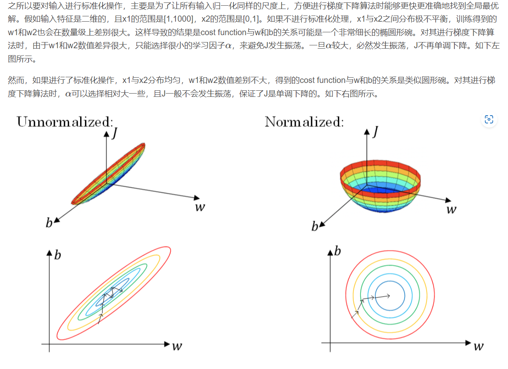
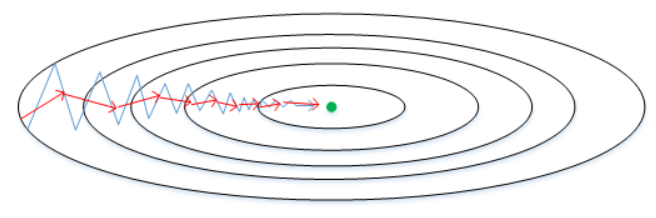
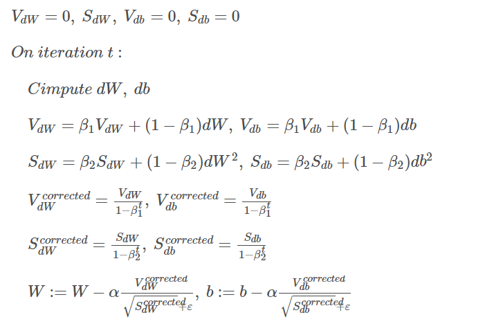
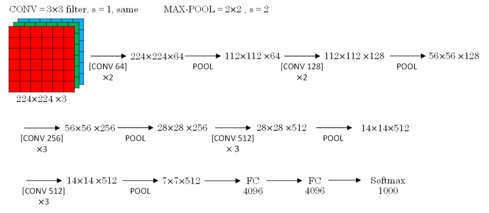
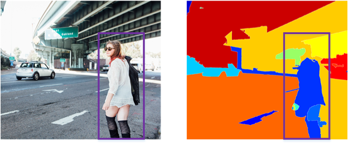
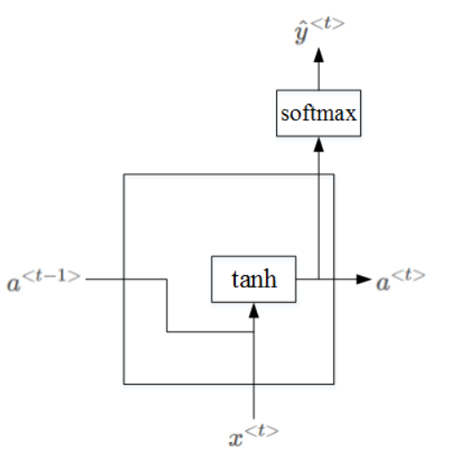
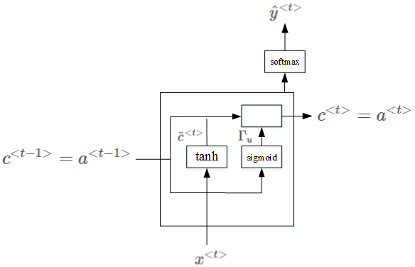

吴恩达Deep Learning 学习笔记


[TOC]


# 第一门课 神经网络和深度学习(Neural Networks and Deep Learning)


## 1、Logstic Regression(回归)

#### 1、理解w=w-α *df/dw 为什么是这样?

https://zhuanlan.zhihu.com/p/86147140

​	由于梯度方向（df/dx，df/dy，df/dw ...）是函数变化最快的方向（通过最大时夹角值得出）

[从为什么梯度方向是函数变化率最快方向详谈梯度下降](https://zhuanlan.zhihu.com/p/420701835)

​	所以每个变量分别取梯度里对应的变化量，整体就沿着下降速度最快的方向去了。

​	然后加上一个学习率来控制步长即可。

#### 2、完整形式


一些简单的推导（此时假设为单个样本）：


其中，X=（x(1),x(2)...) , X的每一列都是一个样本


编程Tips : 使用向量化替代for加快速度，利用广播（复制至同规模）


## 2、多种激活函数

**Sigmoid** : **常用作最后一层二分类的激活函数**，但其他地方不常用，存在梯度消失
$$
a=\sigma(z)=\frac{1}{1+e^{-z}}
$$

$$
导数=a'(z)=a(1-a)
$$

**tanh**:  总体上都优于sigmoid函数的激活函数，**几乎适合所有场合**，存在梯度消失
$$
a=tanh(z)=\frac{e^z-e^{-z}}{e^z+e^{-z}}
\\ 导数= a'(z)=1-(tanh(z))^2
$$
**Relu(Rectified Linear Unit) :** **最常用的默认函数**，解决梯度消失问题

​																𝑎 = 𝑚𝑎𝑥(0, 𝑧)

**Leaky Relu: **Relu的改进
$$
y = max(0, x) + leak*min(0,x) \\ leak是一个很小的常数
$$


## 3、梯度下降法

[有关向量，矩阵的求导 定义与推导](https://zhuanlan.zhihu.com/p/371234412?ivk_sa=1024320u)

其实，求导定义比较可以直观理解：即本来要一个一个求导，为了方便，合成一个整体进行求导，所以定义也就是一个一个的导数拼接而成即可。


#### 神经网络前向传递，反向传播 向量化 推导：

最基本的单元就是Loggistic Regression的单元  

##### 示意图：

（实际实现上一般仅最后一层使用sigmoid激活函数来作分类，其他层一般不用sigmoid函数，暂记作g(x))


##### 前向传递公式如上

注意图中的每一个节点实际上是m个节点(当考虑向量化处理的时候，即每个样本经过的网络是一样的)

##### 反向传播(BP)公式推导

###### 	一些符号:

$$
\begin{align*}
& \quad n^{[x]}表示第n层节点个数，输入层不算进层数里，此时一共是两层。\\
& \quad W^{[x]},b^{[x]}为\textbf{线性组合的系数，维度不受到样本数的影响}。\\
& \quad x表示一批次的样本,也就是n^{[0]}的个数。\\
& \quad 损失函数L这里使用二分类的损失函数=-[ylog \hat{y}+(1-y)log(1-\hat{y})]
\end{align*}
$$


###### 	规模说明：

$$
\begin{align*}
& \quad n^{[x]}表示第n层节点个数，输入层不算进层数里，此时一共是两层。\\
& \quad z^{[x]}，a^{[x]}为n^{[x]} \times m大小的矩阵(m为样本个数,即对于每一个样本，都有n^{[x]} \times 1的结果)，输入X为n^{[0]} \times m,其中n^{[0]}为输入特征的维度，\\
& Y为n_y \times m,其中n_y为输出特征的维度（若为二分类，则只需输出是/否，维度为1）\\
& \quad W^{[x]}看成是行向量的组合，例如
W^{[2]}为n^{[2]} \times n^{[1]}大小的矩阵，记作\\
&W^{[2]}=\left(\begin{matrix}
 W^{[2](1)}\\
 W^{[2](2)}\\
 W^{[2](3)}\\
 .. \\
 W^{[2](n^{[2]})}
\end{matrix}\right)
，其中W^{[2](i)}表示对于第二层第i个节点的W权重组合。
\end{align*}\\
$$


###### 	推导：

**多样本还不知道该怎么表示求导等运算，只能等后续数学更好的时候补上了!!!**

而且推出1/m的位置跟课程里给的也不大一样，也不知道谁对了，希望是我对！


**一些前置推导/知识：**
$$
y=\frac{1}{1+e^{-x}},易证得y'(x)=y(1-y)\\
一个数对向量求导=该数对向量各分量求导后拼接
$$
**正式推导：**
$$
\begin{align*}
&\textbf{损失函数 J= 所有样本平均损失} = \frac{1}{m}\sum_{i=1}^m L(a^{[2](i)},y^{[i]})
=\frac{1}{m}\sum_{i=1}^m -(y^{(i)}log\hat{y}^{(i)}+(1-y^{(i)})log(1-\hat{y}^{(i)}))\\
&其中i表示第i个样本，y^{(i)}与\hat{y}^{(i)}表示对于第i个样本的实际二分类与输出二分类结果。\\
&=\frac{1}{m}\sum_{i=1}^m -(y^{(i)}loga^{[2](i)}+(1-y^{(i)})log(1-a^{[2](i)}))\\
&=-\frac{1}{m}(yloga^{[2]}+(1-y)log(1-a^{[2]}))——向量化形式,\quad 大小: 1\times 1\\
\end{align*}
$$

**第二层：**
$$
\begin{align*}

\\ &\textbf{单个样本:}对每个神经元求导，每个结果记录在对应行，行间无关系。\\
&\quad \frac{dJ}{da^{[2](i)}}=-\frac{1}{m}[\frac{y^{(i)}}{a^{[2](i)}}-\frac{1-y^{(i)}}{1-a^{[2](i)}}] \quad => \quad \frac{dJ}{da^{[2]}}=-\frac{1}{m}[\frac{y}{a^{[2]}}-\frac{(1-y)}{(1-a^{[2]})}]  ,\quad 大小: n^{[2]}\times 1\\
& \textbf{多个样本:}由于不同样本间不会互相影响，各自算各自的，所以直接堆叠即可，由于y为n^{[2]}\times m，所以最终维度为n^{[2]}\times m\\
\\
\\&由于每个z^{[2](i)}是分别通过影响对应的a^{[2](i)}来影响J的，所以求导时可以分开求导，然后拼起来！

\\& \quad \frac{dJ}{dz^{[2](i)}}=\frac{dJ}{da^{[2](i)}}\frac{da^{[2](i)}}{dz^{[2](i)}}
=-\frac{1}{m}(\frac{y^{(i)}}{a^{[2](i)}}-\frac{1-y^{(i)}}{1-a^{[2](i)}})a^{[2](i)}(1-a^{[2](i)})
=\frac{1}{m}(a^{[2](i)}-y^{(i)}),
\\&=> \frac{dJ}{dz^{[2]}}=\frac{1}{m}(a^{[2]}-y),\quad 大小: n^{[2]}\times 1
\\& => 对于多个样本时:a^{[2]}与y的维度都乘以m,但整个计算过程不变，也是堆叠，大小: n^{[2]}\times m
\\

\end{align*}
$$

$$
\begin{align*}

\\& 由于每个W^{[2](i)}是通过影响对应的z^{[2](i)}来影响J的，所以求导时同样可以分离来求。
\\即
\\& \quad \frac{dJ}{dW^{[2](i)}}=\frac{dJ}{dz^{[2](i)}}\frac{dz^{[2](i)}}{dW^{[2](i)}}
\\
\\&同时，\left(\begin{matrix}
 W^{[2](1)}\\
 W^{[2](2)}\\
 ..\\
 W^{[2](i)}\\
 .. \\
\end{matrix}\right)
\left( a^{[1]}\right)=\left(\begin{matrix}
 z^{[2](1)}\\
 z^{[2](2)}\\
 ..\\
 z^{[2](i)}\\
 .. \\
\end{matrix}\right),其中a^{[1]}为该层针对任一节点统一的输入，即z^{[2](i)}=W^{[2](i)}a^{[1]}+b^{[2](i)},\\
&进一步展开，\\
&z^{[2](i)}=W^{[2](i)(1)}a^{[1](1)}+W^{[2](i)(2)}a^{[1](2)}+...,(由于是对W求导，所以这里就忽略b的项，不影响求导结果)\\
&所以，
\frac{dz^{[2](i)}}{dW^{[2](i)}}
=\left(\begin{matrix}
\frac{dz^{[2](i)}}{dW^{[2](i)(1)}} & .. & \frac{dz^{[2](i)}}{dW^{[2](i)(j)}}  & ..
\end{matrix}\right)
=\left(\begin{matrix}
 a^{[1](1)} &  a^{[1](2)} & ..  & a^{[1](j)} & ..\\
\end{matrix}\right)(由于W^{[2](i)}为1\times n^{[1]}大小，z^{[2](i)}为1\times 1,所以结果大小即为1\times n^{[1]}，即a^{[1](i)}的排列方式为横着排列的)\\
&={a^{[1]}}^T
\\& 所以，
\\
&\quad \frac{dJ}{dW^{[2](i)}}=\frac{dJ}{dz^{[2](i)}}\frac{dz^{[2](i)}}{dW^{[2](i)}}
=\frac{1}{m}(a^{[2]}-y){a^{[1]}}^T \quad => \quad \frac{dJ}{dW^{[2]}}=\frac{1}{m}(a^{[2]}-y){a^{[1]}}^T
=\frac{dJ}{dz^{[2]}} {a^{[1]}}^T,
\quad 大小: (n^{[2]}\times 1) , (1 \times n^{[1]})\\
\\ &多样本时: 大小: (n^{[2]}\times m) , (m \times n^{[1]})\\
\\

\end{align*}
$$

$$
\begin{align*}

\\& J受每个z^{[2](i)}影响(该层多个节点),而每个z^{[2](i)}分别收到b^{[2](i)}影响，即b^{[2](i)}会影响到各个z^{[2](i)}进而影响J,所以是累加b^{[2](i)}对每个z^{[2](i)}到J的影响。
\\& 所以,\frac{dJ}{db^{[2](i)}}=\sum_j\frac{dJ}{dz^{[2](j)}}\frac{dz^{[2](j)}}{db^{[2](i)}}=\frac{dJ}{dz^{[2](i)}}(由于z^{[2](i)}=W^{[2](i)(1)}a^{[1](1)}+W^{[2](i)(2)}a^{[1](2)}+...+b^{[2](i)},所以\frac{dz^{[2](i)}}{db^{[2](i)}}=1)
\\& \quad 所以,\frac{dJ}{db^{[2]}}=\frac{dJ}{dz^{[2]}},
\quad 大小: n^{[2]}\times 1\\
&\quad 多样本时，dz^{[2]}的维度乘以m，但b的维度保持不变，所以需要对样本加权来降低维度=\frac{1}{m}np.sum(dz^{[2]},axis=1,keepdims=True)

\end{align*}
$$
​	

**第一层：**
$$
\begin{align*}

& 由于a^{[1]}对J的影响是通过各个z^{[2](i)}产生的，所以求导（变化率）时是累加效果。\\
&\quad \frac{dJ}{da^{[1]}}=\sum_i \frac{dJ}{dz^{[2](i)}} \frac{dz^{[2](i)}}{da^{[1]}},
\\
\\& 由于z^{[2](i)}=W^{[2](i)(1)}a^{[1](1)}+W^{[2](i)(2)}a^{[1](2)}+...+b^{[2](i)}=\sum_j W^{[2](i)(j)}a^{[1](j)}+b^{[2](i)},
\\& 所以\frac{dz^{[2](i)}}{da^{[1](j)}}=W^{[2](i)(j)}（标量对标量导）,得
\frac{dz^{[2](i)}}{da^{[1]}}=

\left(\begin{matrix}
 W^{[2](i)(1)}\\
 W^{[2](i)(2)}\\
 ..\\
\end{matrix}\right)={W^{[2](i)}}^T,即W的第i行按列来排，
\\&所以，
\\& \quad \frac{dz^{[2](i)}}{da^{[1]}}
=\left(\begin{matrix}
 W^{[2](1)(1)} & .. & W^{[2](i)(1)} & ..& W^{[2](..)(1)}\\
 .. & .. & .. & ..  & ..\\
 .. & .. & .. & ..  & ..\\
\end{matrix}\right)
={W^{[2]}}^T
\\&从而，
\\& \quad \frac{dJ}{da^{[1]}}=\sum_i \frac{dJ}{dz^{[2](i)}} \frac{dz^{[2](i)}}{da^{[1]}}
=\frac{1}{m} \sum_i (a^{[2](i)}-y^{(i)})\left(\begin{matrix}
 W^{[2](i)(1)}\\
 W^{[2](i)(2)}\\
 ..\\
\end{matrix}\right),
形式类似于
\end{align*}
$$

****


$$
\begin{align*}
&所以，\\
&\quad \frac{dJ}{da^{[1]}}=\frac{1}{m} {W^{[2]}}^T (a^{[2]}-y)
={W^{[2]}}^T \frac{dJ}{dz^{[2]}},

\quad 大小: (n^{[1]}\times n^{[2]}) , (n^{[2]} \times 1)\\
\end{align*}
$$

$$
\begin{align*}
&由于a^{[1]}=g(z^{[1]}),对应元素分别使用g函数\\
&所以，\frac{da^{[1](i)}}{dz^{[1](i)}}=g^{[1]'}(z^{[1](i)}) \quad => 
\quad \frac{da^{[1]}}{dz^{[1]}}=g^{[1]'}(z^{[1]}) （对应位置的导数）\\
& => 
\frac{dJ}{dz^{[1]}} = \frac{dJ}{da^{[1]}} * g^{[1]'}(z^{[1]}) （对应位置数乘）
={W^{[2]}}^T \frac{dJ}{dz^{[2]}} * g^{[1]'}(z^{[1]}) ，


\quad 大小: n^{[1]} \times 1\\
\end{align*}
$$


$$
\begin{align*}
& \quad \frac{dJ}{dW^{[1]}} = \frac{dJ}{dz^{[1]}}  \frac{dz^{[1]}}{dW^{[1]}}\\
& 类比可得，\frac{dz^{[1]}}{dW^{[1]}}={a^{[0]}}^T=x^T,所以\\
&\quad \frac{dJ}{dW^{[1]}} = \frac{dJ}{dz^{[1]}} x^T\\
&同理，类比\frac{dz^{[2]}}{db^{[2]}}计算过程，可得\\
& \quad \frac{dJ}{db^{[1]}}=\frac{dJ}{dz^{[1]}},(多样本时有\frac{dJ}{db^{[1]}}=\frac{1}{m}np.sum(dz^{[1]},axis=1,keepdims=True))
\end{align*}
$$


##### 公式整理：

###### 正向传递：

$$
z^{[i]}=W^{[i]}a^{[i-1]}+b^{[i]}\\
a^{[i]}=g^{[i]}(a^{[i]})
$$

###### 反向传播：

$$
\frac{dJ}{dz^{[i]}} = \frac{dJ}{da^{[i]}} * g^{[i]'}(a^{[i]})\\
\frac{dJ}{dW^{[i]}} = \frac{dJ}{dz^{[i]}} {a^{[i-1]}}^T\\
\frac{dJ}{db^{[i]}}= \frac{dJ}{dz^{[i]}}\\
\frac{dJ}{da^{[i-1]}}= {W^{[i]}}^T \frac{dJ}{dz^{[i]}}
$$

结果图:


#### 随机初始化：

W需要随机初始化，不能初始化为0，否则所有节点都是对称的，参数完全相同，反向影响也相同。

b可以全初始化为0。


## 4、深层神经网络


```
  "举个例子，这个小方块（第一行第一列）就是一个隐藏单元，它会去找这张照片里“|”
边缘的方向。那么这个隐藏单元（第四行第四列），可能是在找（“—”）水平向的边缘在哪
里。之后的课程里，我们会讲专门做这种识别的卷积神经网络，到时候会细讲，为什么小
单元是这么表示的。你可以先把神经网络的第一层当作看图，然后去找这张照片的各个边
缘。我们可以把照片里组成边缘的像素们放在一起看，然后它可以把被探测到的边缘组合
成面部的不同部分（第二张大图）。比如说，可能有一个神经元会去找眼睛的部分，另外还
有别的在找鼻子的部分，然后把这许多的边缘结合在一起，就可以开始检测人脸的不同部
分。最后再把这些部分放在一起，比如鼻子眼睛下巴，就可以识别或是探测不同的人脸
（第三张大图）。"
```


作业效果：


# 第二门课 改善深层神经网络：超参数调试、正则化以及优化(Improving Deep Neural  Networks:Hyperparameter tuning, Regularization and Optimization)


## 一、深度学习的实践层面


### 1、训练，验证，测试集（Train / Dev / Test sets）

在机器学习中，我们通常将样本分成训练集，验证集和测试集三部分，

**Dev目的：找出多个分类器中最优的一个**

**Test目的：正确评估分类器的性能**

数据集规模相对较小，适用传统的划分比例（7：2：1/7：3）

当前第一个趋势：数据集规模较大的，验证集和测试集要小于数据总量的 20%或 10%，具体地

```
比如我们有 100 万条数据，那么取 1 万条数据便足以进行评估，找出其中表现最好的
1-2 种算法。同样地，根据最终选择的分类器，测试集的主要目的是正确评估分类器的性
能，所以，如果拥有百万数据，我们只需要 1000 条数据，便足以评估单个分类器，并且准
确评估该分类器的性能。
```

当前第二个趋势：越来越多的人在训练和测试集分布不匹配的情况下进行训练

```
假设你要构建一个用户可以上传大量图片的应用程序，目的是找出并呈现所有猫咪
图片，可能你的用户都是爱猫人士，训练集可能是从网上下载的猫咪图片，而验证集和测
试集是用户在这个应用上上传的猫的图片，就是说，训练集可能是从网络上抓下来的图片。
而验证集和测试集是用户上传的图片。结果许多网页上的猫咪图片分辨率很高，很专业，
后期制作精良，而用户上传的照片可能是用手机随意拍摄的，像素低，比较模糊，这两类
数据有所不同，针对这种情况，根据经验，我建议大家要确保验证集和测试集的数据来自
同一分布
```


### 2、偏差，方差（Bias /Variance）

#### 偏差与方差的直观概念：


#### 高偏差&高方差的直观例子：

近线性=>高偏差，错误的地方过拟合=>高方差


### 3、针对偏差和方差的调整

偏差大：采用规模更大的网络（因为原来网络太简单，学不到关键特征）

方差大：最好的解决办法就是采用更多数据；也可以尝试通过正则化来减少过拟合（主要为了解决过拟合问题/拟合了错误特征）


### 4、正则化（Regularization）


#### 防止过拟合的一类：L1，L2 regularization

**L1正则项**：将**权重参数的绝对值之和**加入到损失函数中，即加入$\frac{\lambda}{m} \sum_{j=1}^{n_x}|w_j|$ (一个系数 * 参数𝑤向量的𝐿1范数)

**L2正则项**:   将**权重参数的平方之和**加入到损失函数中,即加入$\frac{\lambda}{2m} \sum_{j=1}^{n_x} w_j^2$  ( 一个系数 * 参数𝑤向量的𝐿2范数)   (更常用)

```
补充说明:
为什么只对w进行正则化而不对b进行正则化呢？
	其实也可以对b进行正则化。但是一般w的维度很大，而b只是一个常数。相比较来说，参数很大程度上由w决定，改变b值对整体模型影响较小。所以，一般为了简便，就忽略对b的正则化了。
```

以L2正则化为例，


补充计算：$\sum_{l=1}^L||w^{[l]}||^2$对向量$w^{[l]}$求导（常数对向量求导=分别求导组合得到向量），

​	其中由于仅第l项求导后仍剩下，又因为为分别求导，即$w^{{[l](1)}^2}+w^{{[l](2)}^2}+...$分别对$w^{[l](1)},w^{[l](2)}...$求导，即可得到$2w^{[l]}$


### 5、为什么 正则化 有利于 预防 过拟合？

**以L2正则化为例：**


### 6&7、Dropout Regularization

#### 另一种防止过拟合方法：随机失活（Dropout）


**Dropout的一种：Inverted Dropout**


#### Dropout有效的原因：

每次丢掉一定数量的隐藏层神经元，相当于在不同的神经网络上进行训练，这样就**减少了神经元之间的依赖性，即每个神经元不能依赖于某几个其他的神经元**（指层与层之间相连接的神经元），使神经网络更加能学习到与其他神经元之间的更加健壮robust的特征。


#### Dropout使用注意：

1、不同隐藏层的dropout系数keep_prob可以不同。一般来说，**神经元越多的隐藏层，keep_out可以设置得小一些**，例如0.5；神经元越少的隐藏层，keep_out可以设置的大一些，例如0.8，1。

2、**不建议对输入层进行dropout**，如果输入层维度很大，例如图片，那么可以设置dropout，但keep_out应设置的大一些，例如0.8，0.9。总体来说，就是**越容易出现overfitting的隐藏层，其keep_prob就设置的相对小一些**。

3、（Debug建议）使用dropout的时候，可以通过绘制cost function来进行debug，看看dropout是否正确执行。**一般做法是，将所有层的keep_prob全设置为1，再绘制cost function**，即涵盖所有神经元，**看J是否单调下降**。下一次迭代训练时，再将keep_prob设置为其它值。


### 8、防止过拟合方法

- 正则化
- Dropout 

- 增加训练样本数量/数据增强制造更多样本

- early stopping


### 9、归一化输入 Normalize input

- **How:**

- **Why :** 在训练神经网络时，标准化输入可以**提高训练的速度**。标准化输入就是对训练数据集进行归一化的操作，即将原始数据减去其均值μ后，再除以其方差$σ^2$





- **Notes:** 值得注意的是，由于训练集进行了标准化处理，那么对于**测试集或在实际应用**时，应该使用同样的μ和$σ^2$对其进行标准化处理。这样保证了训练集合测试集的**标准化操作一致**。


### 10&11、梯度消失与梯度爆炸 Vanishing and Exploding gradients

**梯度消失与梯度爆炸描述：**


 即，L非常大时，例如L=150，则**梯度会非常大或非常小（因为前面参数非常大/小，所以梯度/变化率要非常小/大，才能使得y^有一定变化），这样就引起每次更新的步进长度过大或者过小**，这让训练过程十分困难。


**解决方法：**让W与n相关，互相限制，防止W构成的参数的累积效果太大/太小，即

- 如果激活函数是tanh， w[l] = np.random.randn(n[l],n[l-1])*np.sqrt(1/n[l-1]) （即缩放$\sqrt{\frac{1}{n^{[l-1]}}}$)
- 如果激活函数是ReLU,  w[l] = np.random.randn(n[l],n[l-1])*np.sqrt(2/n[l-1]) （即缩放$\sqrt{\frac{2}{n^{[l-1]}}}$)
- Yoshua Bengio提出了另外一种初始化w的方法,  w[l] = np.random.randn(n[l],n[l-1]) * np.sqrt(2/n[l-1]*n[l]) （即缩放$\sqrt{\frac{2}{n^{[l-1]}\times n^{[l]}}}$)


### 12&13&14、梯度检验

**Back Propagation神经网络**有一项重要的测试是**梯度检查（gradient checking）**。

- **目的：检查验证反向传播过程中梯度下降算法是否正确**。

- **方法：**

- **技巧与注意：**
  - 不要在整个训练过程中都进行梯度检查，仅仅作为debug使用。（因为梯度检查速度很慢）
  - 如果梯度检查出现错误，找到对应出错的梯度，检查其推导是否出现错误。
  - 注意不要忽略正则化项，计算近似梯度的时候要包括进去。
  - 梯度检查时关闭dropout，检查完毕后再打开dropout。（否则无法知道损失函数的真正计算公式进而无法反向传播求导检查）。
  - 具体可以参见作业的梯度检验部分代码。


## 二、优化算法

### 1、Mini-batch 梯度下降法

**Batch Gradient Descent**：神经网络训练过程是对**所有m个样本，称为batch**，通过**向量化**计算方式，同时进行的。如果m很大，例如达到百万数量级，训练速度往往会很慢，因为每次迭代都要对所有样本进行进行求和运算和矩阵运算。我们将这种梯度下降算法称为**Batch Gradient Descent**。

**Mini-batch Gradient Descent：**可以把**m个训练样本分成若干个子集，称为mini-batches**，这样每个子集包含的数据量就小了，例如只有1000，然后每次在单一子集上进行神经网络训练，速度就会大大提高。这种梯度下降算法叫做**Mini-batch Gradient Descent**。

**Epoch**：经过T次循环之后，**所有m个训练样本都进行了梯度下降计算**。这个过程，我们称之为**经历了一个epoch**。对于Batch Gradient Descent而言，一个epoch只进行一次梯度下降算法；而Mini-Batches Gradient Descent，一个epoch会进行T次梯度下降算法。


### 2、指数加权平均


**目的**：希望看到**长时间内某个变量的整体变化趋势**

**公式**：$V_t=βV_{t−1}+(1−β)θ_t$，其中以气温为例，$V_t$表示第t天模型预估的气温，$\theta_t$表示第t天的实际气温，该公式即考虑之前模型的输出与当前的实际节点情况作一个平均。

举个例子，假设$\beta$=0.9,可以看到下面实际上就是**对每个过往时间实际气温作了一个指数的加权处理**


**物理含义：**准确来说，指数加权平均算法跟之前所有天的数值都有关系，根据之前的推导公式就能看出。但是指数是衰减的，一般认为衰减到$\frac{1}{e}$就可以忽略不计了。

因为$(1-\frac1N)^N=\frac1e$当N趋于无穷，所以$\beta^{\frac{1}{1-\beta}}=\frac1e$当$\beta$趋近与1,

而由上述$V_t$的公式可知，考虑最近的第x天实际值的系数为$\beta^{x}\times(1-\beta)$,所以当x=$\frac{1}{1-\beta}$时，近似系数为$\frac{1}{e}$,

即可以认为**指数加权平均的天数为$\frac{1}{1-\beta}$**。


**一些修正：**


紫色曲线与绿色曲线的区别是，**紫色曲线开始的时候相对较低一些**。这是因为开始时我们设置，所以**初始值会相对小一些**，直到后面受前面的影响渐渐变小，趋于正常。

修正这种问题的方法是进行**偏移校正（bias correction）**，即在每次计算完后，对进行下式处理：$\frac{V_t}{1-\beta^t}$

在刚开始的时候，t比较小，这样就将$V_t$修正得更大一些，效果是把紫色曲线开始部分向上提升一些，与绿色曲线接近重合。随着t增大，修正近似不变，紫色曲线与绿色曲线近似重合。


### 3、动量梯度下降算法（Gradient descent with momentum）

其速度要比传统的梯度下降算法快很多。做法是在每次训练时，**对梯度进行指数加权平均处理**，然后**用得到的梯度值更新权重W和常数项b**。


**目的：** 原始的梯度下降算法如上图蓝色折线所示。在梯度下降过程中，梯度下降的振荡较大，尤其对于W、b之间数值范围差别较大的情况。此时每一点处的梯度只与当前方向有关，产生类似折线的效果，前进缓慢。而如果**对梯度进行指数加权平均**，这样使当前梯度不仅与当前方向有关，还与之前的方向有关，这样处理**让梯度前进方向更加平滑(之前的振荡相互抵消)，减少振荡，能够更快地到达最小值处。**

**公式：**
$$
V_{dW}=\beta\cdot V_{dW}+(1-\beta)\cdot dW  \\
V_{db}=\beta\cdot V_{db}+(1-\beta)\cdot db  \\
W=W-\alpha V_{dW} \\
b=b-\alpha V_{db} \\
$$


### 4、RMSprop(Root Mean Square Prop,均方根传播)

**公式：**
$$
S_{dW}=\beta S_{dW}+(1-\beta)dW^2\\
S_{db}=\beta S_{db}+(1-\beta)db^2\\
W:=W-\alpha \frac{dW}{\sqrt{S_{dW}}},\ b:=b-\alpha \frac{db}{\sqrt{S_{db}}}\\
$$
以下图为例，为了便于分析，假设**水平方向为W的方向，垂直方向为b的方向**。


从图中可以看出，梯度下降（蓝色折线）在垂直方向（b）上振荡较大，在水平方向（W）上振荡较小，表示在b方向上梯度较大，即db较大，而在W方向上梯度较小，即dW较小。因此，上述表达式中Sdb较大，而SdW较小。在更新W和b的表达式中，变化值$\frac{d_W}{S_dW}$较大，而$\frac{d_b}{S_db}$较小。也就使得W变化得多一些，b变化得少一些。即加快了W方向的速度，减小了b方向的速度，减小振荡，实现快速梯度下降算法，其梯度下降过程如绿色折线所示。总得来说，就是如果**哪个方向振荡大，就减小该方向的更新速度，从而减小振荡**。


### 5、Adam 优化算法

结合了动量梯度下降算法和RMSprop算法。



**Adam算法超参数**

Adam算法包含以下超参数:

1. Learning rate, \( $\alpha$ \)
2. Momentum term, \( $\beta_1$ \)
3. RMSprop term, \( $\beta_2 $\)
4. Smoothing term, \( $\epsilon$ \)

常用的默认值如下:

- \( $\beta_1$ \): 通常设置为 0.9
- \( $\beta_2$ \): 通常设置为 0.999
- \( $\epsilon$ \): 通常设置为 \( 10^{-8} \)

在实际应用中，大多数情况下只需要对 \( $\beta_1$ \) 和 \( $\beta_2$ \) 进行调试。


### 6、学习率衰减 Learning Rate Decay

常用学习率公式：
$$
\begin{align*}
&\alpha=\frac{1}{1+decay\_rate*epoch}\alpha_0\\
\\
&\alpha=0.95^{epoch}\cdot \alpha_0\\
\\
&\alpha=\frac{k}{\sqrt{epoch}}\cdot \alpha_0\ \ \ \ or\ \ \ \ \frac{k}{\sqrt{t}}\cdot \alpha_0(其中，k为可调参数，t为mini-bach number)\\

\end{align*}
$$


### 7、局部最优问题

- 只要选择合理的强大的神经网络，一般不太可能陷入local optima
- Plateaus可能会使梯度下降变慢，降低学习速度


## 三、超参数调试、Batch正则化和编程框架


### 1、调试处理Tuning Process

#### 神经网络超参数

- 学习因子 (α)：学习率（最重要）
- 动量梯度下降因子 (β)：动量（重要性仅次于α）
- Adam算法参数 (β₁, β₂, ε) （常用默认的）
- 神经网络层数 (#layers)  (再次)
- 各隐藏层神经元个数 (#hidden units)（重要性仅次于α）
- 学习因子下降参数 (learning rate decay) (再次)
- 批量训练样本包含的样本个数 (mini-batch size)（重要性仅次于α）

#### 常用方法

- 随机采样

  - 尺度均匀采样

  - 尺度非均匀采样

    - 对于某些超参数，可能需要非均匀随机采样（即非均匀刻度尺）。例如超参数α，待调范围是[0.0001, 1]。如果使用均匀随机采样，那么有90%的采样点分布在[0.1, 1]之间，只有10%分布在[0.0001, 0.1]之间。这在实际应用中是不太好的，因为最佳的α值可能主要分布在[0.0001, 0.1]之间，而[0.1, 1]范围内α值效果并不好。因此我们更关注的是区间[0.0001, 0.1]，应该在这个区间内**细分更多刻度**。

    - 通常的做法是将**linear scale转换为log scale**，**将均匀尺度转化为非均匀尺度**，然后再在log scale下进行均匀采样。这样，[0.0001, 0.001]，[0.001, 0.01]，[0.01, 0.1]，[0.1, 1]各个区间内随机采样的超参数个数基本一致，也就扩大了之前[0.0001, 0.1]区间内采样值个数。

    - 在超参数调优中，与学习率（α）一样，**动量梯度因子（β）也需要进行非均匀采样**。通常，β的取值范围在**[0.9, 0.999]之间，因此1−β的取值范围在[0.001, 0.1]之间。为了采样1−β在这区间内，可以进行对数变换**。

      为什么需要对β进行非均匀采样呢？假设β从0.9000变化到0.9005，那么**1−β基本没有变化。但如果β从0.9990变化到0.9995，那么1−β前后的差别就是1000。当β接近1时，指数加权平均的项数越多，变化也越大。**因此，对于接近1的β值，应该更密集地采样。

      以上内容解释了为什么需要对β进行非均匀采样以及如何进行1−β的区间内的log变换。


### 2、超参数训练的两种方式（Pandas vs Caviar）


一种情况是受计算能力所限，我们只能对一个模型进行训练，调试不同的超参数，使得这个模型有最佳的表现。我们称之为Babysitting one model(Pandas)。

另外一种情况是可以对多个模型同时进行训练，每个模型上调试不同的超参数，根据表现情况，选择最佳的模型。我们称之为Training many models in parallel(Caviar)。


### 3、Batch Normalization（批量标准化）

#### 单层具体做法：

在神经网络中，第l层隐藏层的输入是第l−1层隐藏层的输出A[l−1]. 对A[l−1]进行标准化处理可以**提高W[l]和b[l]的训练速度和准确度**。这标准化处理就是**Batch Normalization**。在实际应用中，**通常对Z[l−1]进行标准化处理而不是A[l−1]，尽管差别不是很大**。

Batch Normalization**对第l层隐藏层的输入$Z^{[l−1]}$进行如下标准化处理**，忽略上标[l−1]：
$$
\mu=\frac1m\sum_iz^{(i)}:均值\\
\sigma^2=\frac1m\sum_i(z_i-\mu)^2:方差\\
z^{(i)}_{norm}=\frac{z^{(i)}-\mu}{\sqrt{\sigma^2+\varepsilon}}:标准化\\
$$
其中，m是单个mini-batch包含的样本个数，ε是为了防止分母为零，可取值$10^{-8}$。这样，使得该隐藏层的所有输入$z^{(i)}$均值为0，方差为1。

**然而，通常并不希望所有的z(i)均值都为0和方差都为1，因此需要进一步处理：**
$$
\tilde z^{(i)}=\gamma\cdot z^{(i)}_{norm}+\beta
$$
其中，γ和β是可学习参数，类似于W和b，可以通过梯度下降等算法求得。γ和β的作用是让$\tilde z^{(i)}$的均值和方差为任意值，只需调整其值即可。例如，令：

$\gamma=\sqrt{\sigma^2+\varepsilon},\ \ \beta=u$

可以得到的$\tilde z^{(i)}$，**通过设置不同的γ和β值，可以获得任意均值和方差。**

这样，通过Batch Normalization，对隐藏层的各个$z^{[l] (i)}$进行标准化处理，得到$\tilde z^{[l](i)}$，替代$z^{[l] (i)}$。

值得注意的是，输入的标准化处理Normalizing inputs和隐藏层的标准化处理Batch Normalization是有区别的。

- Normalizing inputs使所有**输入的均值为0，方差为1**。

- 而Batch Normalization可使各**隐藏层输入的均值和方差为任意值**。实际上，**从激活函数的角度(例如Sigmoid激活函数)来说，如果各隐藏层的输入均值在靠近0的区域即处于激活函数的线性区域，这样不利于训练好的非线性神经网络，得到的模型效果也不会太好。**这也解释了为什么需要用γ和β来对$z^{[l] (i)}$作进一步处理。


#### 多层具体做法：


由于Batch Normalization对各隐藏层$Z^{[l]}$的输入进行**去均值操作**，**常数项$b^{[l]}$的影响可以被消除**，其数值效果完全可以由$\tilde z^{[l]}$中的β来实现。 在神经网络中，常数项$b^{[l]}$的值通常会对隐藏层的输出产生影响，但在**应用Batch Normalization后**，这种影响可以通过$\tilde z^{[l]}$中的可学习参数β来实现，而**常数项b[l]的具体值在这一过程中可以被忽略**。


#### 效果

- 收敛速率增加
- 模型更稳定（对各隐藏层输出$Z^{[l]}$进行均值和方差的归一化处理，$W^{[l]}$
  和$B^{[l]}$更加稳定


#### 测试时如何使用？

训练过程中，Batch Norm是对单个mini-batch进行操作的

而测试时由于是一个一个样本进行的，所以不可能对整体计算$\mu$和$\sigma^2$,所以采用训练集的参数，利用移动平均来得到需要的$\mu$和$\sigma^2$,即
$$
new\_average=β×old\_average+(1−β)×current\_value
$$


### 4、Softmax回归

多分类问题——Logistics分类的更一般形式


使用的损失函数
$$
L(\hat y,y)=-\sum_{j=1}^Cy_j\cdot log\ \hat y_j
$$

### 5、TensorFlow 框架

简单示例代码

```python
import numpy as np
import tensorflow as tf

cofficients = np.array([[1.],[-10.],[25.]])

w = tf.Variable(0,dtype=tf.float32)
x = tf.placeholder(tf.float32,[3,1]) #placeholder——可以后续赋值的
#cost = tf.add(tf.add(w**2,tf.multiply(-10,w)),25)
#cost = w**2 - 10*w +25
cost = x[0][0]*w**2 + x[1][0]*w + x[2][0]
train = tf.train.GradientDescentOptimizer(0.01).minimize(cost)

#全局变量等
init = tf.global_variables_initializer()
session = tf.Session()
session.run(init)
print(session.run(w))

#运行1次
session.run(train, feed_dict=(x:coefficients))
print(session.run(w))

#运行1000次
for i in range(1000):
    session.run(train, feed_dict=(x:coefficients))
print(session.run(w))
```


# 第三门课 结 构 化 机 器 学 习 项 目（Structuring Machine Learning Projects）


## 一、机器学习策略(上)

### 1、Why ML Strategy

目的：使用快速、有效的策略来优化机器学习模型

### 2、Strategy 1：正交化

Orthogonalization的核心在于**每次调试一个参数只会影响模型的某一个性能**。例如老式电视机旋钮，每个旋钮就对应一个功能，调整旋钮会调整对应的功能，而不会影响其它功能。也就是说**彼此旋钮之间是互不影响的，是正交的**


对应到机器学习监督式学习模型中，可以大致分成四个独立的“功能”，每个“功能”对应一些可调节的唯一的旋钮。四个“功能”如下：

- **Fit training set well on cost function**
- **Fit dev set well on cost function**
- **Fit test set well on cost function**
- **Performs well in real world**

| 旋钮                      | 解决方法                                           | 考虑解决的问题                                               |
| ------------------------- | -------------------------------------------------- | ------------------------------------------------------------ |
| Training Set   对应“旋钮” | Larger Network ; Different Optimization(like Adam) | 解决模型过于简单问题/Human-level与Traning error差距过大，超过Dev error与Training error的差距 |
| Dev Set  对应“旋钮”       | more training samples ; Regularization（正则化）   | 解决过拟合问题                                               |
| Test Set  对应“旋钮”      | more dev set samples                               | 解决dev set测得可能不够充分问题                              |
| Real Work     对应“旋钮”  | change test set ; use new cost function            | 解决cost可能跟实际不符问题/test set分布跟实际不符            |


### 3、Strategy 2：单值评价指标

将多指标的评价**整合成一个指标**，用以迅速评价哪个模型更好

- 1个作为优化指标（e.g Optimize accuracy），其他作为满足指标（e.g. $time \leq 100ms$）
- 各指标加权作为最终指标
- ...


### 4、Strategy 3：设立Train,Dev,Test Set

- Dev与Test Set的数据分布要近似一致（随机分配到两边）


## 二、机器学习策略(下)

### 1、错误分析（error analysis）

人工**从错误样本中进行统计**，判断其是受到了什么的影响，列一个表，从中找到主要影响因素并进行优化。

```
	我们可以从分类错误的样本中统计出狗类的样本数量。根据狗类样本所占的比重，判断这一问题的重要性。假如狗类样本所占比重仅为5%，即时我们花费几个月的时间扩大狗类样本，提升模型对其识别率，改进后的模型错误率最多只会降低到9.5%。相比之前的10%，并没有显著改善。我们把这种性能限制称为ceiling on performance。相反，假如错误样本中狗类所占比重为50%，那么改进后的模型错误率有望降低到5%，性能改善很大。因此，值得去花费更多的时间扩大狗类样本。
```

作出统计表，如下：


### 2、清除错误标记的数据

统计**dev sets中所有分类错误的样本**中**incorrectly labeled data所占的比例**，看其占error rate的占比来决定是否特地处理错误标记数据

注意，系统性标记错误是需要处理的，e.g 白色的狗都标记成猫


### 3、Training and testing on different distribution


以猫类识别为例，train set来自于网络下载（webpages），图片比较清晰；dev/test set来自用户手机拍摄（mobile app），图片比较模糊。假如train set的大小为200000，而dev/test set的大小为10000，显然train set要远远大于dev/test set。

此时的**推荐做法**为：**train为网络下载(+手机拍摄）,dev/test全为手机拍摄（确保目标的数据分布与实际相同）**


### 4、 Bias and Variance with mismatched data distributions

当train set与dev/test set的数据分布不匹配时，如何分析Bias（human level & train error）和Variance(train error& dev error)并进行调整

例如某个模型

| Error Type        | Error Rate |
| ----------------- | ---------- |
| human-level error | 0%         |
| training error    | 1%         |
| dev error         | 10%        |

根据我们之前的理解，若数据分布一致，显然该模型出现了variance。

但是由于train与dev分布不同，所以此时的9%有两种可能：

- **由于train没有见过dev的数据而导致的error**
- **单纯由于数据分布不同而导致的error**

所以，引入 **train-dev set**（从train中shuffle中一部分数据，不进行训练，用于测试），用于检测是不是第一种可能。

举例说明，

| Exp1               |                                                            |      | Exp2               |                                                              |
| ------------------ | ---------------------------------------------------------- | ---- | ------------------ | ------------------------------------------------------------ |
| training error     | 1%                                                         |      | training error     | 1%                                                           |
| training-dev error | 9%                                                         |      | training-dev error | 1.5%                                                         |
| dev error          | 10%                                                        |      | dev error          | 10%                                                          |
| 结论               | （8%说明没讲过数据对结果影响较大）**variance问题比较突出** |      | 结论               | （8.5差距说明是因为数据分布不一致导致的问题）**data mismatch problem比较突出** |


### 5、解决数据分布不匹配问题

方法：采用 **error analysis** 去分析出主要影响因素，比如train set与dev set的区别在哪里，更具体地，

- **Make training data more similar**
  - **人工数据合成**的方法（artificial data synthesis）。例如说话人识别问题，实际应用场合（dev/test set）是包含背景噪声的，而训练样本train set很可能没有背景噪声。为了让train set与dev/test set分布一致，我们可以在train set上人工添加背景噪声，合成类似实际场景的声音。
  - 不能给每段语音都增加同一段背景噪声，这样会出现对背景噪音的**过拟合**，效果不佳。这就是人工数据合成需要注意的地方。
- **collect more data similar to dev/test sets**


### 6、迁移学习 Transfer Learning

将已经训练好的模型的一部分知识（网络结构）直接应用到另一个类似模型中去。

如果我们已经有一个训练好的神经网络，用来做图像识别。现在，我们想要构建另外一个通过X光片进行诊断的模型。迁移学习的做法是**无需重新构建新的模型**，而是利用之前的神经网络模型，**只改变样本输入、输出以及输出层的权重系数W[L], b[L]**。也就是说**对新的样本(X,Y)，重新训练**输出层权重系数W[L], b[L]，而**其它层所有的权重系数W[l], b[l]保持不变**。


**适用场景：**

- Task A and B have the **same input x.**


- You have a lot **more data for Task A** than Task B.


- **Low level features from A could be helpful for learning B.**
  - 例如，神经网络浅层部分能够**检测出许多图片固有特征**，e.g. 图像边缘、曲线等。而使用之前训练好的神经网络部分（原有训练图像识别）结果有助于我们更快更准确地提取X光片特征。


### 7、多任务学习（multi-task learning）

构建神经网络同时执行多个任务。这跟二元分类或者多元分类都不同，多任务学习类似将多个神经网络融合在一起，用一个网络模型来实现多种分类效果。如果有C个，那么输出y的维度是(C,1)。例如汽车自动驾驶中，需要实现的多任务为行人、车辆、交通标志和信号灯。如果检测出汽车和交通标志，则y为：
$$
y=
\left[
 \begin{matrix}
   0\\
   1\\
   1\\
   0
  \end{matrix}
  \right]
$$
**适用场景：**

- Training on a set of tasks that could benefit from having **shared lower-level features**.
- Usually: **Amount of data** you have for each task is **quite similar**.
- Can train a **big enough neural network to do well on all the tasks**.


### 8、端到端深度学习 End-to-End

将所有不同阶段的数据处理系统或学习系统模块组合在一起，用一个单一的神经网络模型来实现所有的功能。它将所有模块混合在一起，**只关心输入和输出**。


**优点：**

- **Let the data speak**
- **Less hand-designing of components needed**

**缺点：**

- **May need large amount of data**
- **Excludes potentially useful hand-designed**


# 第四门课 卷积神经网络（Convolutional Neural Networks）

## 一、卷积神经网络基础

### 1、边缘检测&卷积


#### 边缘检测器设计的原因：

其实目的就是要找出变化/突变的边，可以近似转换成两侧的差值->即两侧的值同样权值进行对减，

又因为是减法，所以就把一侧的权重换成相反数，然后统一成加法即可。

即上面见到的
$$
\left(\begin{matrix}
1 & 0 & -1\\
1 & 0 & -1\\
1 & 0 & -1\\
\end{matrix}\right)
$$


#### 其他常见边缘检测器：


#### 相关系数（cross-correlations）与卷积（convolutions）的区别：

- 真正的**卷积**运算会先将**filter绕其中心旋转180度**，**然后再将旋转后的filter在原始图片上进行滑动计算**。filter旋转如下所示：


- **相关系数的计算过程则不会对filter进行旋转**，而是**直接在原始图片上进行滑动计算**。

但是，为了简化计算，我们一般把CNN中的这种“相关系数”就称作卷积运算。之所以可以这么等效，是因为滤波器算子一般是水平或垂直对称的，180度旋转影响不大；而且最终滤波器算子需要通过CNN网络梯度下降算法计算得到，旋转部分可以看作是包含在CNN模型算法中。总的来说，忽略旋转运算可以大大提高CNN网络运算速度，而且不影响模型性能。


### 2、三维卷积


### 3、卷积神经网络

#### 卷积层 Convolution


##### 一些符号设定

设层数为 $l$ ,
$$
\begin{align}
& f^{[l]} = \text{filter size} \\
& p^{[l]} = \text{padding} \\
& s^{[l]} = \text{stride} \\
& n_c^{[l]} = \text{number of filters}
\end{align}
$$

**输入维度**为：\( $n_H^{[l-1]} \times n_W^{[l-1]} \times n_c^{[l-1]}$ \)

每个**滤波器组维度**为：\( $f^{[l]} \times f^{[l]} \times n_c^{[l-1]}$ \)

**权重维度**为：\( $f^{[l]} \times f^{[l]} \times n_c^{[l-1]} \times n_c^{[l]}$ \)

**偏置维度**为：\( $1 \times 1 \times 1 \times n_c^{[l]}$ \)

**输出维度**为：\( $n_H^{[l]} \times n_W^{[l]} \times n_c^{[l]} $\)

其中，

$$
\begin{align}
& n_H^{[l]} = \left\lfloor \frac{n_H^{[l-1]} + 2p^{[l]} - f^{[l]}}{s^{[l]}} + 1 \right\rfloor \\
& n_W^{[l]} = \left\lfloor \frac{n_W^{[l-1]} + 2p^{[l]} - f^{[l]}}{s^{[l]}} + 1 \right\rfloor
\end{align}
$$

如果有 m 个样本，进行向量化运算，相应的输出维度为：\( $m \times n_H^{[l]} \times n_W^{[l]} \times n_c^{[l]}$ \)


- 一般而言，随着CNN层数增加，$n_H^{[l]} 和n_W^{[l]} 一般逐渐减小，而n_c^{[l]} 一般逐渐增大$

- **每个filter对应提取的一种特征**，且最后一个维度与上一层的channel维度值一样(确保一个filter纵向层仅一层)

  

#### 池化层 Pooling

就两个参数，**filter_size，stride_size**并且是不需要进行学习的超参数，**一般不使用padding**(即p=0)

**但本质上与Conv一样，也是两个内容作运算，只是做的运算不同**

- Max Pooling

  - Pooling layers的做法比convolution layers简单许多，没有卷积运算，仅仅是在滤波器算子滑动区域内取最大值，即**max pooling，这是最常用的做法**。

    

- Average Pooling

  - 滑动区域里取平均值

  

#### 全连接层 FC

变成一列


#### 一个具体完整卷积神经网络的例子（数字识别）


## 二、深度卷积模型：案例研究

### 1、经典网络

#### LeNet-5

由Yann LeCun教授于1998年提出来的 , 它是第一个成功应用于数字识别问题的卷积神经网络。在MNIST数据中，它的准确率达到大约99.2%。

典型的LeNet-5结构包含CONV layer，POOL layer和FC layer，顺序一般是**CONV layer => POOL layer =>CONV layer => POOL layer => FC layer => FC layer => OUTPUT layer，即y^**。下图所示的是一个数字识别的LeNet-5的模型结构：


该LeNet模型总共包含了大约6万个参数。值得一提的是，当时Yann LeCun提出的LeNet-5模型池化层使用的是average pool，而且各层激活函数一般是Sigmoid和tanh。现在，我们可以根据需要，做出改进，使用max pool和激活函数ReLU。


#### AlexNet

Alex Krizhevsky、Ilya Sutskever和Geoffrey Hinton共同提出的，其结构如下所示：


与LeNet-5模型类似，只是要复杂一些，总共包含了大约6千万个参数。同样可以根据实际情况使用激活函数ReLU。


#### VGG-16

一般情况下，其CONV layer和POOL layer设置如下：

- **CONV = 3x3 filters, s = 1, same**

- **MAX-POOL = 2x2, s = 2**



VGG-16的参数多达1亿3千万。


### 2、残差网络 Residual Networks（ResNets） 


#### What is ResNets

如果神经网络层数越多，网络越深，源于**梯度消失和梯度爆炸的影响**，整个模型难以训练成功。解决的方法之一是Residual Networks(ResNets)。

- **普通网络**：from the final layer back to the first layer, you are **multiplying by the weight matrix on each step**, and thus the gradient can decrease **exponentially quickly to zero**

- **ResNets**：**a "shortcut" or a "skip connection" allows the gradient to be directly backpropagated to earlier layers**

Residual Networks由许多隔层相连的神经元子模块组成，我们称之为Residual block。单个Residual block的结构如下图所示：


上图中红色部分就是skip connection，直接建立a[l]与a[l+2]之间的隔层联系。相应的表达式如下：
$$
\begin{align*}
&z^{[l+1]}=W^{[l+1]}a^{[l]}+b^{[l+1]}\\
&a^{[l+1]}=g(z^{[l+1]})\\
&z^{[l+2]}=W^{[l+2]}a^{[l+1]}+b^{[l+2]}\\
&a^{[l+2]}=g(z^{[l+2]}+a^{[l]}) （比正常情况多了一个a^{[l]}）\\
\end{align*}
$$
$$a^{[l]}$$直接隔层与下一层的线性输出相连，与$$z^{[l+2]}$$共同通过激活函数（ReLU）输出$$a^{[l+2]}$$。

该模型由Kaiming He, Xiangyu Zhang, Shaoqing Ren和Jian Sun共同提出。由多个Residual block组成的神经网络就是Residual Network。实验表明，这种模型结构对于训练非常深的神经网络，效果很好。另外，为了便于区分，我们把非Residual Networks称为Plain Network。


Residual Network的结构如上图所示。

与Plain Network相比，Residual Network能够训练更深层的神经网络，有效避免发生发生梯度消失和梯度爆炸。从下面两张图的对比中可以看出，随着神经网络层数增加，Plain Network实际性能会变差，training error甚至会变大。然而，Residual Network的训练效果却很好，training error一直呈下降趋势。


#### Why ResNets Work?


普通网络在加上ResNet后如上图所示，
$$
a^{[l+2]}=g(z^{[l+2]}+a^{[l]})=g(W^{[l+2]}a^{[l+1]}+b^{[l+2]}+a^{[l]})
$$
若$$W^{[l+2]}\approx0,b^{[l+2]}\approx0$$,则有
$$
a^{[l+2]}=g(a^{[l]})=ReLU(a^{[l]})=a^{[l]}\ \ \ \ when\ a^{[l]}\geq0
$$
意味着残差网络是普通网络的更一般化，并且可以更容易地学习恒等函数（**从该实验结果上看比简单堆叠普通网络效果来的好**），当W,b不为0时，还可能能学习其他有用信息。


#### CNN中的ResNets


ResNets同类型层之间，例如CONV layers，大多使用same类型，保持维度相同。如果是不同类型层之间的连接，例如CONV layer与POOL layer之间，如果维度不同，则引入矩阵Ws。


### 3、1x1 卷积 

滤波器算子filter的维度为1x1。

1x1 Convolutions的作用实际上可以看作**对 每一长块 做类全连接**。


同样，它还可以**压缩图片的通道数目**来减少计算。


### 4、Inception Network

Inception Network在单层网络上**可以使用多个不同尺寸的filters**，进行same convolutions，**把各filter下得到的输出拼接起来**。除此之外，还可以将CONV layer与POOL layer混合，同时实现各种效果。但是要注意使用same pool。


Inception Network**使用不同尺寸的filters并将CONV和POOL混合起来，将所有功能输出组合拼接，再由神经网络本身去学习参数并选择最好的模块（即通过学习filter的参数）。**


Inception Network在提升性能的同时，会带来**计算量大**的问题。


此CONV layer需要的计算量为：28x28x32x5x5x192=120m，其中m表示百万单位。

为此，我们可以**引入1x1 Convolutions来减少其计算量**，


通常我们把该1x1 Convolution称为“瓶颈层”（bottleneck layer）。引入bottleneck layer之后，总共需要的计算量为：28x28x16x192+28x28x32x5x5x16=12.4m。明显地，虽然多引入了1x1 Convolution层，但是总共的计算量减少了近90%，效果还是非常明显的。由此可见，1x1 Convolutions还可以有效减少CONV layer的计算量。


**引入1x1 Convolution后的Inception module**：


**多个Inception modules组成Inception Network：**


上述Inception Network除了由许多Inception modules组成之外，**网络中间隐藏层也可以作为输出层Softmax，有利于防止发生过拟合。**


### 5、数据增强

- 常用的Data Augmentation方法是对已有的样本集进行**Mirroring和Random Cropping**

  

- 另一种Data Augmentation的方法是**color shifting**（对图片的RGB通道数值进行随意增加或者减少，改变图片色调）

  

  - 还可以更有针对性地对图片的RGB通道进行PCA color augmentation，也就是对图片颜色进行主成分分析，对主要的通道颜色进行增加或减少，可以采用高斯扰动做法。这样也能增加有效的样本数量。


在构建大型神经网络的时候，**data augmentation和training**可以由**两个不同的线程**来进行，数据增强后的内容传入training线程进行训练。


## 三、目标检测

### 1、目标定位


对于**损失函数Loss function**，若使用平方误差形式，有两种情况：


### 2、特征点检测（Landmark Detection）

除了使用矩形区域检测目标类别和位置外，我们还可以仅对目标的关键特征点坐标进行定位，这些关键点被称为**landmarks**。


### 3、目标检测 Object Detection

####  方法：滑动窗算法

这种算法首先在训练样本集上搜集相应的各种目标图片和非目标图片。注意训练集图片尺寸较小，尽量仅包含相应目标


**然后，使用这些训练集构建CNN模型，使得模型有较高的识别率。**

最后，在测试图片上，**选择大小适宜的窗口、合适的步进长度，进行从左到右、从上倒下的滑动**。每个窗口区域都送入之前构建好的CNN模型进行识别判断。**若判断有目标，则此窗口即为目标区域**；若判断没有目标，则此窗口为非目标区域。


- **优点：**原理简单，且不需要人为选定目标区域（检测出目标的滑动窗即为目标区域）。

- **缺点：**首先滑动窗的大小和步进长度都需要人为直观设定。滑动窗过小或过大，步进长度过大均会降低目标检测正确率。而且，每次滑动窗区域都要进行一次CNN网络计算，如果滑动窗和步进长度较小，整个目标检测的算法运行时间会很长。所以，滑动窗算法虽然简单，但是性能不佳，不够快，不够灵活。


##### 滑动窗口具体卷积实现

首先，单个滑动窗口区域进入CNN网络模型时，包含全连接层。那么滑动窗口算法卷积实现的第一步就是将全连接层转变成为卷积层。

###### 如何转换：

​	具体而言，对于第一个5 * 5 * 16全连接层得到400个结果的就等效为 使用5 * 5 * 16 的filter 400个，这样就可以得到等效的400个结果，同时，每个filter将所有元素映射到第一个结果上，作用与FC的全连接（所有元素映射到一个上）效果一致。


###### 全连接层转换为卷积层的原因：

用卷积层替换全连接层可以让卷积网络在一张更大的输入图片上滑动，得到每个区域的输出，这样就突破了此前对于图像输入尺寸的限制。**而网络需要输入固定大小图像的主要原因就是有全连接层。**


但是由于这方法确定的Bounding Box还不够准确，所以引入**更精确的Bounding Box确定算法**。


#### 改进方法：Yolo（1-stage）

##### 训练集：

一个包含**训练图像和相应标签（bounding box信息和类别标签）**的数据集。数据集应涵盖要检测的所有物体类别。标签通常以XML或JSON格式存储，每个图像对应一个标签文件。

```json
//JSON格式的标签文件示例：
{
    "filename": "image001.jpg",
    "size": {"width": 416, "height": 416},
    "objects": [
        {"name": "cat", "bbox": [50, 60, 120, 150]},
        {"name": "dog", "bbox": [200, 100, 280, 180]}
    ]
}
```

##### 训练过程：

**(一) 分割生成 Bounding Box等**

将原始图片分割成n x n网格，每个网格代表一块区域。

以每个格式/框 为基本单位生成8元素向量（假设此时每个格子生成的Bounding Box个数为1个，分类类别为3个，正常bounding box个数为2个）
$$
y=\left [
\begin{matrix}
Pc \\
bx \\
by \\
bh \\
bw \\
c1 \\
c2 \\
c3
\end{matrix}
\right ]
$$
每个都预测出**B个bounding box**，这个bounding box有5个量，分别是物体的**中心位置(x,y)**和它的**高(h)**和**宽(w)**，以及这次预测的**置信度**。它还要负责预测这个框框中的物体**是什么类别(C个)**的，这里的类别用one-hot编码表示。

所以元素个数为**B*5+C** = 8

对该原始图片构建CNN网络，得到的的输出层维度为n x n x ( B* 5 + C )


**操作之后得到：**


**（二）使用NMS（利用IoU进行剔除多余bounding box）：**

- **IoU(Intersection Over Union 交并比) **

  - 

    如上图所示，红色方框为真实目标区域，蓝色方框为检测目标区域。两块区域的交集为绿色部分，并集为紫色部分。蓝色方框与红色方框的接近程度可以用IoU比值来定义：

    $$
    IoU=\frac IU
    $$
    **IoU可以表示任意两块区域的接近程度**。IoU值介于0～1之间，且越接近1表示两块区域越接近。

- **NMS(Non-max Suppression  非最大值抑制) **

  

图示每个网格的Pc值可以求出，Pc值反映了该网格包含目标中心坐标的可信度。首先**选取Pc最大值对应的网格和区域，然后计算该区域与所有其它区域的IoU，剔除掉IoU大于阈值（例如0.5）的所有网格及区域**。这样就能保证同一目标只有一个网格与之对应，且该网格Pc最大，最可信。接着，再从剩下的网格中选取Pc最大的网格，重复上一步的操作。最后，就能使得每个目标都仅由一个网格和区域对应。

```
For each class (pedestrian, car, motorcycle) use non-max suppression to generate final predictions.
```


**（三）Loss函数**

可以参考本章目标定位一节的损失函数，其实类似，只是可能将平方差换成一些其他的函数。

**（四）补充：Anchor Box**

为了同时检测两个目标，我们可以设置两个Anchor Boxes，Anchor box 1检测人，Anchor box 2检测车。也就是说，每个网格多加了一层输出。原来的输出维度是 n x n x **8**，现在是n x n x **2 x 8**（也可以写成n x n x 16的形式）。这里的2表示有两个Anchor Boxes，用来在**一个网格中同时检测多个目标**。**每个Anchor box都有一个Pc值，若两个Pc值均大于某阈值，则检测到了两个目标。**


$$
y=\left [
\begin{matrix}
Pc \\
bx \\
by \\
bh \\
bw \\
c1 \\
c2 \\
c3 \\
Pc \\
bx \\
by \\
bh \\
bw \\
c1 \\
c2 \\
c3
\end{matrix}
\right ]
$$
对于**Anchor Box形状的设置**：

- 人为选取
- or 使用其他机器学习算法，例如k聚类算法对待检测的所有目标进行形状分类，选择主要形状作为Anchor Boxes。


参考链接：[写给小白的YOLO介绍 - Frank Tian的文章 - 知乎](https://zhuanlan.zhihu.com/p/94986199)


#### 另一类方法：Region-based（2-stage）

之前介绍的滑动窗算法会对原始图片的每个区域都进行扫描，即使是一些空白的或明显没有目标的区域，例如下图所示。这样会降低算法运行效率，耗费时间。


为了解决这一问题，尽量避免对无用区域的扫描，可以使用**Region Proposals的方法**。具体做法是先对原始图片进行**分割算法处理，然后只对分割后的图片中的块进行目标检测。**



Region Proposals共有三种方法：

- **R-CNN: 滑动窗的形式，一次只对单个区域块进行目标检测，运算速度慢。**
- **Fast R-CNN: 利用卷积实现滑动窗算法，类似第4节做法。**
- **Faster R-CNN: 利用卷积对图片进行分割，进一步提高运行速度。**


## 四、人脸识别与神经风格迁移

### 1、人脸识别与人脸验证

- **人脸验证：输入一张人脸图片，验证输出与模板是否为同一人，即一对一问题。**
- **人脸识别：输入一张人脸图片，验证输出是否为K个模板中的某一个，即一对多问题。**

一般地，人脸识别比人脸验证更难一些。


### 2、One Shot Learning

One-shot learning就是说数据库中**每个人的训练样本只包含一张照片**，然后训练一个CNN模型来进行人脸识别。**若数据库有K个人，则CNN模型输出softmax层就是K维的。**

但是One-shot learning的性能并不好，其包含了两个缺点：

- 每个人只有一张图片，训练样本少，构建的CNN网络不够健壮。


- 若数据库增加另一个人，输出层softmax的维度就要发生变化，相当于要重新构建CNN网络，使模型计算量大大增加，不够灵活。


**为了解决One Shot Learning中遇到的问题**，引入了**相似函数similarity function：**

使用d(img1,img2)来表示。若d(img1,img2)较小，则表示两张图片相似；若d(img1,img2)较大，则表示两张图片不是同一个人。相似函数可以在人脸验证中使用：

对于人脸识别问题，则**只需计算测试图片与数据库中K个目标的相似函数，取其中d(img1,img2)最小的目标为匹配对象**。若所有的d(img1,img2)都很大，则表示数据库没有这个人。


### 3、Siamese Network

#### Similarity Function的一种可选的表示式的训练网络

若一张图片经过一般的CNN网络（包括CONV层、POOL层、FC层），最终得到全连接层FC，**该FC层可以看成是原始图片的编码encoding**，表征了原始图片的关键特征。这个网络结构我们称之为**Siamese network**。也就是说**每张图片经过Siamese network后，由FC层每个神经元来表征**。


建立Siamese network后，**两张图片和的相似度函数d可由各自FC层 差的范数**来表示：
$$
d(x^{(1)},x^{(2)})=||f(x^{(1)})-f(x^{(2)})||^2
$$
利用梯度下降算法，不断调整网络参数，使得属于同一人的图片之间很小，而不同人的图片之间很大。


#### Method 1：结合Triplet Loss 三元组损失

构建人脸识别的CNN模型，需要定义合适的损失函数，这里我们将引入Triplet Loss。

Triplet Loss需要每个样本包含三张图片：**靶目标（Anchor）、正例（Positive）、反例（Negative）**，这就是triplet名称的由来。顾名思义，靶目标和正例是同一人，靶目标和反例不是同一人。Anchor和Positive组成一类样本，Anchor和Negative组成另外一类样本。


于是希望Anchor（A）与Positive（P）的d差值尽可能小，Anchor（A）与Negative（N）的d差值尽可能大
$$
||f(A)-f(N)||^2-||f(A)-f(P)||^2 \geq \alpha
$$
**超参数 $$\alpha$$** 这里也被称为**边界margin**

于是，通过移项就可以得到**Triplet Loss函数：**
$$
L(A,P,N)=max(||f(A)-f(P)||^2-||f(A)-F(N)||^2+\alpha,\ 0)
$$
注：即希望max的第一个要小于0，当其满足条件时认为没有损失，没满足条件时认为存在Loss值

相应地，对于**m组训练样本**，cost function为：
$$
J=\sum_{i=1}^mL(A^{(i)},P^{(i)},N^{(i)})
$$
同一组训练样本，A，P，N的选择尽可能不要使用随机选取方法。因为随机选择的A与P一般比较接近，A与N相差也较大，毕竟是两个不同人脸。这样的话，也许模型不需要经过复杂训练就能实现这种明显识别，但是抓不住关键区别。所以，最好的做法是**人为选择A与P相差较大（例如换发型，留胡须等），A与N相差较小（例如发型一致，肤色一致等）**。这种人为地增加难度和混淆度会让模型本身去寻找学习不同人脸之间关键的差异，“尽力”让更小，让更大，即让模型性能更好。


#### Method 2：结合二分类网络

将**两个siamese网络组合在一起**，将各自的编码层输出经过一个逻辑输出单元，该神经元使用**sigmoid函数**，**输出1则表示识别为同一人，输出0则表示识别为不同人。**结构如下：


**每组训练样本包含两张图片，每个siamese网络结构和参数完全相同**。这样就把人脸识别问题转化成了一个二分类问题。引入逻辑输出层参数w和b，输出表达式为：
$$
\hat y=\sigma(\sum_{k=1}^Kw_k|f(x^{(i)})_k-f(x^{(j)})_k|+b) \quad \mathbf{or} \\
\hat y=\sigma(\sum_{k=1}^Kw_k\frac{(f(x^{(i)})_k-f(x^{(j)})_k)^2}{f(x^{(i)})_k+f(x^{(j)})_k}+b)
$$
其中参数和都是通过梯度下降算法迭代训练得到。

在训练好网络之后，进行人脸识别的常规方法是测试图片与模板分别进行网络计算，编码层输出比较，计算逻辑输出单元。为了减少计算量，**可以使用预计算的方式在训练时就将数据库每个模板的编码层输出保存下来**。因为编码层输出比原始图片数据量少很多，所以无须保存模板图片，只要保存每个模板的编码层即可，节约存储空间。而且，测试过程中，无须计算模板的siamese网络，只要计算测试图片的siamese网络，得到的直接与存储的模板进行下一步的逻辑输出单元计算即可，计算时间减小了接近一半。这种方法也可以应用在上一节的triplet loss网络中。


### 4、风格迁移 neural style transfer

将一张图片的风格“迁移”到另外一张图片中，生成具有其特色的图片。

一般用C表示内容图片，S表示风格图片，G表示生成的图片。


### 5、深层卷积网络到底在做什么？

从可视化的角度看一下卷积神经网络每一层到底是什么样子？它们各自学习了哪些东西。

典型的CNN网络如下所示：


首先来看**第一层隐藏层，遍历所有训练样本**，找出**让该层激活函数输出最大的9块图像区域**；然后**再找出该层的其它单元（不同的滤波器通道）**激活函数输出最大的9块图像区域；**最后共找9次**，得到9 x 9的图像如下所示，其中每个3 x 3区域表示一个运算单元。


可以看出，第一层隐藏层一般检测的是原始图像的边缘和颜色阴影等简单信息。

继续看CNN的更深隐藏层，**随着层数的增加，捕捉的区域更大，特征更加复杂，从边缘到纹理再到具体物体。**


### 6、风格迁移的代价函数

#### 总代价函数

神经风格迁移生成图片G的cost function由两部分组成：**C与G的相似程度和S与G的相似程度**。
$$
J(G)=\alpha \cdot J_{content}(C,G)+\beta \cdot J_{style}(S,G)
$$
其中，$\alpha,\beta$ 是超参数，用来调整相对比重。

**基本算法流程**：首先令G为随机像素点，然后使用梯度下降算法，不断修正G的所有像素点，使得不断减小，从而使G逐渐有C的内容和G的风格
$$
G:100\times 100 \times 3 \quad (100\times 100 ,RGB)\\
G=G-\frac{d J(G)}{dG}
$$


#### 内容代价函数 Content Cost Function

表示**内容图片C与生成图片G之间的内容相似度**。

使用的CNN网络是之前训练好的模型。C，S，G共用相同模型和参数。

- 首先，需要**选择合适的层数来计算**。根据上一小节的内容，CNN的每个隐藏层分别提取原始图片的不同深度特征，由简单到复杂。如果太小，则G与C在像素上会非常接近，没有迁移效果；如果太深，则G上某个区域将直接会出现C中的物体。因此，既不能太浅也不能太深，**一般选择网络中间层**。

- 然后比较**C和G在 $l$ 层的激活函数输出**。相应的的表达式为：

$$
J_{content}(C,G)=\frac12||a^{[l](C)}-a^{[l](G)}||^2
$$


#### 风格代价函数 Style Cost Function

可以将**内容**理解成**特征**，**内容相似度**也就是**特征的相似度**，所以用**第$l$层的特征 $a^{[l]}$的差距**来度量（因为**a表示的就可以认为是一些特征**，具体可视化可以见上一节）

同时可以将**风格**理解成**一张图片若干特征的伴生性**，即出现**a特征时是否同时出现b特征（即若干特征间的相关性）**，例如

我们选取之前的第2层隐藏层，其各通道使用不同颜色标注。1通道（红色）值 对应 提取的是图片的垂直纹理特征，2通道（黄色）值 对应 提取的是图片的橙色背景特征。所谓风格就是**这两种特性是否同时出现在了一张图里，即两个通道的相关性大小是否较大**（相关性越大，表示原始图片及既包含了垂直纹理也包含了该橙色背景；相关性越小，表示原始图片并没有同时包含这两个特征）

```
注：所谓激活层就是带数值的矩阵
```

那么，所谓**风格**就是**不同channel的层之间的相关程度**


附：**皮尔逊相关系数（Pearson correlation coefficient）：**

皮尔逊相关系数衡量的是**两个变量之间的线性关系程度**。它的取值范围在 -1 到 1 之间，其中：

- 1 表示完全正相关。
- -1 表示完全负相关。
- 0 表示无线性关系。

公式为：
$$
 r = \frac{\sum_{i=1}^{n}(x_i - \bar{x})(y_i - \bar{y})}{\sqrt{\sum_{i=1}^{n}(x_i - \bar{x})^2 \sum_{i=1}^{n}(y_i - \bar{y})^2}}
$$
 其中，n是样本大小，$x_i$ 和  $y_i$ 分别是第 i 个样本点的两个变量的取值， $\bar{x} $ 和  $\bar{y} $ 分别是两个变量的样本均值。


论文中将相关系数公式进行适当简化**（个人觉得直接简化为两个向量的内积这一点有待商榷，毕竟没固定大小的模长一致等条件）**

定义**图片的风格矩阵（style matrix）G**：
$$
\begin{align*}
& \quad G_{kk'}^{[l]}=\sum_{i=1}^{n_H^{[l]}}\sum_{j=1}^{n_W^{[l]}}a_{ijk}^{[l]}a_{ijk'}^{[l]}\\ \\
&其中,a_{ijk}^{[l]}=activation \, at \,(i,j,k),即(Height，Width,Channel) \\ \\
&G^{[l](s)},G^{[l](G)} 为n_c^{[l]} \times n_c^{[l]}
\end{align*}
$$
其中，在第 $l$ 层隐藏层，k，k’分别表示不同通道。i，j分别表示该隐藏层的高度和宽度。**风格矩阵**计算**第 $l$ 层隐藏层不同通道对应的所有激活函数对应元素相乘的和/内积和**。若两个通道之间相似性高，则对应的G较大；若两个通道之间相似性低，则对应的G较小。
	那么，对应地，**单层风格代价函数**使用的就是**各风格损失函数的差值的平方和**
$$
J^{[l]}_{style}(S,G)=\frac{1}{(2n_H^{[l]}n_W^{[l]}n_C^{[l]})^2}\sum_{k=1}^{n_C^{[l]}}\sum_{k'=1}^{n_C^{[l]}}||G_{kk'}^{[l][S]}-G_{kk'}^{[l][G]}||^2
$$
**总风格代价函数**就是**各层代价函数的权累加**（由实验证明 效果比单层的好 得出的），
$$
J_{style}(S,G)=\sum_l\lambda^{[l]}\cdot J^{[l]}_{style}(S,G)\\
其中，\lambda^{[l]}表示累加过程中各层的权重系数，为超参数
$$
**最终的Cost Function**为：
$$
J(G)=\alpha \cdot J_{content}(C,G)+\beta \cdot J_{style}(S,G)，其中，\alpha,\beta 是超参数
$$


# 第五门课 序列模型—RNN（Sequence Model——Recurrent Neural Networks）

## 一、循环神经网络（RNN）

### 1、序列模型

#### 例子


#### 序列模型的命名规则

示例语句为：Harry Potter and Hermione Granger invented a new spell.

该句话包含9个单词，输出y即为1 x 9向量，每位表征对应单词是否为人名的一部分，1表示是，0表示否。很明显，该句话中“Harry”，“Potter”，“Hermione”，“Granger”均是人名成分，所以，对应的输出y可表示为：

y=[1  1  0  1  1  0  0  0  0]
一般约定使用$y^{<t>}$表示**序列对应位置t的输出**，$T_{y}$使用表示**输出序列长度**，$T_{x}$使用表示**输入序列长度**，则对于输入x，表示为：
$$
[x^{<1>}\ \ x^{<2>}\ \ x^{<3>}\ \ x^{<4>}\ \ x^{<5>}\ \ x^{<6>}\ \ x^{<7>}\ \ x^{<8>}\ \ x^{<9>}]
$$
同时，如果是多样本，则使用

-  $X^{(i)<t>}$表示**第i个样本 位置为t的输入**， $y^{(i)<t>}$表示**第i个样本 位置为t的输出**

- $T_{x}^{(i)}$表示**第i个样本的输入序列长度**，$T_{y}^{(i)}$表示**第i个样本的输出序列长度**


1. 如何来表示每个呢？方法是首先建立**一个词汇库vocabulary**，尽可能包含更多的词汇。例如一个包含10000个词汇的词汇库为：
   $$
   \left[
   \begin{matrix}
   a \\
   and \\
   \cdot \\
   \cdot \\
   \cdot \\
   harry \\
   \cdot \\
   \cdot \\
   \cdot \\
   potter \\
   \cdot \\
   \cdot \\
   \cdot \\
   zulu
   \end{matrix}
   \right]
   $$
   

2. 然后使用**one-hot编码**，例句中的每个单词都可以表示成10000 x 1的向量，词汇表中与对应的位置为1，其它位置为0。该为one-hot向量。如果出现词汇表之外的单词，可以使用UNK或其他字符串来表示。


### 2、RNN(Recurrent Neural Network Model)

对于序列模型，如果使用**标准的神经网络**


存在两个问题：

1. 不同样本的**输入序列长度或输出序列长度不同**，解决办法之一是设定一个最大序列长度，需要padding，但是这种做法实际效果并不理想。
2. 也是主要问题，**这种标准神经网络结构无法共享序列不同之间的特征。**例如，如果某个即“Harry”是人名成分，那么句子其它位置出现了“Harry”，也很可能也是人名。这是共享特征的结果，如同CNN网络特点一样。但是，上图所示的网络不具备共享特征的能力。共享特征还有助于减少神经网络中的参数数量，一定程度上减小了模型的计算复杂度。
   

所以，提出了RNN来解决序列问题

#### RNN

##### 模型结构


序列模型**从左到右，依次传递**，其中，$a^{<0>}$一般为零向量。

RNN模型包含**三类权重系数**，分别是$W_{aa}$，$W_{ax}$，$W_{ya}$。且**不同元素之间同一位置共享同一权重系数**。

​	附：$W_{ax}$表示右边乘以的是x的类型变量，生成的是a类型的变量，其他同理。


##### 正向传播过程

$$
\begin{align*}
& a^{<t>}=g_1(W_{aa}\cdot a^{<t-1>}+W_{ax}\cdot x^{<t>}+b_a)\\
& \hat y^{<t>}=g_2(W_{ya}\cdot a^{<t>}+b_y)
\end{align*}
$$

为了简化表达式，可以对项进行整合：
$$
W_{aa}\cdot a^{<t-1>}+W_{ax}\cdot x^{<t>}=[W_{aa}\ \ W_{ax}]\left[
\begin{matrix}
a^{<t-1>} \\
x^{<t>}
\end{matrix}
\right]\rightarrow W_a[a^{<t-1>},x^{<t>}]
$$
则**正向传播**可表示为：
$$
\begin{align*}
& a^{<t>}=g(W_a[a^{<t-1>},x^{<t>}]+b_a)\\
& \hat y^{<t>}=g(W_{y}\cdot a^{<t>}+b_y)
\end{align*}
$$


​	附：以上所述的RNN为单向RNN，即按照从左到右顺序，单向进行，只与左边的元素有关。但是，有时候也可能与右边元素有关。例如下面两个句子中，单凭前三个单词，无法确定“Teddy”是否为人名，必须根据右边单词进行判断。

`He said, “Teddy Roosevelt was a great President.”`
	`He said, “Teddy bears are on sale!”`

​	因此，有另外一种RNN结构是双向RNN，简称为BRNN。与左右元素均有关系,在后续中会介绍。


##### 反向传播过程 Backpropagation through Time

**1、共用$W_{a},b_a$,计算出$a^{<t>}$**


**2、共用$W_{y},b_y$,计算出$\hat y^{<t>}$**


**3、生成损失函数L**

单个元素的Loss function为交叉熵损失函数：
$$
L^{<t>}(\hat y^{<t>},y^{<t>})=-y^{<t>}log\ \hat y^{<t>}-(1-y^{<t>})log\ (1-\hat y^{<t>})
$$
该样本所有元素的Loss function为：
$$
L(\hat y,y)=\sum_{t=1}^{T_y}L^{<t>}(\hat y^{<t>},y^{<t>})
$$


**4、从右到左分别计算对参数$W_{aa}$，$W_{ax}$，$W_{ya}$的偏导数**


#### 各类型的RNN


### 3、语言模型与句子生成

#### 语言模型做的事

**预测一个语句出现的概率 P(sentence)**,类似下面条件概率的计算公式
$$
P(y^{<1>},y^{<2>},y^{<3>})=P(y^{<1>})\cdot P(y^{<2>}|y^{<1>})\cdot P(y^{<3>}|y^{<1>},y^{<2>})
$$

#### 如何建立一个language model

1、需要一个足够大的训练集，训练集由大量的单词语句语料库（corpus）构成。然后，对corpus的每句话进行切分词（tokenize）。做法就跟第1节介绍的一样，建立vocabulary，对每个单词进行one-hot编码。

例如下面这句话：

`The Egyptian Mau is a bread of cat.`

One-hot编码已经介绍过了，不再赘述。还需注意的是，每句话结束末尾，需要加上< EOS >作为语句结束符。另外，若语句中有词汇表中没有的单词，用< UNK >表示。假设单词“Mau”不在词汇表中，则上面这句话可表示为：

`The Egyptian < UNK > is a bread of cat. < EOS >`
	

2、准备好训练集并对语料库进行切分词等处理之后，接下来构建相应的RNN模型。


Softmax输出层 $\hat{y}{^{<1>}}$ 表示出现该语句**第一个单词的概率**，softmax输出层  $\hat{y}{^{<2>}}$  表示在第一个单词基础上出现第二个单词的概率，即**条件概率！**，以此类推，最后是出现**< EOS >**的条件概率。


3、损失函数

单个元素的softmax loss function为：
$$
L^{<t>}(\hat y^{<t>},y^{<t>})=-\sum_iy_i^{<t>}log\ \hat y_i^{<t>}
$$
该样本所有元素的Loss function为：
$$
L(\hat y,y)=\sum_tL^{<t>}(\hat y^{<t>},y^{<t>})
$$


#### 如何对建立的RNN模型进行采样

利用训练好的RNN语言模型，可以进行新的序列采样，从而随机产生新的语句。


1. 根据输出的$\hat y^{<t>}$的值（sigmoid分布）来对词汇表进行**随机采样**，
2. 并将得到的结果（例如“The")的one-hot编码作为输入传入下一层，以此类推，
3. 直到产生< EOS >结束符，语句生成完毕。也可以设定语句长度上限，达到长度上限即停止生成新的单词。
4. 最终，根据随机选择的首单词，RNN模型会生成一条新的语句。


#### RNN模型的梯度问题

语句中可能存在跨度很大的依赖关系，即某个word可能与它距离较远的某个word具有强依赖关系。例如下面这两条语句：

The **cat**, which already ate fish, **was** full.

The **cats**, which already ate fish, **were** full.

第一句话中，was受cat影响；第二句话中，were受cats影响。它们之间都跨越了很多单词。而**一般的RNN模型每个元素受其周围附近的影响较大，难以建立跨度较大的依赖性**。上面两句话的这种依赖关系，由于跨度很大，**普通的RNN网络容易出现梯度消失，捕捉不到它们之间的依赖，造成语法错误。**


##### RNN的梯度爆炸问题

常用的解决办法是设定一个阈值，**一旦梯度最大值达到这个阈值**，就对整个梯度向量进行尺度缩小。这种做法被称为gradient clipping。


##### RNN的梯度消失问题

常用解决方法：

- GRU(Gated Recurrent Unit) 门控循环单元
- LSTM(Long Short Term Memory)  长短时期记忆

###### GRU(simplified)

GRU实际上就是对RNN的隐藏层进行修改，

**原始RNN的隐藏层单元：**
$$
a^{<t>}=tanh(W_a[a^{<t-1>},x^{<t>}]+b_a)
$$


**GRU：**

为了解决梯度消失问题，对上述单元进行修改，**添加了记忆单元C**，构建GRU,并且引入$\tilde C$ 表示候选值。
$$
\tilde c^{<t>}=tanh(W_c[c^{<t-1>},x^{<t>}]+b_c)\\
\Gamma_u=\sigma(W_u[c^{<t-1>},x^{<t>}]+b_u)\\
c^{<t>}=\Gamma_u*\tilde c^{<t>}+(1-\Gamma_u)*c^{<t-1>}
$$


其中，使用$\Gamma_u$表示是否要更新$c^{<t>}$

由于sigmoid函数的特性，所以$\Gamma_u$的值绝大多数会极接近1/0，当$\Gamma_u$的值为0时，即学习到了恒等函数，$c^{<t>}=c^{<t-1>}$


这一点跟CNN中的ResNets的作用有点类似(更容易学习到恒等函数)。因此，能够保证RNN模型中跨度很大的依赖关系不受影响，一定程度上消除梯度消失问题。


###### GRU(Full)

完整的GRU添加了另外一个gate$\Gamma_r$ ，对$c^{<t-1>}$进行门控（实验证明效果更好）。
$$
\begin{align*}
& \tilde c^{<t>}=tanh(W_c[\Gamma_r*c^{<t-1>},x^{<t>}]+b_c)\\
& \Gamma_u=\sigma(W_u[c^{<t-1>},x^{<t>}]+b_u) \\
& \Gamma_r=\sigma(W_r[c^{<t-1>},x^{<t>}]+b_r) \\
& c^{<t>}=\Gamma_u*\tilde c^{<t>}+(1-\Gamma_u)*c^{<t-1>} \\
& a^{<t>}=c^{<t>}
\end{align*}
$$
优点：相比于LSTM更简单

###### LSTM

比GRU更灵活强大。

隐藏层单元结构：与GRU的区别在于直接使用了$a^{<t-1>}$而不是$c^{<t-1>}$,并且使用了两个门来生成$c^{<t>}$，$c^{<t>}$到$a^{<t>}$也使用了一个门。
$$
\begin{align*}

& \tilde c^{<t>}=tanh(W_c[a^{<t-1>},x^{<t>}]+b_c)\\
& \Gamma_u=\sigma(W_u[a^{<t-1>},x^{<t>}]+b_u) \\
& \Gamma_f=\sigma(W_f[a^{<t-1>},x^{<t>}]+b_f) \\
& \Gamma_o=\sigma(W_o[a^{<t-1>},x^{<t>}]+b_o) \\
& c^{<t>}=\Gamma_u*\tilde c^{<t>}+\Gamma_f*c^{<t-1>} \\
& a^{<t>}=\Gamma_o*c^{<t>}

\end{align*}
$$


### 4、RNN进化

#### 双向RNN (Bidirectional RNN) 

$$
\hat y^{<t>}=g(W_{y}[a^{\rightarrow <t>},a^{\leftarrow <t>}]+b_y)
$$


BRNN能够同时对序列进行双向处理，性能大大提高。但是计算量较大，且在处理实时语音时，需要等到完整的一句话结束时才能进行分析。


#### 深层RNN (Deep RNNs)

Deep RNNs由多层RNN组成


与DNN一样，用上标$^{[l]}$表示层数。Deep RNNs中的表达式为：
$$
a^{[l]<t>}=g(W_a^{[l]}[a^{[l]<t-1>},a^{[l-1]<t>}]+b_a^{[l]})
$$
DNN层数可达100多，而Deep RNNs一般没有那么多层，3层RNNs已经较复杂了。


另外一种Deep RNNs结构是每个输出层上还有一些垂直单元，如下图所示：


## 二、NLP & Word Embeddings

### 1、词汇表征 Word Representation
